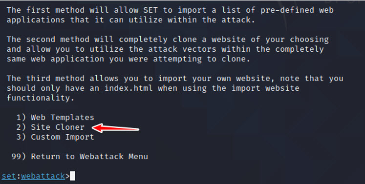
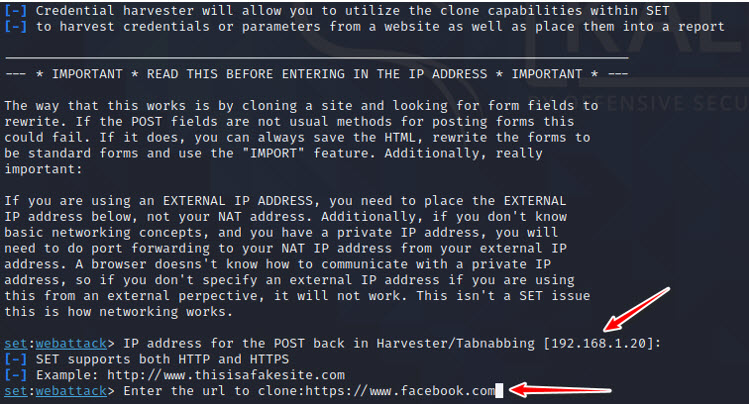
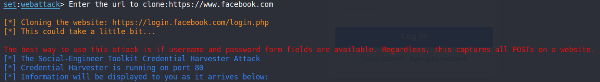
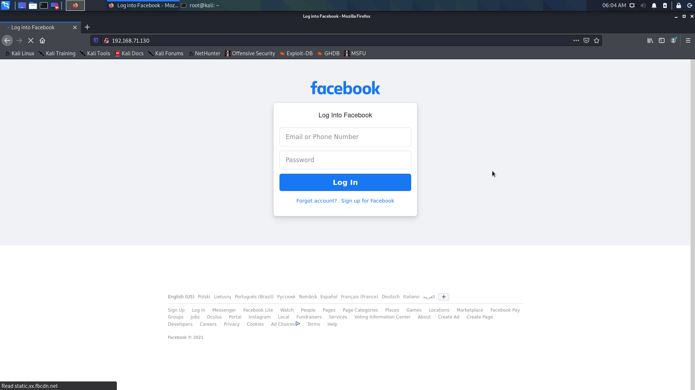
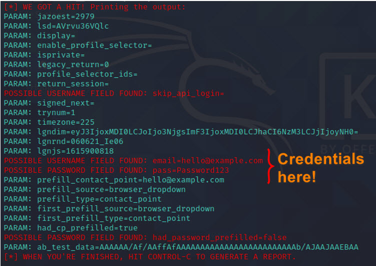

**Lab Objective:**

Learn how to harvest credentials using a cloned site.

**Lab Purpose:**

Credential harvesting is the process of gathering sensitive information on a target such as credit card details or passwords, without them knowing that this information is being captured.

**Lab Tool:**

Kali Linux

**Lab Topology:**

You can use Kali Linux in a virtual machine for the purpose of this lab.

**Lab Walkthrough:**

### Task 1:

The first step is to boot your virtual machine and get Kali Linux up and running. Once this is complete, open a terminal and start the Social Engineering Toolkit by typing:

_sudo setoolkit_

### Task 2:

From this menu, choose option 2 for website attack vectors. You will then be presented with the following screen asking you which kind of website attack you want to conduct. Choose option 3, the credential harvester attack method.

### Task 3:

The next menu will ask you which method you want to choose to harvest a victim’s credentials. In this lab we will be cloning a site, so choose option 2.

### Task 4:

SET will ask you for your IP address so that it can send the POST requests from the cloned website back to your machine. For the purpose of this lab, enter your Kali machine’s local IP address. This can be found by opening a new terminal and typing _ifconfig_.

Once you tell SET that you would like to clone a website, it will then ask you for the URL of the site you wish to clone. You can enter any site you like, but for this lab I will be using [https://www.facebook.com](https://www.facebook.com/).

### Task 5:

Once the URL is entered, SET will clone the site and display all the POST requests of the site back to this terminal. It is now time to navigate to the cloned site.

### Task 6:

To get to the cloned site, open Firefox in your Kali machine and enter your local IP address into the browser. You will then be able to view the cloned login page for Facebook. Enter a random username and password into the fields and press Log In.

### Task 7:

Finally, go back to the terminal where SET is running. You will see lots of text from the numerous POST requests being sent from the cloned site. Scroll down until you see the values username and password. You should be able to see the username and password you entered into the cloned site in cleartext.

