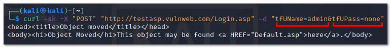

- [ ] Pasitikrinti ar viskas veikia

**Lab Objective:**

Learn how to use the Curl tool for manual information gathering.

**Lab Purpose:**

Curl stands for Client URL. It is a command line tool for getting and sending data including files using URL syntax.

**Lab Tool:**

Kali Linux

**Lab Topology:**

We will use Kali Linux for this lab.

**Lab Walkthrough:**

### Task 1:

The general syntax for using curl is the following:

Curl [options] URL

This is a basic syntax that makes the tool quite simple to use. To get some more information on curl and how it is used, type curl –help to display the information screen.

Curl can be installed on Linux using the following command:

sudo apt-get install curl

### Task 2:

The first task we will perform is getting the source code of a site. The first step is to boot your virtual machine and get Kali Linux up and running. Once this is complete, open a terminal and type the following:

curl [https://example.com](https://example.com/)

To save this output to a file, we will use either the “-o” or “-O” option. The lowercase option saves the file with a predefined filename, while the uppercase option saves the file with its original filename. Basically, the lowercase option allows us to specify a file name. This is a useful option if the webpage we are trying to inspect is preventing us from right clicking on the page to view the source code in the browser. Type the following to save your output:

curl -o output.txt [https://example.com](https://example.com/)

We can see some brief statistic data on this output.

### Task 3:

Curl also provides you with the ability to download multiple files at once. To do this, use multiple -O options, followed by the URL of the file you want to download. For example:

curl -O https://arxiv.org/ftp/arxiv/papers/1610/1610.05971.pdf -O

https://arxiv.org/pdf/2103.08624.pdf

If your connection drops while downloading a file, you can resume the download with the “-C-“ option. This is an especially useful feature when downloading large sized files, ex DVD ISO files, or MP4 video files. This way, if your connection drops when downloading a file, you can resume the download instead of starting from scratch, using, for example:  
curl -C- -O https://arxiv.org/pdf/2103.08624.pdf

### Task 4:

Curl can also be useful for downloading HTTP headers, which is useful when testing a site. To do this,

use the following command:

curl -I https://example.com

This will display many useful pieces of information, such as server info, content type, and content encoding.

### Task 5:

When attempting to download a file or gather other information using curl, you may discover that the target site may be designed to block curl. In this case, it is useful to emulate a browser, such as Firefox, to return the information you are looking for. To do this, use the following command:

curl -A “Mozilla/5.0 (X11; Linux x86_64; rv:60.0) Gecko/20100101 Firefox/60.0”  
https://ifconfig.me

In this example, remote site https://ifconfig.me answers with different messages according to clients’ user-agent strings.

### Task 6:

Another important feature of curl is its ability to transfer files. This is useful when interacting with servers through the command line, particularly if you are trying to take advantage of potential vulnerabilities. To access a protected FTP server, use the -u option to specify the username and password:

curl -u “username:pwd” “ftp://mirrors.sonic.net/knoppix/live.iso”

To upload a file to the server, we can use the -T option:

curl -T file.zip -u “username:password” [ftp://mirrors.sonic.net/](ftp://mirrors.sonic.net/)

### Task 7:

Normally, curl denies connection to sites which have invalid SSL certificates. To connect without blocking and getting a warning message, we can use the “–k” option, for example:

curl -k [http://192.168.1.1/](http://192.168.1.1/)

### Task 8:

Curl can also be configured to use a proxy. To do this, use the -x option followed by the proxy URL. For example:

curl -x 192.168.0.1:8080 [http://example.com/](http://example.com/)

### Task 9:

Curl can also be used for sending HTTP POST data to FORM pages.

In this example, we are sending two parameters, “tfUName” and “tfUPass”, with attached values to “http://testasp.vulnweb.com/Login.asp”.

