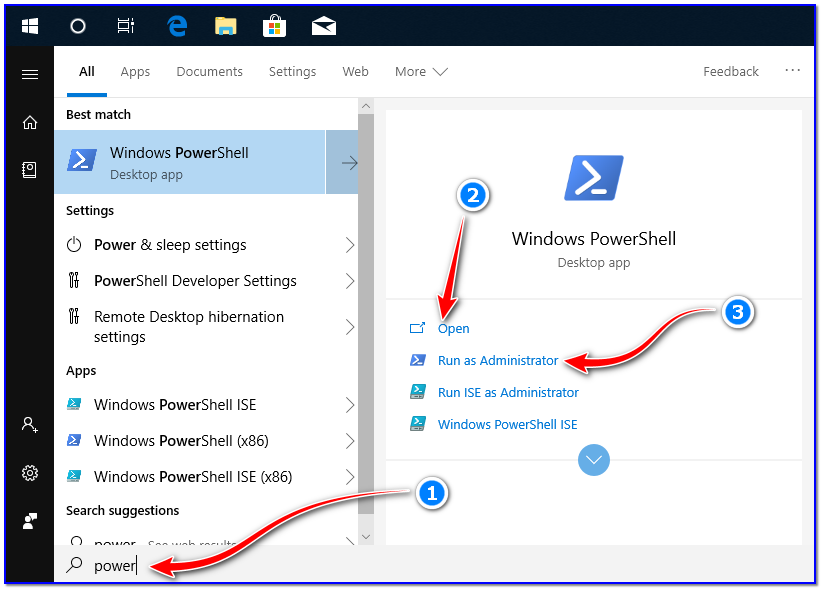
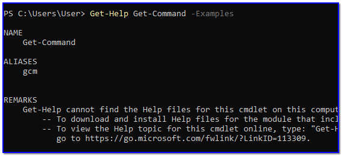
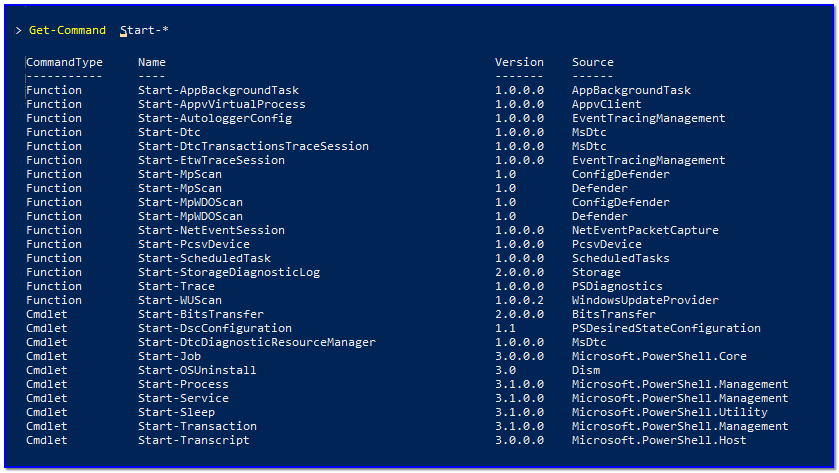
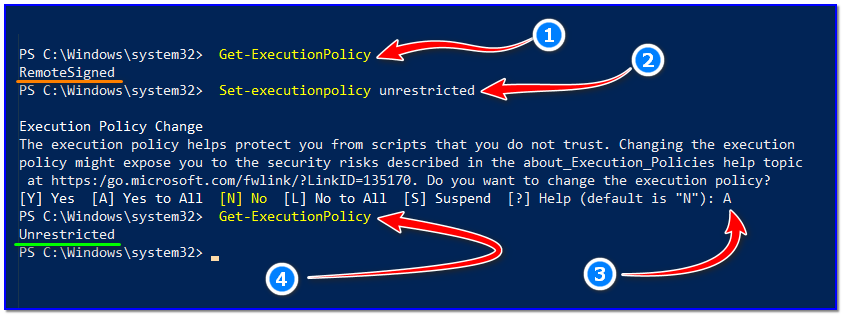
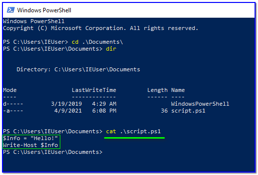
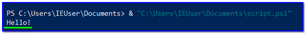

- [ ] Pasitikrinti ar viskas veikia

**Lab Objective:**

Learn how to use some basic PowerShell commands and functions.

**Lab Purpose:**

PowerShell is a task automation and configuration management framework from Microsoft. It consists of a command-line shell and the associated scripting language.

**Lab Tool:**

Kali Linux and Windows

**Lab Topology:**

You can use a Windows machine for this lab.

**Lab Walkthrough:**

### Task 1:

In this lab, we will be covering some basics surrounding PowerShell. PowerShell commands are called cmdlet’s, and are written in .NET. The output of these cmdlet’s are objects. This means that we can perform actions on the output object by running cmdlets. The typical cmdlet is constructed using a verb-noun format. For example, the Get-Help command is used to get help about a particular cmdlet. Some of the most common verbs used include the following:

- Get — To get something
- Start — To run something
- Out — To output something
- Stop — To stop something that is running
- Set — To define something
- New — To create something

You can launch PowerShell by searching for the following on your Windows machine:

PowerShell

### Task 2:

Let’s look at some of the most basic PowerShell commands. Keep in mind throughout this lab that you can use Get-Help at any time to get some information about a command. You can also use the -examples flag which would return some examples of how this command is used. This is what that would look like:

Get-Help Get-Command -Examples

The “Get-Command” can be used to get all of the cmdlet’s installed. We can use this command to search for a particular cmdlet for a specific verb or noun by typing like the following:

Get-Command Start-*

### Task 3:

Let’s now have a quick look at variables. Variables should start with $ in PowerShell. The following is an example of a variable in PowerShell:

$location = “Earth”

This command will create a variable called $location and assign it the output of Get-Location cmdlet. This variable will now contain the current location. To call the variable, we simple type the following:

$location

### Task 4:

We will now look at writing our first PowerShell script. Before we are able to execute any scripts, we will first need to change to execution policy on our Windows machine. It is recommended to do this in a Windows virtual machine, or another machine which is not your main or host OS. Changing the execution policy will allow your machine to execute any PowerShell script. If you download a PowerShell file containing a virus, this could be disasterous for your PC. To change the execution policy, open PowerShell and type the following commands one after the other:

- Get-ExecutionPolicy
- Set-executionpolicy unrestricted
- Enter Y in the prompt
- Get-ExecutionPolicy

Before doing this, make sure you opened powershell with Administrator permissions. Your execution

policy should now be set to unrestricted, and we can proceed with the lab.

Now, create a new file in notepad and type the following:

|   |
|---|
|$Info = “Hello!”  Write-Host $Info|

Save this script to your Documents with the name script.ps1.

Now, open PowerShell if you have not already done so, by searching for PowerShell. Then, call the script with the following command:

& “C:\Users\IEUser\Documents\script.ps1”

You have to write the full path of the script that you’re trying to run.

Notice how Hello! is printed to the console. Ok, we have executed our first PowerShell script!