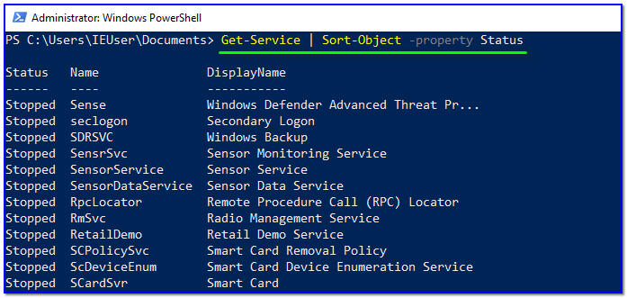
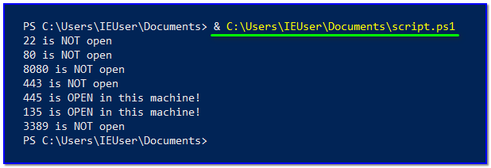

- [ ] Pasitikrinti ar viskas veikia

**Lab Objective:**

Learn more advanced PowerShell commands and functions.

**Lab Purpose:**

PowerShell is a task automation and configuration management framework from Microsoft. It consists of a command-line shell and the associated scripting language.

**Lab Tool:**

Kali Linux and Windows

**Lab Topology:**

You can use a Windows machine for this lab.

**Lab Walkthrough:**

### Task 1:

In this lab, we will run through some more advanced PowerShell concepts and attempt to write some more comprehensive PowerShell scripts.

Note: When running PowerShell scripts, the location of some of the files we use in the lab may be stored in different locations on your PC than mine. For example, if I store something on the Desktop, it will be saved under C:\User\user\Desktop\filename, but for you, it could be stored in somewhere like X:\username\username\Desktop\filename. Just make sure that you have the correct location for the file you are trying to use.

So, we have now established that every cmdlet will output an object when it is run. Now, we will cover how to manipulate these objects. To do this, we will need to pass output to other cmdlet’s and use specific object cmdlet’s to extract information.

To begin, you should note that Pipeline(|) is used to pass output from one cmdlet to another. Every object will contain methods and properties, much like in every object-oriented framework. Methods are functions which can be applied to output from the cmdlet. Properties are variables in the output from a cmdlet.

Run a command now using the pipelines like this:

Get-Service | Sort-Object -property Status

This command will get all services sorted by their status. Note the output.

Now, let’s create a script making use of pipes. Edit your script so that it looks like the following:

|   |
|---|
|Get-Service \| Sort-Object -property Status   “Hello All!” \| Out-File C:\Users\IEUser\Documents\newfile.txt|

So, we have just added an extra line to our previous command to write Hello All! to a text file. Ensure that the text file exists first by creating one and saving it to your Documents folder.

Now, save the script and execute it. Notice that both commands executed. We have received all services sorted by their status, and Hello All! has been written to the newfile.txt file.

### Task 2:

Now that we have a basic understanding of PowerShell and how it works, we will attempt to write a more advanced script. Open your PowerShell script and edit it so that it looks like the following:

|   |
|---|
|$system_ports = Get-NetTCPConnection -State Listen   $text_port = Get-Content -Path C:\Users\IEUser\Documents\portnumbers.txt  foreach($port in $text_port){  if($port -in $system_ports.LocalPort){  echo “$port is OPEN in this machine!”  }  else { echo “$port is NOT open” }  }|

Save this script.

Let’s break this script down:

- In the first line, we are getting a list of all the ports on the system that are listening. This is achieved using the Get-NetTCPConnection cmdlet. This output is saved to the variable system_ports
- The second line is reading a list of port numbers from the file “portnumbers.txt”. This file contains a random set of port numbers with each number on a different line. We are then storing the contents of this file in the variable text_port
- The third line is establishing a loop for each port stored in the text_port variable. This loop will run until all the stored ports have been dealt with.
- The fourth line is an if statement. This statement will check to see if the port in the port variable is in the LocalPort property of the Windows system. If this statement is true, the port will be echoed to the console. If the statement is not true, that port number will be ignored.

Before running it, create a text file on your “C:\Users\IEUser\Documents\portnumbers.txt” path and add in a random list of ports with each port number on a different line, like this:

|   |
|---|
|22   80   8080   443   445   135   3389|

Save this file, and, finally, run the “script.ps1” file:

If any of the ports listed in the text file you created are listening on your Windows system, they will be printed to the console as “OPEN”. This is a simple example of how PowerShell can be used to interact with the Windows OS for gathering information.