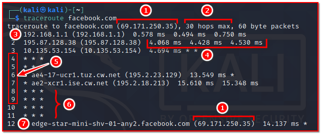
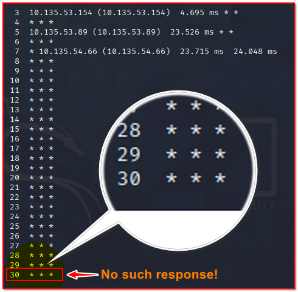

- [ ] Pasitikrinti ar viskas veikia

**Lab Objective:**

Learn how to use Traceroute in Linux to trace the route to a host.

**Lab Purpose:**

Traceroute is used to trace the route to a host. This is useful for finding out if the host is up, where the host is located, and how many hops the server is away from you.

**Lab Tool:**

Kali Linux

**Lab Topology:**

We will use Kali Linux for this lab.

**Lab Walkthrough:**

### Task 1:

To install traceroute on Kali Linux, simply open a terminal and type the following:

sudo apt-get install traceroute

In this lab, we will demonstrate how this tool works by using Kali Linux. Begin by opening a terminal window. It is important to note that we can use “traceroute” for any host as it is considered public knowledge. Therefore, we can use any site as our target site for this lab without being “root” user.

We will begin by targeting a big site such as “facebook.com”. Type the following:

traceroute facebook.com

1) The very first line after the traceroute shows Hostname and IP address, which it has obtained by using the reverse DNS look up.

2) 30 hops means that traceroute will only route the first 30 routes between your system and the victim’s system. 30 is often too much; it usually ends in 3 to 15 hops, though it can sometime go deeper depending on the site’s security and lack of response.

3) This is the first router; possibly our AP, modem, router, etc.

These are the IP address ranges for private IP’s:  
10.0.0.0 – 10.255.255.255,  
172.16.0.0 – 172.31.255.255,  
192.168.0.0 – 192.168.255.255,  
224.0.0.0 – 239.255.255.255

4) These three columns display the round trip time(s) for our packet to reach that point and return to our computer. This is listed in milliseconds. There are three columns because the traceroute sends three separate signal packets. This is for display consistency—or a lack thereof—in the route.

5) This is the first column and is simply the number of the hop along the route.

6) This means that the target system could not be reached. Requests timed out. More accurately, it means that the packets could not make it there and back; they may actually be reaching the target system but encountering problems on the return trip. This is possibly due to some kind of error, but it may also be an intentional block due to a firewall or other security measures, and the block may affect tracing the route but not actual server connections.

7) It shows our last destination, which has the same IP address as the first line.

This is extremely useful for finding a whole range of information, all of which will be displayed during the trace. We can also see that the host is two hops away from us, and the IP addresses of each of the servers our request had went through to reach our target.

### Task 2:

Traceroute is also useful for determining if a host is up. For example, try targeting the following host:

traceroute eheheueueu.com

We can see that this hostname doesn’t exist through traceroute.

We can also see if the hostname exists but is down. It is possible to understand this if we take the following response: