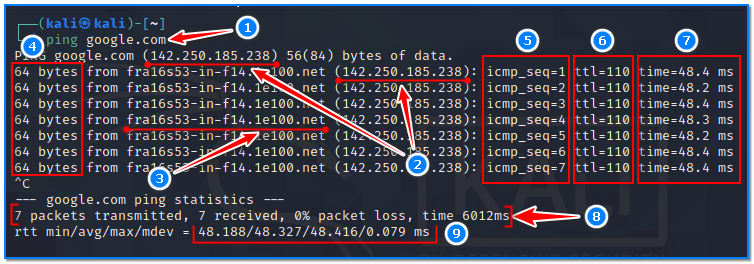
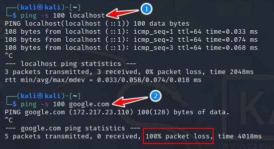
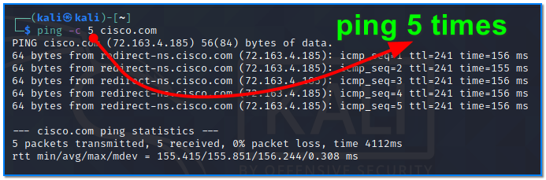
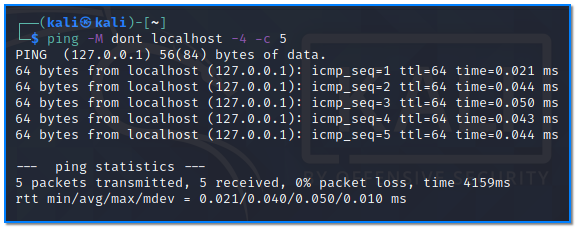
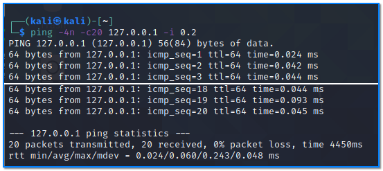
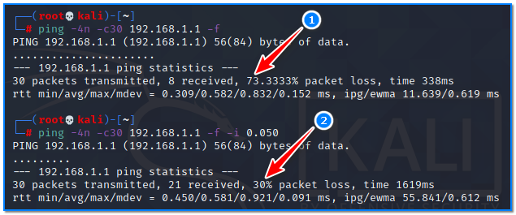

- [ ] Pasitikrinti ar viskas veikia

**Lab Objective:**

Learn how to use ping and its different parameters.

**Lab Purpose:**

Ping is a simple and useful network-based utility which can be used to identify if a host is alive or dead. Technically, we can call it an echo reply. By “alive”, I mean that the host is active, and by “dead”, that the host is in shutdown mode. Anything which has a network card can be a host: computers, servers, switches, websites, smartphones, IOT devices, etc.

It is often useful when setting up some new infrastructure to use ping to test if your infrastructure can correctly reach the network.

**Lab Tool:**

Kali Linux or Windows

**Lab Topology:**

You can use Kali Linux for this lab.

**Lab Walkthrough:**

### Task 1:

Ping works on both Kali linux and Windows. For this lab, we will be demonstrating ping on Kali Linux VM machine. To begin, open a terminal window. Then, type the following:

ping google.com

The ping command will continue to send ICMP packages to the destinated IP address until it receives an interruption. To stop the command, just hit the Ctrl + C key combination.

As you will see, a number of lines of information will appear on our screen. This shows the packets being sent from our machine to google.com, as well as the response being received. We sent out 7 packets and received 7 packets back, indicating that google.com is up and responding to requests.

1) The hostname we are pinging. Use “-n” with this command if you want to avoid any reverse DNS lookups. For example: “ping google.com -n”

2) The IP address of the target host.

3) The reverse DNS name of target IP address. It’s different from the original hostname, right? This happens when one hostname has many IP addresses and each IP address has only one DNS name.

4) The number of data bytes. The default is 56, which translates into 64 ICMP data bytes.

5) The ICMP sequence numbers for each packet.

6) TTL: The Time to Live values.

7) The ping time, measured in milliseconds which is the round trip time for the packet to reach the host, and the response to return to the sender. Greater values indicate possible network problems or target’s load.

8) Once the command stops, it displays a statistic including the percentage of packet loss. The packet loss means that the data was dropped somewhere in the network, indicating an issue within the network or target’s performance. If there is a packet loss, you can use the traceroute command to identify where the packet loss occurs.

9) RTT (Round-trip time) metrics of those ping packages. RTT is the duration in milliseconds it takes for a network request to go from a starting point to a target and back again to the starting point.

### Task 2:

We can set the packet size using the following commands:

ping -s 100 localhost  
ping -s 100 google.com

Some targets respond to ping packets as expected (1), some of them just drop (2).

This is useful when testing a system to see how it will respond differently to very small or very large packets. The default packet size of ping is 56.

### Task 3:

As aforementioned, by default, ping will continue to send packages until it receives an interrupt signal. To specify the number of echo request packages to be sent after pings exit, use the -c option followed by the number of packages:

ping -c 5 cisco.com

### Task 4:

When you run the ping command, it will use either IPv4 or IPv6, depending on your machine’s DNS settings. To force ping to use IPv4, pass the -4 option, or use its alias: ping4. To force ping to use IPv6, pass the -6 option, or use its alias: ping6;

ping -4 localhost

ping -6 localhost

To send 5 packets which “will not fragment the flag (IPv4 only)” pass “-M dont” option with the following command:

ping -M dont localhost -4 -c 5

### Task 5:

In some cases, it may be necessary to wait a certain amount of time between sending each packet. The default is to wait about one second between each packet, or not to wait in flood mode. Unpriviledged users may set an interval to 0.2 seconds and above.

Send 20 ping packages within 0.2 ms interval to target system:

ping -4n -c20 127.0.0.1 -i 0.2

### Task 6:

In flood ping; for every ECHO REQUEST sent a period ”.” is printed, while for every ECHO REPLY received, the last printed period “.” is removed. This provides a rapid display of how many packets are being dropped. If interval is not given, it sets interval to zero and outputs packets as fast as they come back or one hundred times per second, whichever is more. Only the super-user may use this option with a zero interval.

As a root user, flood target system with sending 30 ping packages. Choose your local router or Access Point as target system. Run this command:

ping -4n -c30 192.168.1.1 -f  
ping -4n -c30 192.168.1.1 -f -i 0.050

In this flood test, packet loss is 73% in test number (1), while in test number (2), when the packet is sent with 50 ms delay, the loss is around 30%.

This feature can be used to slow down the target system’s network or to measure end-to-end network performance. It can also be used to create artificial loads. For this reason, it is necessary to be careful when using it on systems in production.