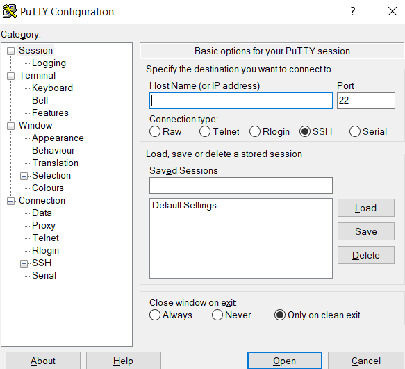
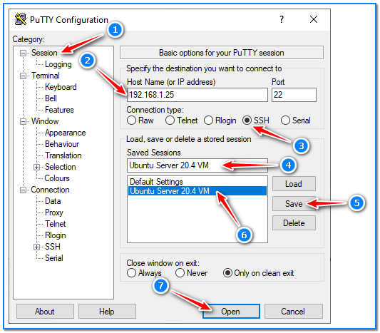
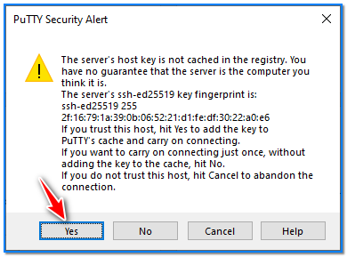
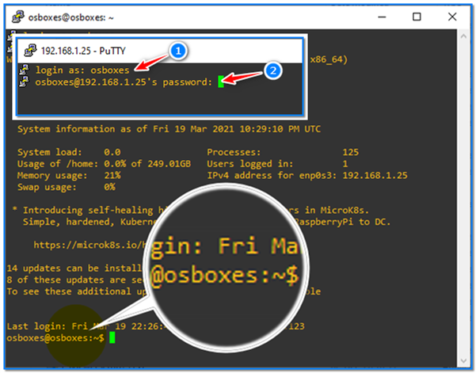

- [ ] Pasitikrinti ar viskas veikia

**Lab Objective:**

Learn how to use PuTTY to SSH into a server from a Windows machine.

**Lab Purpose:**

PuTTY is an open-source terminal emulator which supports several network protocols. It is also free and can be downloaded for Windows from the following link: [https://www.putty.org/](https://www.putty.org/)

**Lab Tool:**

Windows

**Lab Topology:**

You can use a Windows machine for this lab. In this lab, we need another SSH-enabled machine to make connections through. You can find a prebuilt Ubuntu Server image on

[https://www.osboxes.org/ubuntu-server/](https://www.osboxes.org/ubuntu-server/) for this purpose.

Download and import it to your virtualization platform and run.

**Lab Walkthrough:**

### Task 1:

SSH stands for Secure Shell and it is used to connect to machines securly over the internet. For this lab, we will be using PuTTY to connect to a server using a Windows machine. Connecting to a server using a Linux machine will be covered in a different lab.

The first step is to download PuTTY from the following link: [https://www.putty.org/](https://www.putty.org/) . Click through the installer, and once it is finished, open the application. Once open, you will be met with the following screen:

This is where we will connect to our server through SSH.

### Task 2:

We can see under the Host Name input box that PuTTY supports a number of different protocols, such as Telnet, which is the unsecure version of SSH. We have selected SSH and are thus ready to specify the server information, such as IP and port, to get connected.

Simply enter the IP address or hostname; for example, type the Ubuntu VM’s IP you just created and the port which you want to connect on. For SSH, this is port 22. It is good practice to then go to saved sessions and enter a name for the connection and press save, so that you don’t have to enter the information again next time. Once this is done, click open on the bottom right corner.

### Task 3:

When connecting, a window will pop up with a warning. It will warn you that you have not connected to this server before and that you should only connect to servers you trust. Click yes and continue.

You will then be asked for login information to continue. Once this is entered you will have access to

the server and its different file directories.