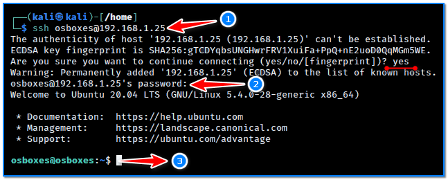
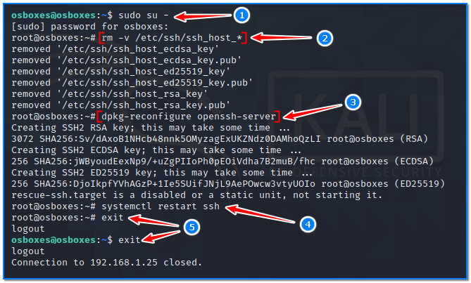
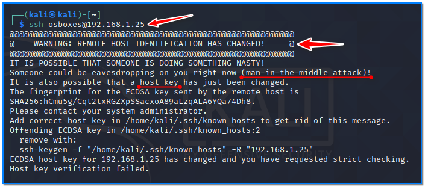
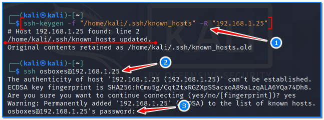
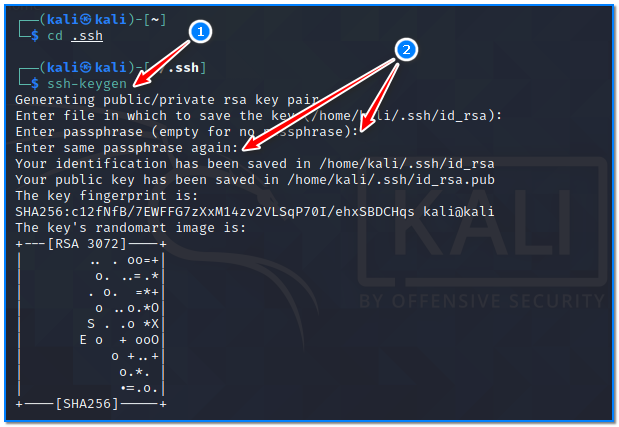
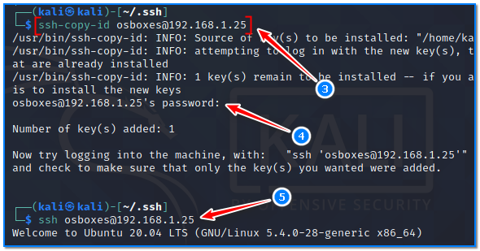
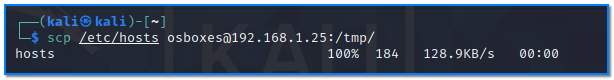
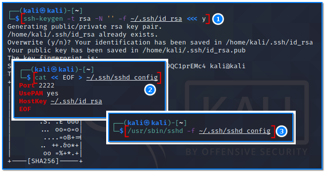
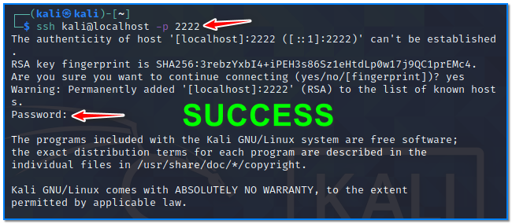

- [ ] Pasitikrinti ar viskas veikia

**Lab Objective:**

Learn how to access a server from a Linux machine using SSH.

**Lab Purpose:**

Linux comes built in with the ability to connect directly to a server through SSH without the need to download any applications. SSH stands for Secure Shell and it is a secure method of connecting to devices over the internet.

**Lab Tool:**

Kali Linux

**Lab Topology:**

You can use a Kali Linux VM for this lab. In this lab, we need another SSH-enabled machine to make connections through. You can find a prebuilt Ubuntu Server 20.04 image on [https://www.osboxes.org/ubuntu-server/](https://www.osboxes.org/ubuntu-server/) for this purpose.

Download and import it to your virtualization platform and run.

**Lab Walkthrough:**

### Task 1:

Linux has the ability to connect to a device over the internet through SSH, without the need to download external applications. This functionality is not the same for Windows, and this was covered in the previous lab. To begin, open a terminal.

Connecting to a server via SSH is very easy in Linux. All you have to do is type the following into the terminal:

ssh osboxes@192.168.1.25

This will then ask you if you trust the server as your machine would have never connected to it

before. Simply type “yes” to move on.

1) All connection information in a single line, except password.  
2) The password is entered invisibly. In this example, the password for the “osboxes” user is preset as “osboxes”.  
3) The remote connection is established and dropped on the terminal line.

SSH is really handy for controling remote servers and devices across the internet. It provides you with the ability to remotely login to any device to manage it at any time.

### Task 2:

Change the remote server’s certificate and see what happens.

Connect to remote server with user “osboxes” and password “osboxes” again, with SSH. Change to privileged user then run this command:

sudo su –  
rm -v /etc/ssh/ssh_host_*

Regenerate remote server’s SSH keys with this command:

dpkg-reconfigure openssh-server

Restart the service to make sure the remote server is working with newly created SSH keys:

systemctl restart ssh

Disconnect from the remote server to re-establish the SSH connection.

Each remote server operates with a unique SSH certificate. When trying to connect to another server with the same IP address as the remote server, the local SSH client will warn you about the situation

in order to prevent user information from being stolen.

If it is definitely known that the operating system on the remote server has been reinstalled or if the SSH server keys are regenerated like in this example, it will be necessary to update the SSH key records on the local user who established the connection. In the local terminal screen, type the following and reconnect to remote server via SSH:

ssh-keygen -f “/home/kali/.ssh/known_hosts” -R “192.168.1.25”

ssh osboxes@192.168.1.25

Thanks to this simple mechanism, the critical access information of the local user connected via SSH is prevented from being seized by a possible thief server.

### Task 3:

If you make frequent SSH connections to the same server during the day, it is possible to gain password-free connection capability by copying your local SSH public key to the remote server. The steps to achieve this are easy. We will manually add the content of the “kali” user’s “.ssh/id_rsa.pub” file to the “.ssh/authorized_keys” file located in the remote user’s home directory.

While on the terminal screen of the Kali VM machine, as “kali” user:

cd .ssh/  
ssh-keygen  
ssh-copy-id [osboxes@192.168.1.25](mailto:osboxes@192.168.1.25)

ssh osboxes@192.168.1.25

As can be seen, no password is required for SSH logins. Even if the remote user changes their password, this will not prevent us from logging in without a password.

If you were able to log into your account using SSH without a password, you have successfully configured SSH-key-based authentication to your account. However, your password-based authentication mechanism is still active, meaning that your server is still exposed to brute-force attacks. In order to permanently block SSH access to the remote server with a password, it is necessary to edit the “sshd_config” file and make “PasswordAuthentication no”.

The changes will take effect after the SSH service is restarted:

systemctl restart ssh

From now on, users who have not yet copied their SSH public keys to the remote server will not be able to login even with a password. Local console logins are not affected by this situation.

### Task 4:

It is possible to access IP targets that can only be accessed from a remote server by port-forwarding via SSH tunneling method. Connect to remote server with this command:

ssh -L8080:192.168.1.1:80 [osboxes@192.168.1.25](mailto:osboxes@192.168.1.25)

When this command is run in Kali Linux, requests to 127.0.0.1:8080 are forwarded via the remote server to the destination 192.168.1.1:80, by establishing a secure SSH tunnel.

### Task 5:

It is possible to copy a file residing on the local machine to a desired location on the remote server via a secure SSH tunnel. To do this:

scp /etc/hosts [osboxes@192.168.1.25:/tmp/](mailto:osboxes@192.168.1.25:/tmp/)

In this case, the password-free connection capability when using the “ssh” command is also valid when using the “scp” command.

### Task 6:

It is possible to run the SSH service outside port 22. We can even do this on a system that does not have root privileges. Open terminal on Kali Linux VM machine and type the following commands:

ssh-keygen -t rsa -N ” -f ~/.ssh/id_rsa <<< y

Create a file with nano editor, and put following lines in it:

nano ~/.ssh/sshd_config  
Port 2222  
UsePAM yes  
HostKey ~/.ssh/id_rsa

Now, we can start a new SSH service with a non-root user by listening to port 2222.

/usr/sbin/sshd -f ~/.ssh/sshd_config

Now, we have created an anternative entrance point to our system. If there is no firewall rule applied that blocks all ports save exceptions, someone can access this system using port 2222 via SSH.

Let’s try it by making a SSH connection ourselves;