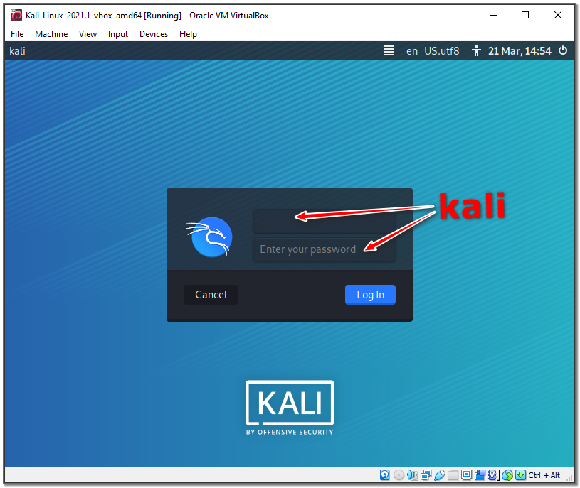

- [ ] Pasitikrinti ar viskas veikia

**Lab Objective:**

Learn how to setup your own Kali Linux Virtualbox Machine for the purpose of hacking.

**Lab Purpose:**

Kali Linux is a Debian-based Linux distribution which is aimed at advancing Penetration Testing and Security Auditing. Kali Linux contains several hundred tools which are geared towards various information security tasks, and many more can be downloaded from sources such as GitHub.

**Lab Tool:**

Windows Machine

**Lab Topology:**

You can use a Windows or Linux PC which can offer Desktop login for this lab.

**Lab Walkthrough:**

### Task 1:

There are two major virtualization platforms that are currently free for Windows and Linux operating systems. You can access the website of both platforms from the links below:

Oracle VirtualBox [ https://www.virtualbox.org/ ]  
VMware Workstation Player [https://www.vmware.com/products/workstation-player.html ]

In this lab, we prefer to use the VirtualBox because of its easy use and because it’s also the most popular in the open source world. You can use it in both Linux and Windows PC environments. It is very easy to install in the Windows environment. After installing the actual application, do not forget to download and install the VirtualBox Extension Pack, which is the same version as this.

This software will allow us to run the Kali Linux Operating System within our Windows or Linux Desktop Operating System. This means the things we do in the virtual OS will not impact our actual OS.

### Task 2:

There are various methods of installing Kali Linux under VirtualBox. For convenience, we will proceed by importing a preinstalled VM image. Go to:

[https://www.offensive-security.com/kali-linux-vm-vmware-virtualbox-image-download/](https://www.offensive-security.com/kali-linux-vm-vmware-virtualbox-image-download/)

You will see two types of images here, 32bit and 64bit. If your Desktop Operating System supports running a 64bit virtual OS, it is recommended that you download it. Make sure you download for the

right virtualization platform.

### Task 3:

We will import the pre-installed Kali Linux VM machine just downloaded, into the VirtualBox environment.

Open Oracle VM VirtualBox Manager, select “File” on the top menu, then click “Import Appliance” from the drop-down menu.

In the “Appliance to import” window, following the numbered steps indicated in the figure, select

the Kali Linux VM OVA file we just downloaded. Then, click Next.

Check the information displayed in the window that opens, then click import. Also click on the

“Agree” button in the “Software License Agrement” window that opens. Importing begins…

After the import is done, the Kali Linux VM is ready for use. Click the green “Start” button to boot virtual machine.

### Task 4:

Once the importer is finished, boot up the virtual machine. It may take a few minutes to load. Once loaded, enter “kali” as both username and password.

By default, a password is not defined for the root user, so you cannot log in directly as that user.

For operations that require root authorization, you will need to use “sudo” command on the terminal screen, in this case the password that must be entered is “kali”.

To ensure you are using the most up to date version of the machine, open a teminal screen, then enter the following commands:

sudo apt update

sudo apt full-upgrade -y

You will be prompted for the sudo password. Enter the default password “kali”. It is important to have these updates on a freshly installed Kali VM, otherwise both the OS and some hacking tools may not work properly. After all updates are finished, reboot the Kali VM to make sure all updates have been applied.

### Task 5:

Done! Now we have a fully functioning Kali Linux Virtual Machine to begin hacking. It is useful to take a snapshot of the machine, from the virtualization software setttings, once all the updates are done. This is useful if the VM image becomes damaged, in which case we can simply revert to the recently updated working version. Also, connecting the default network adaptor to the “Bridge Adapter” instead of NAT will benefit us in many subsequent hacking operations.

First, make sure that Kali is in shutdown state. In the Oracle VirtualBox Manager main window, click

the Settings button, then follow the steps described in the figure.

Now, we can take a snapshot of the entire Kali VM.

Now, whenever necessary, we can restore Kali Linux virtual machine to this snapshot level and then boot the system in its initial state.

