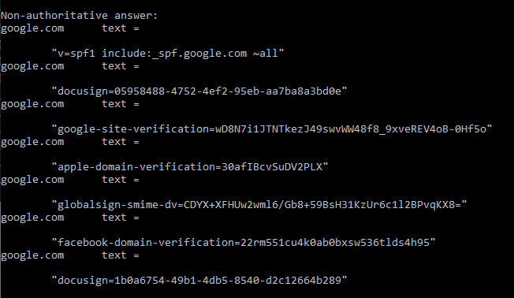

- [ ] Pasitikrinti ar viskas veikia

**Lab Objective:**

Learn how to use the Nslookup command to gather DNS information on a target site.

**Lab Purpose:**

Nslookup is a network administration command-line tool used for querying the DNS to obtain domain name or IP address mapping information.

**Lab Tool:**

Windows Machine or Kali Linux.

**Lab Topology:**

You can use a Windows Machine or Kali Linux for this lab.

**Lab Walkthrough:**

### Task 1:

Nslookup comes built in on both Windows and Linux. In Windows, it comes in both an interactive and non-interactive mode. To open the interactive mode, type “nslookup”. To quit the interactive mode, type “quit”.

We will begin by finding the IP address of a host. To do this, type the following:

nslookup [www.google.com](http://www.google.com/)

As you will see, we are returned with the different IPv4 and IPv6 ip addresses for Google.com. The node, called as “local DNS resolver”, is the first point of contact we make with a DNS query every time.

This is usually the IP address of the device provided to you by your Internet Service Provider. Of course, you can target your “all DNS queries” to a different server by changing your local machine’s network settings accordingly.

### Task 2:

We will now perform a reverse lookup which will match an IP address to a domain name. This is also called the DNS PTR record, and can be thought of as the exact opposite of the DNS A record. To do this type:

nslookup 74.125.193.99

Oftentimes, we can see that hostnames DNS A and DNS PTR queries do not match on web servers. This is because multiple IP addresses may be matched against a DNS A record to perform load balancing.

### Task 3:

We can also find any “Mail eXchange” servers for a particular domain. To do this, type:

nslookup -querytype=mx google.com

### Task 4:

We can also find the “Name Servers” responsible for a domain. In other words, only those servers which are authoritative sources to keep DNS records of the google.com domain name. To do this, first open an interactive console by typing “nslookup”. Then, type:

set query=ns

Then, type the domain name into the terminal.

### Task 5:

It is possible to access domain verification data by making a DNS TXT query.

nslookup -querytype=txt google.com

