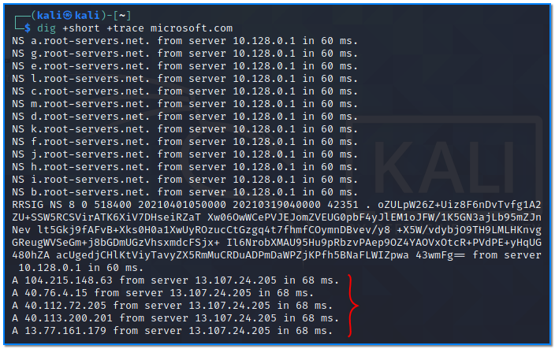

- [ ] Pasitikrinti ar viskas veikia

**Lab Objective:**

Learn how to use the Dig command to gather DNS information.

**Lab Purpose:**

Dig stands for Domain Information Groper. It is a tool for querying DNS nameservers for information about host addresses, mail exchanges, nameservers and related information.

**Lab Tool:**

Kali Linux.

**Lab Topology:**

You can use Kali Linux for this lab.

**Lab Walkthrough:**

### Task 1:

Dig is a tool which can be used on either Linux or Mac OS. Dig comes pre-installed on Kali Linux and you can check its version using the following command:

dig -v

The dig syntax looks like the following:

Dig [server] [name] [type]

We will begin by performing a simple dig command. Type the following into a terminal:

dig google.com

### Task 2:

The above command will include several information. There may be a time when you only want the

result of the query. This can be achieved in dig with the following command:

dig google.com +short

As you can see, there can be more than one IP for a host record.

### Task 3:

This next command will get rid of all information before the answer section, for easier reading. We can specify this using the following command:

### Task 4:

We can also specify the nameservers we wish to query using the following command:

This command queries the “google.com” record from the Name Server with IP address 8.8.8.8.

### Task 5:

If we want to query all DNS record types, we can use the “ANY” option. This will display all the available record types in the output:

### Task 6:

We can also look up a specific record. For example, if we want to get only the mail exchange section associated with a domain, we can use the following command:

dig google.com MX

We can query a number of specific record types using the following tags in place of MX:

TXT, CNAME, NS, A

### Task 7:

We can trace the DNS path, similar to traceroute, using the following command:

### Task 8:

It is also possible to make DNS queries for IP addresses.

### Task 9:

Dig has a useful feature which allows you to perform a number of DNS lookups for a list of domains instead of doing the same for each one individually. This can be done by performing a lookup using a file:

dig -f domain_names.txt +short

### Task 10:

It is possible to access domain verification data by making a DNS TXT query.

Dig is a tool with multiple uses and can be very useful for gathering a broad range of DNS information about a target site.