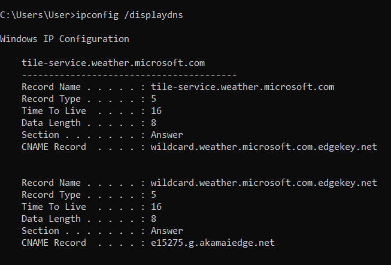
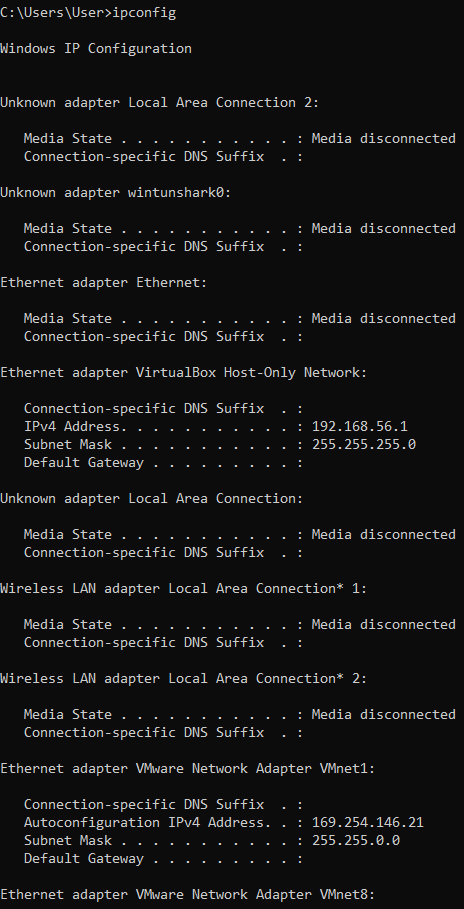
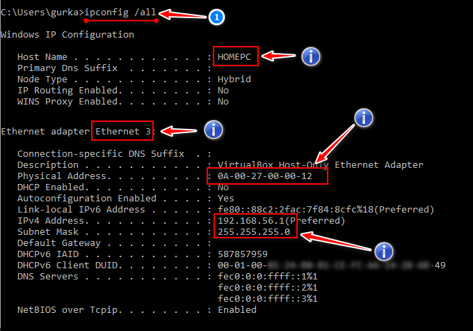
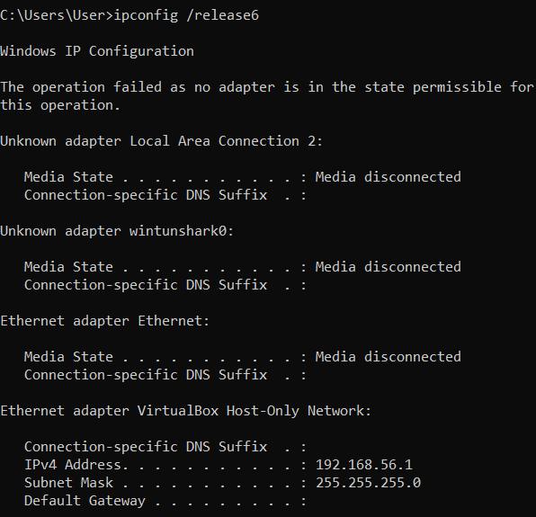
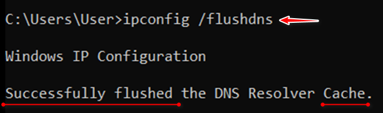
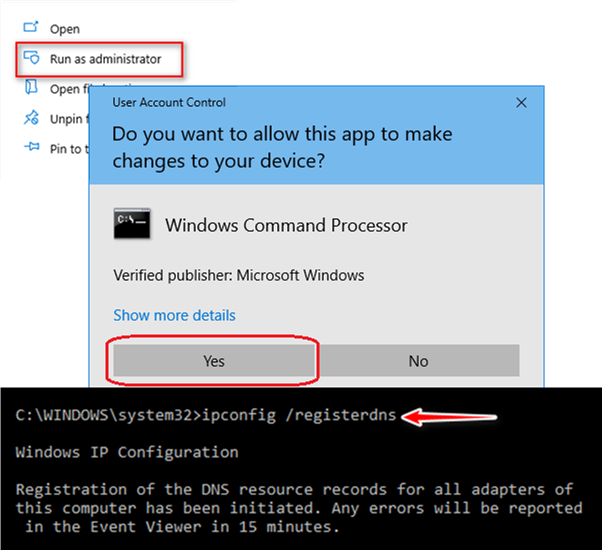
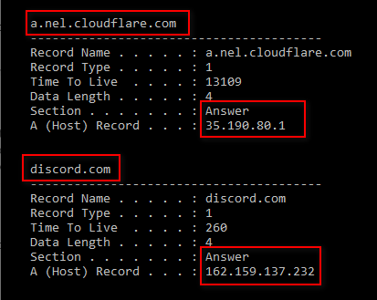

- [ ] Pasitikrinti ar viskas veikia

**Lab Objective:**

Learn how to use ipconfig to view and modify network information on Windows.

**Lab Purpose:**

Ipconfig stands for Internet Protocol configuration. It is a console application which displays all current TCP/IP network configuration values and refreshes DHCP and DNS settings.

**Lab Tool:**

Windows

**Lab Topology:**

You can use Windows for this lab.

**Lab Walkthrough:**

### Task 1:

We will begin by viewing the help information screen by executing the following command:

ipconfig /?

Open a command prompt to begin, and type “ipconfig” to view your networking information.

As you will see, there will be a lot of information shown, including your local IP addresses.

### Task 2:

To display the fill TCP/IP configuration information for all network adapters, we can use the following command:

ipconfig /all

### Task 3:

Assume that our machine has an IP address with DHCP. To release our current IPv4 or IPv6 address, we can use the following commands:

ipconfig /release

ipconfig /release6

Renew our IP addresses via DHCP:

ipconfig /renew

### Task 4:

If we want to purge the DNS resolver cache, we can do that using the following command:

ipconfig /flushdns

This will essentially get rid of the local cache of DNS information.

### Task 5:

We can also refresh all DHCP leases and re-register DNS names using the following command:

ipconfig /registerdns

You will need to run command prompt as administrator to execute this command.

### Task 6:

We can display the content of the DNS Resolver Cache using the following command:

ipconfig /displaydns

