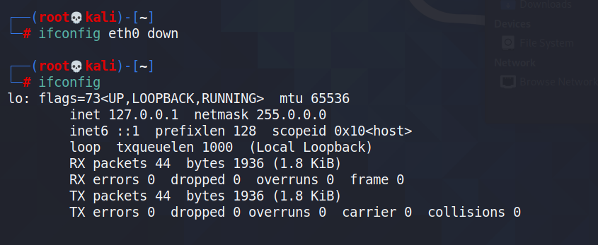
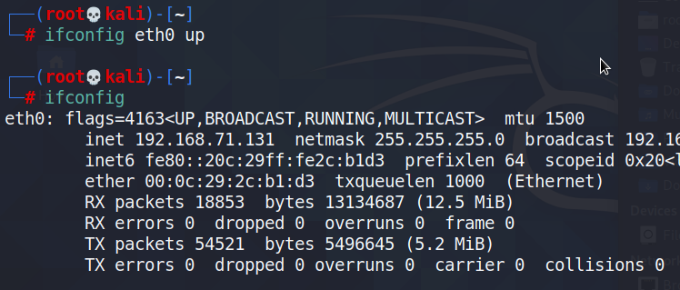

- [ ] Pasitikrinti ar viskas veikia

**Lab Objective:**

Learn how to use ifconfig to view and modify network information on Linux.

**Lab Purpose:**

Ifconfig is a system administration utility in Linux operating systems, used for network interface configuration. It is a command line interface tool and is used in the system start-up scripts of many operating systems.

Ifconfig is the equivalent of the ipconfig tool used on Windows.

**Lab Tool:**

Kali Linux

**Lab Topology:**

You can use Kali Linux for this lab.

**Lab Walkthrough:**

### Task 1:

We will begin by viewing the help information screen by executing the following command:

Ifconfig -h

Open a terminal to begin, and type “ifconfig” to view your networking information.

As you will see, there will be a lot of information, including your local IP addresses. New Linux distributions do not have the “ifconfig” command installed. In this case, you can use the “ip addr” command.

### Task 2:

To display a short list output, we can use the following command:

ifconfig -s

### Task 3:

We can display information about a specific interface by using the following command:

ifconfig [interface-name]

This is useful for determining interface information and for debugging.

### Task 4:

We can disable or enable a network interface using an ifconfig flag. For example:

ifconfig eth0 down

This command will disable our local connection to the Wi-Fi card. To enable it, enter the following command:

ifconfig eth0 up

### Task 5:

We can use ifconfig to enable promiscuous mode on an interface. This will allow the interface to receive all packets on the network. You will need a compatible network card for this to work correctly:

ifconfig eth0 promisc

This can be disabled using the following command:

ifconfig eth0 -promisc

### Task 6:

The ifconfig tool also enables you to change the MAC address associated with a network interface. This can be done with the following command:

ifconfig [network-name] hw [class] [hardware-address]

Eg. ifconfig eth0 hw ether 66:3e:7f:60:f2:1f

There are actually 4 sets of Locally Administered Address Ranges that can be used on your network without fear of conflict, assuming no one else has assigned these on your network:

x2-xx-xx-xx-xx-xx  
x6-xx-xx-xx-xx-xx  
xA-xx-xx-xx-xx-xx  
xE-xx-xx-xx-xx-xx

To make the changes permanent, open the file below and add the following lines in it:

nano /etc/network/interfaces

pre-up ifconfig eth0 hw ether AA:22:33:44:55:66

Reboot the system. The new MAC address will appear.