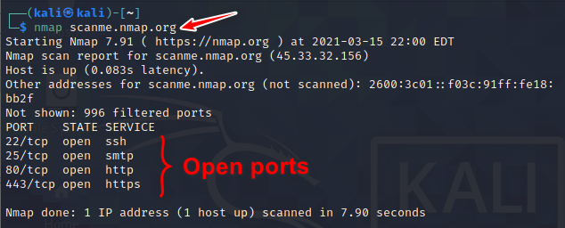
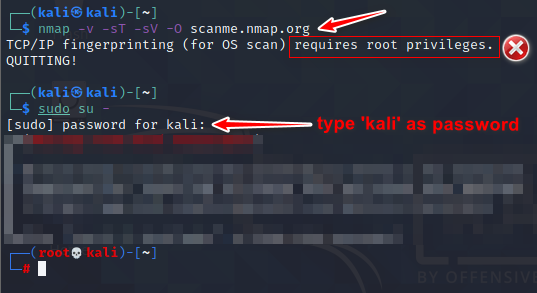
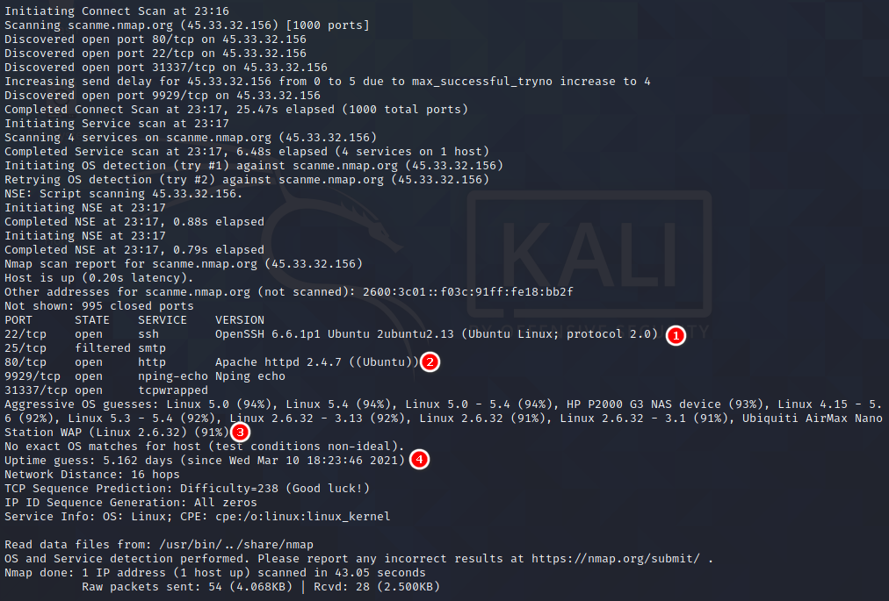

**Lab Objective:**

Learn how to scan a host using Nmap and understand the results.

**Lab Purpose:**

Nmap (Network Mapper) is one of the most common tools used among hackers and system administrators. It is used to scan a host, which can be a server, pc, network, etc. When running an Nmap scan, the goal is usually to discover various pieces of information about a target system or network. Examples of such information include: the devices that are connected to a network, the ports that are open on a device, the services that are running on these ports, whether the device is up, and whether there is a firewall protecting the device, among others.

**Lab Tool:**

Kali Linux

**Lab Topology:**

You can use Kali Linux in a virtual machine for the purpose of this lab. Scan the following site: [scanme.nmap.org](http://www.scanme.nmap.org/)

Note: This site has been developed by Nmap for the purpose of scanning. Never scan any site, system, or network without prior permission from the owner.

**Lab Walkthrough:**

### **Task 1:**

Nmap comes pre-installed in Kali Linux. Just open a terminal, type “nmap scanme.nmap.org” without the inverted commas. This will initiate a scan of the target and will attempt to determine which ports are open and what services are open on these ports.

As we can see from the scan results, there are 4 ports open, and there are different services running on each port. The scan we just performed, however, is a very basic scan and will only scan the top 1000 ports for basic information. In the next step, we will run a more advanced scan.

### Task 2:

In this step, we will be scanning the same target, scanme.nmap.org, but with a more advanced scan. Let’s say we want to determine the versions for the services running on each port, so that we can determine if they are out of date and potentially vulnerable to exploitation. We also want to determine the operating system of the webserver running the target site. We will run the following scan to determine this information:

Oops! You must be root before doing this type of scan. Type “sudo” and  re-enter nmap command with desired parameters. The line in the terminal will be like the following:

sudo nmap -v -sT -sV -O scanme.nmap.org

When asked for the password, type “kali” without inverted commas.

The results from our scan show us the exact versions of software running on each open port. Note, if there was a firewall protecting this webserver, we may be unable to see this information. We can also determine with relatively high accuracy the version of the operating system running on the web server.

An easier way to perform a full scan on a target is to use the -A flag, which will scan a target using the -sS, -sV, and -O flags.

### Task 3:

Try scanning the same target with a number of different flags. Visit the following site to see the different scans you can run against targets, as well as the different outputs different flags will provide.

[https://nmap.org/book/port-scanning-options.html](https://nmap.org/book/port-scanning-options.html)