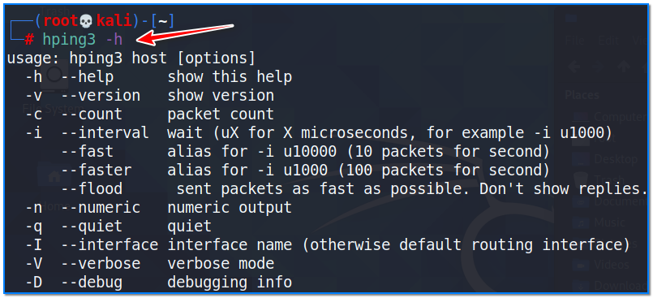
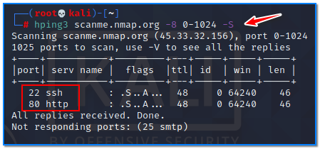
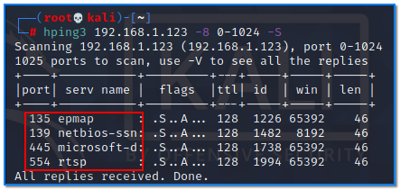
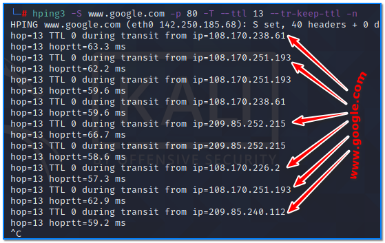
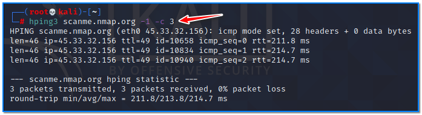
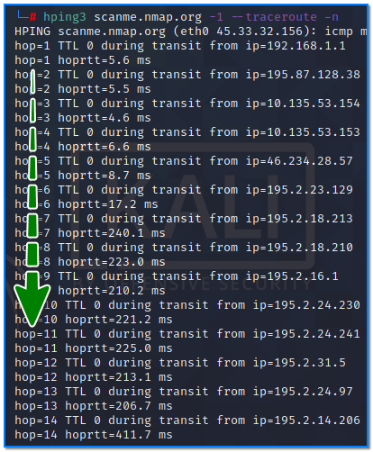
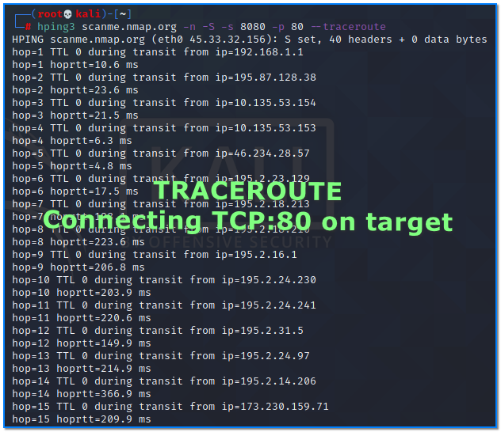
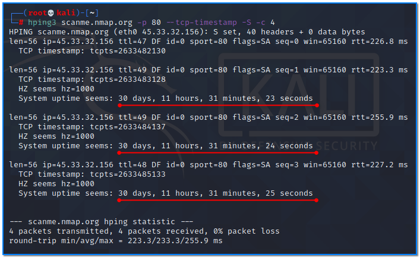

- [ ] Pasitikrinti ar viskas veikia

**Lab Objective:**

Learn how to use hping for security auditing and the testing of networking devices.

**Lab Purpose:**

Hping is an open-source packet generator and analyser for the TCP/IP protocol. It is often referred to as a swiss army knife, as it can perform a lot of packet-related functions for security testing and auditing.

**Lab Tool:**

Kali Linux

**Lab Topology:**

We will use Kali Linux for this lab. hping3 command requires root privileges to work. First of all, we have to become the “root” user using the terminal:

sudo su –

In this lab we need another “victim” machine to make connections through. We can use [scanme.nmap.org](http://www.scanme.nmap.org/) as a target host on the internet. This site has been developed by NMAP for the purpose of scanning. Never scan any site, system, or network without prior permission from the owner.

If you have no internet connection during hping testing, you may consider installing a Kali or Ubuntu VM on your own working PC.

**Lab Walkthrough:**

### Task 1:

We will begin by viewing the help information screen by executing the following command:

hping3 -h

The default packet which hping will create is a TCP packet. This means that even if a device such as a router or firewall is blocking ping requests, we can still perform host discovery and reconnaissance with hping.

We will perform our first scan using the SYN flag. This will send out the same packets as nmap would when performing a -sS scan. We will also check if port 80 is open. “-c 5” parameter tells us that this scan will only be repeated 5 times. Type the following command:

hping3 scanme.nmap.org -p 80 -S -c 5

Note that, in my scan, the packets came back with the flags “SA” set. This indicates that the port is open. If the flag were set to “RA”, the port would be closed.

### Task 2:

Create a SYN package and use scan mode to scan port 1 through 1000 on these targets. “-8” puts hping command to sweep-scan mode.

hping3 scanme.nmap.org -8 1-1024 -S

hping3 192.168.1.123 -8 1-1024 -S

In these two examples, we scanned two different machines. As a result of both scans, the ports that are detected as open give us some information about the operating systems of the machines. We can roughly say that the first is Linux OS and the second is Windows.

### Task 3:

If we want to perform a more detailed scan, we can scan all the ports beginning with 1. We can do this by adding the increment switch (++1) after the port switch and the port number where we want the scan to begin.

hping3 -S 139.162.196.104 -p ++1

### Task 4:

Nowadays, many websites which are heavily accessible use multiple servers to meet incoming requests. For example, a web request to www.google.com is handled by more than one server. In order to learn the IP addresses of these servers that are behind the DNS, type this command:

hping3 www.google.com -S -p 80 -T –ttl 13 –tr-keep-ttl -n

In this case, we used the TTL in traceroute to obtain some of the load-balancing devices’ IP addresses.

### Task 5:

We can use hping command as a ordinary ping tool. “-1” parameter indicates that this is an ICMP package.

Traceroute to a target using ICMP mode and show verbose.

hping3 scanme.nmap.org -1 –traceroute -n

Hping also improves on the traceroute ability. Traceroute uses ping to determine the location of servers, firewalls, routers etc. This can be very useful for hackers looking to create a network map of their target. For this reason, many firewalls do not respond to ping packets. Hping does the same thing but can also use TCP packets instead of ICMP, which all firewalls will allow (otherwise, it would not allow internet traffic). Let’s try this now:

hping3 scanme.nmap.org -n -S -s 8080 -p 80 –traceroute

Traceroute to determine if port 80 is open, set local traffic to be generated from source port 8080.

### Task 6:

Hping can be used to tell us how long a server has been up. This is useful information for a hacker as each time a server is patched or updated, it must also be rebooted. If we see that a server is up for 5 years, we can be sure that the server has not been patched or updated in that time, and that it therefore will be vulnerable to all vulnerabilities discovered during that timeframe. We can do this using the following command:

hping3 scanme.nmap.org -p 80 –tcp-timestamp -S -c 4

Note: This will not work on a Kali Linux VM with NAT settings enabled.

### Task 7:

To start a SYN flood attack, run the command bellow.

hping3 scanme.nmap.org -S –flood -p 80

When running the commands, hping3 will not show any output; it is working in the background.