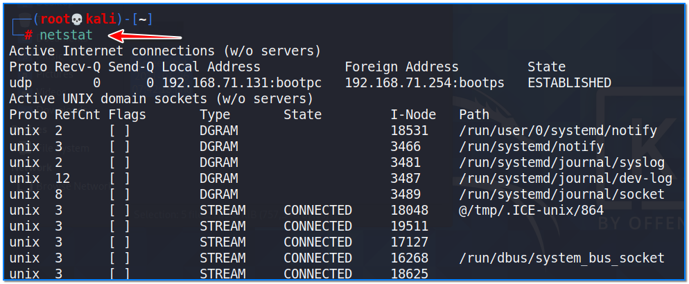
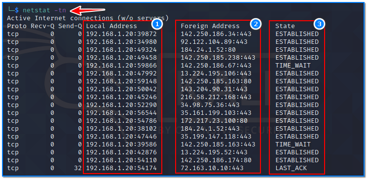
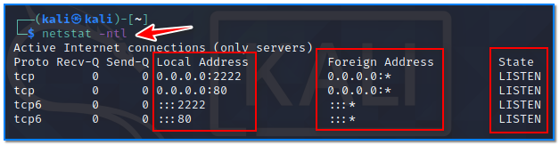
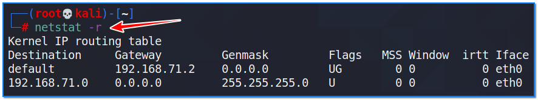
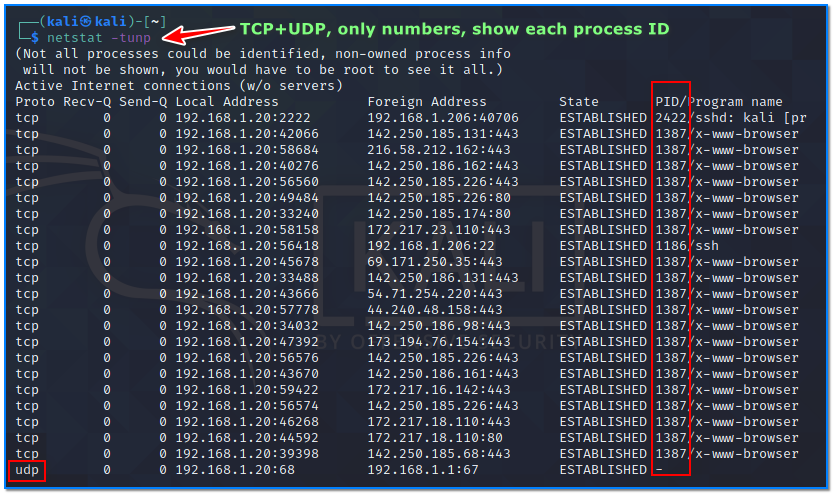
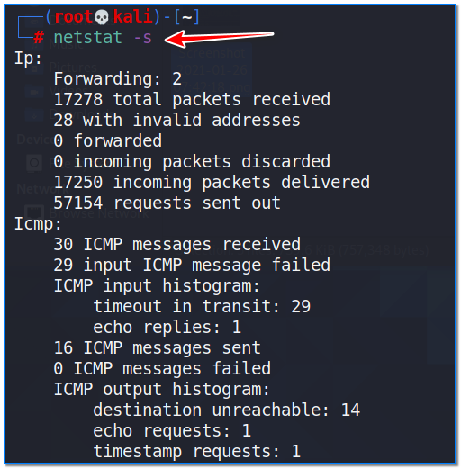

- [ ] Pasitikrinti ar viskas veikia

**Lab Objective:**

Learn how to use netstat to view networking information.

**Lab Purpose:**

Netstat is a command line tool which let’s you print network connections, routing tables, interface statistics, masquerade connections, and multicast memberships.

**Lab Tool:**

Kali Linux

**Lab Topology:**

You can use Kali Linux for this lab. Some netstat command features may requires privileges to work. First of all, we have to be the “root” user using the terminal:

sudo su –

**Lab Walkthrough:**

### Task 1:

We will begin by viewing the help information screen by executing the following command:

netstat -h

We will then view all active connections by typing the following:

netstat

### Task 2:

We can use netstat to display both local and foreign addresses in numeric IP form using the “-n” parameter.

netstat -n

If we want to view only TCP connections, we need to add the “-t” parameter.

netstat -t

Similary, if we want to view only UDP connections, we need to add the “-u” parameter.

netstat -u

We can combine and operate multiple parameters in a single command as follows;

netstat -nt

Let’s look at the figure;

1) This area shows our local IP address and port number for each connection.

2) This field shows our remote IP address and port number for each connection.

3) This area displays the TCP / UDP status of each connection;

LISTEN: represents waiting for a connection request from any remote TCP and port.  
SYN-SENT: represents waiting for a matching connection request after having sent a connection request.  
SYN-RECEIVED: represents waiting for a confirming connection request acknowledgment after having both received and sent a connection request.  
ESTABLISHED: represents an open connection, data received can be delivered to the user.  The normal state for the data transfer phase of the connection.  
FIN-WAIT-1: represents waiting for a connection termination request from the remote TCP, or an acknowledgment of the connection termination request previously sent.

FIN-WAIT-2: represents waiting for a connection termination request from the remote TCP.  
CLOSE-WAIT: represents waiting for a connection termination request from the local user.  
CLOSING: represents waiting for a connection termination request acknowledgment from the remote TCP.  
LAST-ACK: represents waiting for an acknowledgment of the connection termination request previously sent to the remote TCP (which includes an acknowledgment of its connection termination request).  
TIME-WAIT: represents waiting for enough time to pass to be sure the remote TCP received the acknowledgment of its connection termination request.  
CLOSED: represents no connection state at all.

### Task 3:

netstat allows us to view only connections which are listening. We can do this by typing this command:

netstat -ntl

“0.0.0.0” in the local address column indicates all IP addresses that are listening. “0.0.0.0:*” in the foreign address column indicates everyone and all ports in the IP space. In the last lines, it shows that we are in a state of listening for each connection.

### Task 4:

We can view the kernel routing table by using the following command:

netstat -r

Note: netstat -r and route -e product the same result.

### Task 5:

We can make netstat show us the process IDs and where they belong by using the following command:

netstat -tunp

This command shows only TCP and UDP traffic with their associated process IDs. Displays IP addresses and port numbers as numbers.

We get more details if the last command is used with the -e parameter;

netstat -tunpe

### Task 6:

We can display high level statistics by using the following command:

netstat -s

