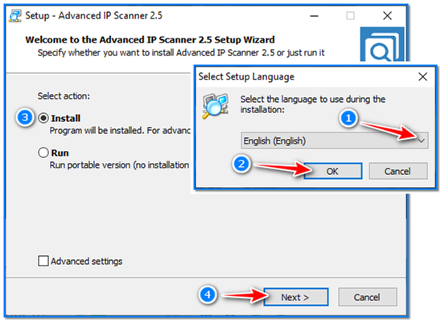
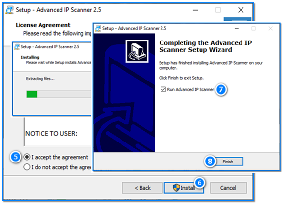
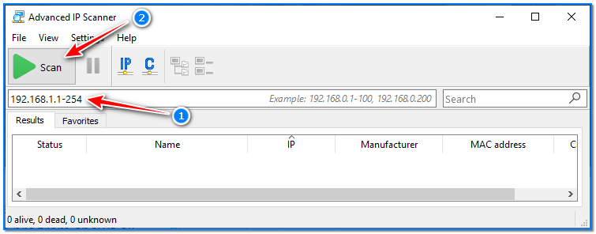
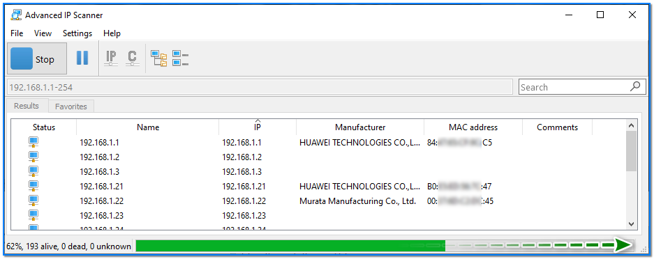
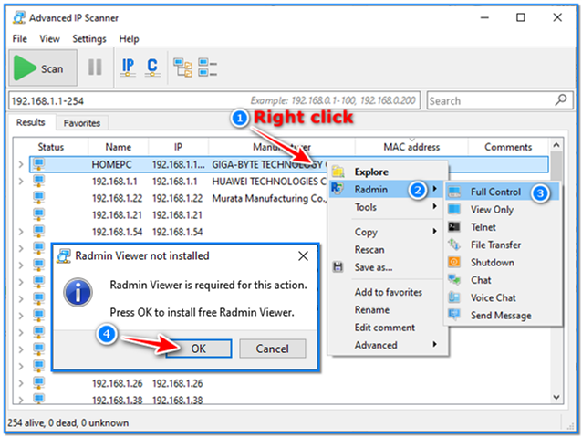

- [ ] Pasitikrinti ar viskas veikia

**Lab Objective:**

Learn how to use IP Scanners for network reconnaissance.

**Lab Purpose:**

IP scanners are tools which scan and monitor your network. They are often used by administrators for discovering devices on a network as well as remotely managing these devices.

**Lab Tool:**

Windows

**Lab Topology:**

You can use Windows for this lab.

**Lab Walkthrough:**

### Task 1:

We will be demonstating how to use an IP scanner on a Windows machine in this lab. To begin, download the following IP scanner:

[https://www.advanced-ip-scanner.com/](https://www.advanced-ip-scanner.com/)

### Task 2:

Now, double click the downloaded file and complete the installation in the order shown in the figures.

### Task 3:

This will scan our network and pick up on all devices connected to the network. It will display information such as each device’s IP address and MAC address.

Enter your subnet range in the space. If you do not know said range, simply hit the scan button.

When the scan is complete, the nodes detected on the network will be listed together with their MAC and IP addresses.

### Task 4:

This tool can then be used to connect and remotely manage any of these devices. To do this, simply select the device you would like to manage. You will be asked to install another tool called Radmin, which will allow you to contol the other devices on your network. Click yes and install it.

Note: to successfully control a device on your network, you will need to have a Radmin server running on that device.

There are a lot of useful functions admins can perform when taking control of a device on their network using this tool, such as taking full control, read-only control, connecting via Telnet, file transfer, shutting down the device, and chatting via both text and voice.

This tool is useful for network administrators as it can both manage devices and pick up on any rouge devices present on their network.

### Task 5:

IP scanners can also be installed on Linux. The most popular of these is called Angry IP Scanner, or simply ipscan. It is open source and provides the same functionality as the above IP Scanner. It can be downloaded for Windows, Mac, and Linux from the following link:

[https://angryip.org/](https://angryip.org/)