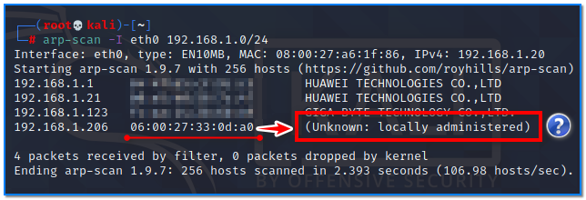

- [ ] Pasitikrinti ar viskas veikia

**Lab Objective:**

Learn how to use the ARP command for network reconnaissance.

**Lab Purpose:**

ARP stands for the Address Resolution Protocol. Its purpose is to map IP addresses to MAC addresses. ARP is effective in finding all network-connected devices as you cannot block ARP.

Network scanning activities may generate high level alarms in firewalls when you are running on your local network. For this reason, it is recommended that you inform your security/network administrator before starting the scan.

**Lab Tool:**

Kali Linux

**Lab Topology:**

You can use Kali Linux in a VM for this lab. Some command features require higher privileges to work. First of all, we have to be the “root” user using the terminal:

sudo su –

**Lab Walkthrough:**

### Task 1:

Arp-scan is the tool we will be using for the purpose of this lab and it comes pre-installed on Kali Linux. To begin, we will first look at the help screen for this tool by typing the following:

arp-scan -h

This will tell us a bit about the tool and provide us with some common tags we can use.

### Task 2:

We will now conduct a complete scan of our local network. We will need to run the arp-scan as “root” to do this. Type the following command:

arp-scan –localnet

If you receive an error during this scan, double check that you are running it as root.

Let’s take a look at the figure.

As a result of the scan, we detected 4 different network-capable devices. We can see their MAC addresses and their corresponding IP addresses in columns 2 and 3. The first 3 segments of MAC addresses are assigned to hardware manufacturers by IEEE. arp-scan creates vendor information in column 4 by comparison from its own database.

The last 3 segments in the MAC address are defined specifically for the interface card produced by that manufacturer. They are permanently written into interface cards. However, it is still possible to temporarily change these addresses at the software level. As a matter of fact, arp-scan has the option to change the MAC address for the selected card, which we will see later in this lab. The MAC address of the network card used for querying is indicated at number 5 in this figure.

Since MAC addresses have to be globally unique, copying them can cause problems, so they are blurred.

### Task 3:

To specify the interface and subnet which you want to scan the network with and for, use the “-I” option followed by the name of the interface you want to use. Here is what that would look like:

arp-scan -I eth0 192.168.1.0/24

In this scan, we have specified that we want to use the eth0 interface and we want to scan a specific subnet. The IP address assigned to the interface card does not have to be in the subnet to be scanned. It doesn’t even need to be assigned an IP. See figure below:

### Task 4:

If the interface is configured as trunk, it is possible to scan on specific VLAN. Example for VLAN 10;

### Task 5:

If you find unknown devices as a result of an arp scan, they are not necessarly rouge devices. It simply means that the MAC adress is not in the arp-scan vendor databases. To identify these devices, you can use an online MAC finder site.

You can also update the arp-scan databases by executing the following commands:

cd /usr/share/arp-scan

get-iab -v -u [http://standards.ieee.org/develop/regauth/iab/iab.txt](http://standards.ieee.org/develop/regauth/iab/iab.txt)  
get-oui -v -u [http://standards.ieee.org/develop/regauth/oui/oui.txt](http://standards.ieee.org/develop/regauth/oui/oui.txt)

If there are cards in your network whose MAC addresses have been changed intentionally, you can manually add a line to “/usr/share/arp-scan/mac-vendor.txt” file to identify them. For our example:

060027          SPOOFED-NIC TECHNOLOGIES LLC

### Task 6:

If we want to analyze the responses from the scanned devices later with analysis tools such as tcpdump, wireshark, it is possible to save them in a separate file.

arp-scan –localnet -W results.pcap  
tcpdump -nr results.pcap

There are many things that an ARP scan can uncover, making it a very useful tool, including the following:

- Discovery of all IPv4 network-connected devices.
- Quickly identify and map IP addresses to MAC addresses.
- Find duplicate IP addresses.
- Isolate and locate rogue devices.

Identify devices by NIC vendor.