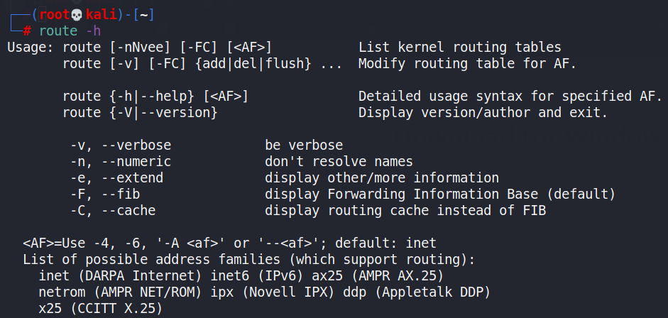
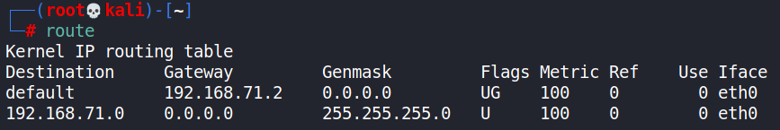
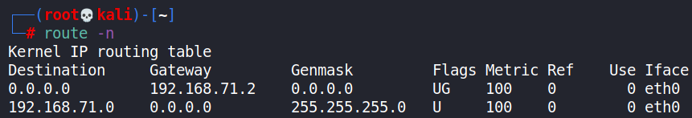
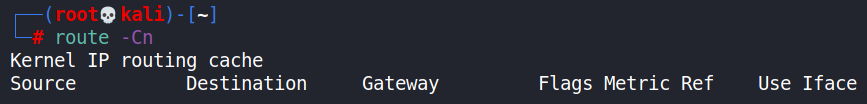
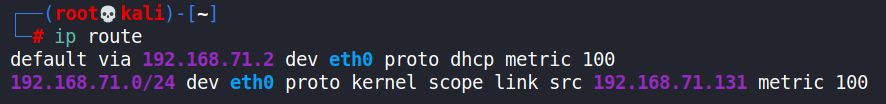
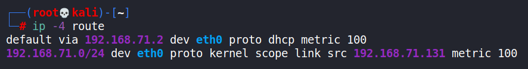
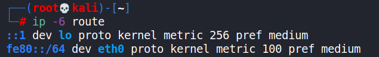

- [ ] Pasitikrinti ar viskas veikia

**Lab Objective:**

Learn how to use the route command to display network information on Linux.

**Lab Purpose:**

Route is used when you want to work with the IP/kernel routing table. It is typically used to setup static routes to specific networks of hosts via an interface. It is used for updating or showing the IP/kernel routing table.

**Lab Tool:**

Kali Linux

**Lab Topology:**

You can use Kali Linux in a VM for this lab.

Some route command features may require high privileges to work. First of all, we have to be the “root” user using the terminal:

sudo su –

**Lab Walkthrough:**

### Task 1:

In order to use route, you may need to install it. It comes in a package called net tools, and it can be installed on Kali Linux with the following command:

Sudo apt-get install net-tools

Once this is installed, we will first view the help screen using the following command:

route -h

We will then use a simple command to view our IP/kernel routing table:

route

### Task 2:

If we want to display the previous routing table in ful numeric form, we can use this command:

route -n

This is useful for more accurately determining values in the routing table.

### Task 3:

We can add a default gateway by executing the following command:

route add default gw xxx.xxx.xxx.xxx

Replace the x’s with the your gateway IP. This assigns a gateway address through which all packets that do not belong to the network are forwarded.

### Task 4:

To view the kernel’s routing cache information, we can use the following command:

route -Cn

The cache is used to route the packets faster. This command will print all saved cache information.

### Task 5:

We can specify to reject routing to a specific host or network using this command:

route add -host 192.168.1.51 reject

If we attempt to ping the above IP address, we will be presented with a “Network is unreachable” notice.

### Task 6:

If we want to get the details of the kernel/IP routing table, we can use the following ip command:

ip route

This will detail the kernel/IP routing table.

### Task 7:

In some instances, we may wish to delete the default gateway, which we can achieve by running this command:

route del default

NOTE: this may lead to some malfunctioning of your internet connection and it is important you take note of your default gateway before executing this command.

### Task 8:

To get the output in relation to IPv4 and IPv6, we can use the following commands respectively:

ip -4 route

The above will display the entries with IPv4 only

ip -6 route

The above will display the entries with IPv6 only

