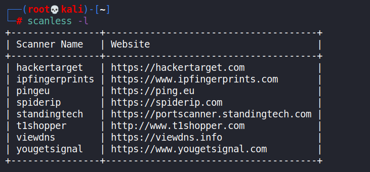
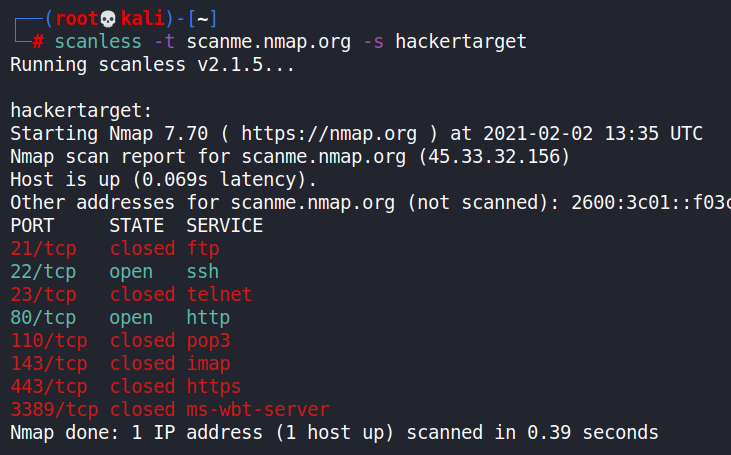
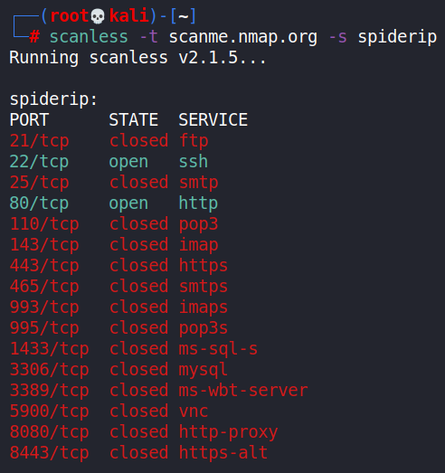
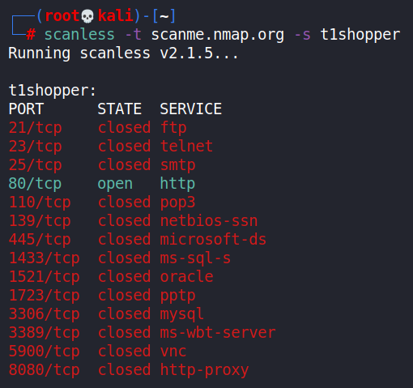
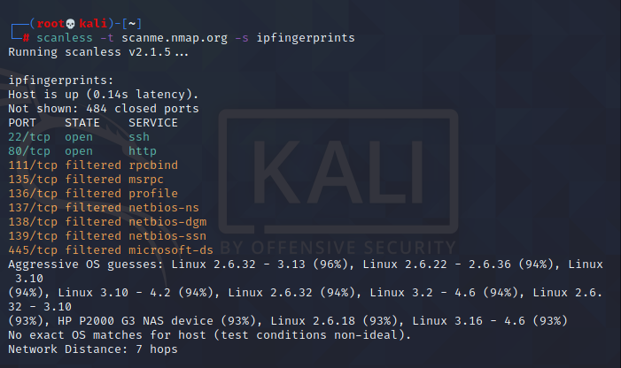

- [ ] Pasitikrinti ar viskas veikia

**Lab Objective:**

Learn how to use Scanless to anonymously scan a target.

**Lab Purpose:**

Scanless is a script which makes use of online scanners to allow you to scan a target anonymously. It provides a number of scanners which you can use to scan your target. The different scanners will prioritise different ports, making it worthwhile to run a number of scans using the different tools.

**Lab Tool:**

Kali Linux

**Lab Topology:**

You can use Kali Linux in a VM for this lab.

**Lab Walkthrough:**

### Task 1:

We will need a tool called pip to download this tool. You may already have it installed, but if not, use the following command to install it:

sudo su –

apt install pip

Once pip is installed, we can easily install the scanless tool. Simply type the following:

pip install scanless

The tool will install quickly. After the installation, for the changes to take effect, close the current terminal and open a new one. Be root user before continuing to futher tasks.

### Task 2:

We will begin by first viewing the help screen by typing the following:

scanless -h

We will then look at the list of scanners available to use by typing the following:

scanless -l

This will list the different scanners and the sites where they are available.

### Task 3:

You can set the target you wish to scan with a command such as the following:

scanless -t [Target hostname or IP] -s [Scanner Name]

We can select one of the scanner types we listed in the previous command and place it in square brackets. It is important you have root permission from the target before you initiate a scan.

Also, you can use the following site as a target as it has been setup for the purpose of scanning:

scanme.nmap.org

We will now run through a number of scans using different tools to determine how each tool priortises different ports. Here is a scan using the tool “hackertarget”:

scanless -t scanme.nmap.org -s hackertarget

This is a scan using spiderip:

scanless -t scanme.nmap.org -s spiderip

This is a scan using t1shopper:

scanless -t scanme.nmap.org -s t1shopper

Each of these tools will priortise scanning for different ports and, as such, they will provide different information.

Unlike others, “ipfingerprints” also estimates OS for the target, and reports results with estimation percentages.

scanless -t scanme.nmap.org -s ipfingerprints

### Task 4:

If we want to use all of the scanning tools available to us to get a more comprehensive scan of the target, we can use the following command:

scanless -t scanme.nmap.org -a