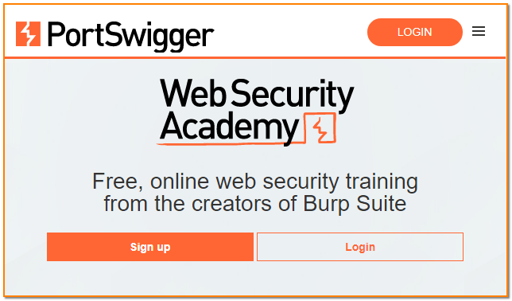
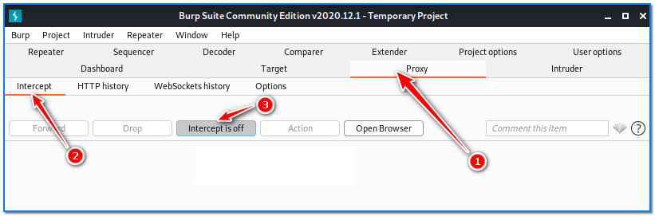
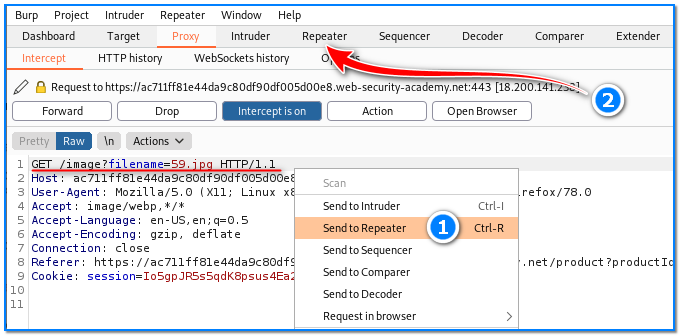
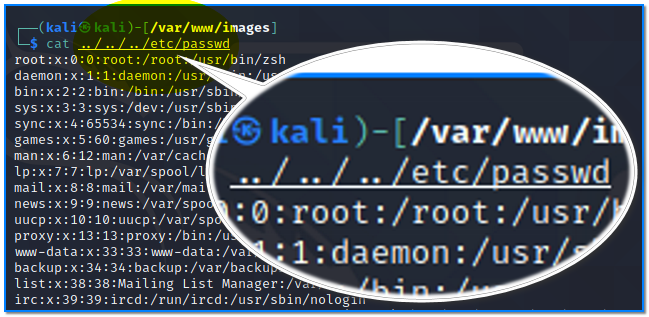
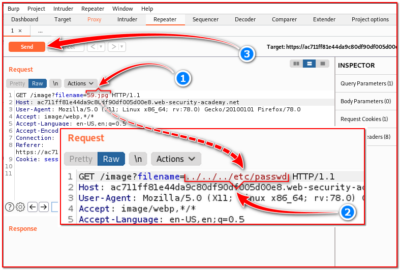
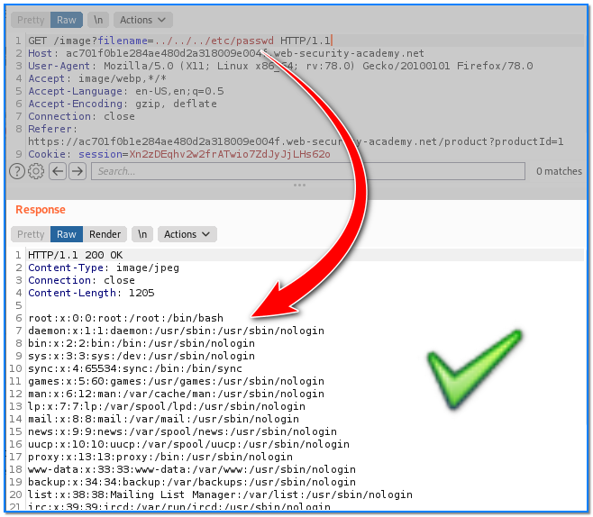
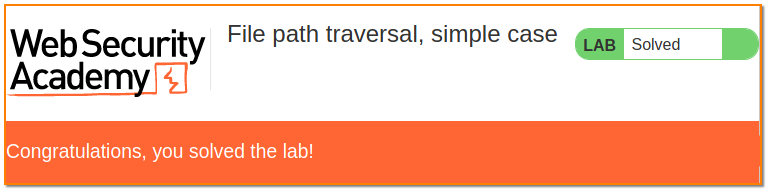

- [ ] Pasitikrinti ar viskas veikia

**Lab Objective:**

Learn how to test a site for a directory traversal vulnerability.

**Lab Purpose:**

A directory traversal vulnerability is when a site sends a request for a file, say an image, to the webserver and this request can be captured by an attacker. They can then manipulate this request to navigate out of the directory where the image is stored into another directory. This allows the attacker to move through the webserver and look at the different files stored there.

**Lab Tool:**

Kali Linux or Windows

**Lab Topology:**

You can use Kali Linux in a VM or Windows for this lab.

**Lab Walkthrough:**

### Task 1:

We will be using Burp Suite for this lab. It comes pre-installed on Kali Linux but may need to be updated using the command: sudo apt upgrade burpsuite

We strongly recommend you look at a previous lab, lab 7, we did on Burp Suite.

### Task 2:

In this lab, we will be using the Port Swigger Web Security Academy in order to demonstrate a directory traversal vulnerability. They provide some vulnerable labs where you can practice these skills. You will need to signup (for free) in order to do this:

https://portswigger.net/web-security

### Task 3:

Start Burp Suite. Turn intercept mode off. Then, login into https://portswinger.com with your credentials.

Start the path-traversal-lab there:

https://portswigger.net/web-security/file-path-traversal/lab-simple

Once you have started the lab, you will be presented with a fake shop, as depicted in the screenshot.

Our goal for this lab is to take advantage of a directory traversal vulnerability in order to read the “/etc/passwd” file.

### Task 4:

We can now begin our attack. With Burp Suite open and intercept enabled, click on one of the products in this fake shop.

Click the forward button until you get the page in the figure below:

Once you capture this request, you should right-click and press “Send to Repeater”. This will allow us to send the request and analyse the server’s response in real-time. Navigate to the Repeater tab and continue with the next steps.

Notice the first line where the webpage is requesting the image file from the webserver? This is where we will perform our directory traversal attack.

You should know that ../ is used to step up through a directory in both Windows and Linux. The image file here is stored in the directory /var/www/images. If we want to escape out of the /images directory and access the /www directory, we can use ../ to do this.

Similarly, we can use ../../../ to escape out of the /images directory, then out of the /www directory and finally out of the /var directory. We will then be in the root directory.

Since we are in the root directory, we can now request any file we like from the webserver, as long as we know its location. The “passwd” file is stored in the following location: /etc/passwd.

### Task 5:

So, in order to access the root directory and then the passwd file, this is the full path we want to specify:

../../../etc/passwd

We will replace the 48.jpg file in the request above with this path, and the webserver will respond with the file we requested. This looks like the following:

Click the Send button on the up-left side to send this request to the webserver. You will see the following response on the right side of the screen.

As you can see, we were successful in accessing the passwd file and have now completed the lab.

