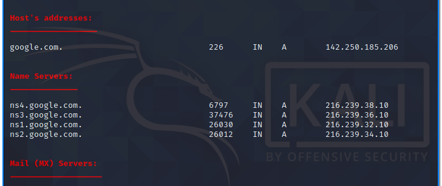
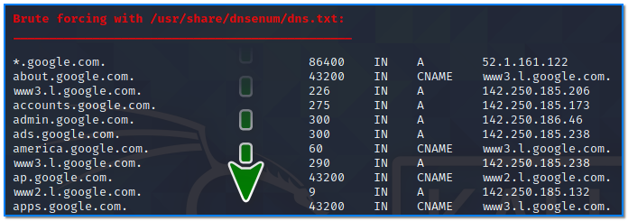
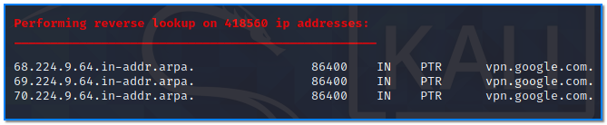
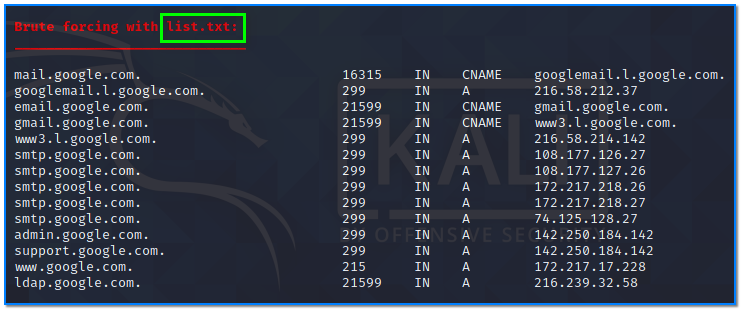
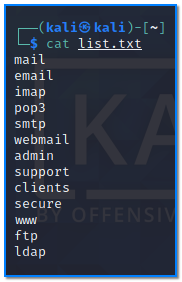

- [ ] Pasitikrinti ar viskas veikia

**Lab Objective:**

Learn how to gather DNS information on a target using dnsenum.

**Lab Purpose:**

Dnsenum is a tool used for the locating of all DNS servers and DNS entries for a target. DNS enumeration is an important tool to have as it allows us to gather critical information about the organisation, such as usernames, computer names, IP addresses, etc.

**Lab Tool:**

Kali Linux

**Lab Topology:**

You can use Kali Linux in a VM for this lab.

**Lab Walkthrough:**

### Task 1:

Dnsenum comes pre-installed on Kali Linux, so we will begin by looking at the help screen for this tool by using this command:

dnsenum -h

Our first target will be google.com. To perform a comprehensive DNS enumeration on this site, use the following command:

dnsenum -enum google.com

This will perform a comprehensive information gathering scan on the domain google.com. It will provide us with information such as the different host IP addresses, name servers, mail servers, sub domains, and will even attempt some domain takeovers.

It will also perform automatic brute forcing of some of the most common subdomains, such as admin.google.com, and provide you with this information. This is very useful information as it gives you a better idea of the attack surface of a target.

### Task 2:

We can also perform a brute force search for all subdomains associated with a site by using a custom file. This allows us to search for any subdomains we deem to be valuable. This can be done using the following sample command:

dnsenum -f list.txt -r google.com

