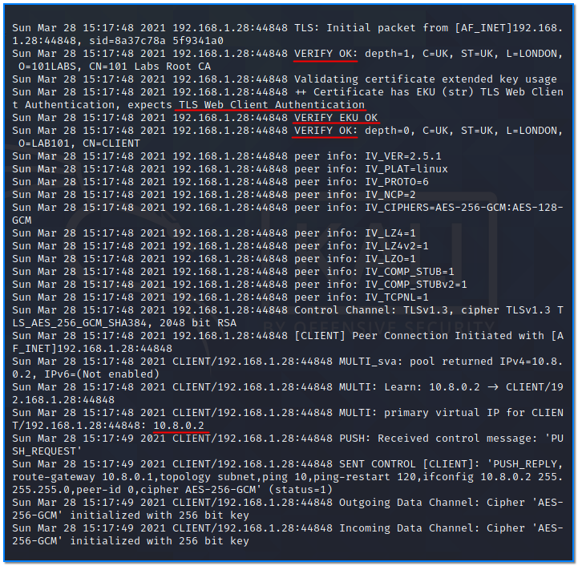

- [ ] Pasitikrinti ar viskas veikia

**Lab Objective:**

Learn how to use OpenVPN to connect to an internal network.

**Lab Purpose:**

OpenVPN is an open-source VPN protocol and VPN software which enables us to establish secure VPN connections. It is a very secure protocol and is offered by most VPN providers for this reason. It works across multiple platforms, making it a versatile and useful tool.

**Lab Tool:**

Kali Linux

**Lab Topology:**

You can use a Kali Linux VM for this lab. In this lab we need another Linux machine to make VPN connections through. You can find a prebuilt Ubuntu Server image on [https://www.osboxes.org/ubuntu-server/](https://www.osboxes.org/ubuntu-server/) for this purpose.

Download and import to your virtualization platform and run.

**Lab Walkthrough:**

### Task 1:

First, we will set up a newly created Ubuntu Linux machine as a OpenVPN server and establish a simple one-to-one connection. We will design the Kali Linux VM machine as a local, and the Ubuntu Linux VM as a VPN server that we will connect to. Both have a direct connection to the internet for now.

First, we open a terminal window from the Kali Linux machine and connect to the Ubuntu Linux machine via SSH:

ssh osboxes@192.168.1.206

In this instance, the IP address of our Ubuntu Linux machine is 192.168.1.206.

Then we update the OpenVPN package:

sudo apt update  
sudo apt upgrade openvpn

This command will find the package with its dependent packages from repos on the internet and install it on the machine if the package is not installed. If there is an old version, it will find and install the most recent version. Let’s see which version installed on our Ubuntu VM:

openvpn –version

Since following processes will require privileges, we will switch to root user.

sudo su –

OpenVPN’s settings files are located under the “/etc/openvpn” folder. There are two empty folders named “server” and “client” here. Since we will configure Ubuntu as a VPN server, we will create all our files under the “server” directory. Copy the text lines below in the grey box and paste them into the terminal screen of Ubuntu. Then, hit enter.

|   |
|---|
|cat << EOF > server.conf  local 192.168.1.206  port 1194  proto udp4  dev tun  keepalive 10 120  topology subnet  server 10.8.0.0 255.255.255.0  verb 3  auth-nocache  user nobody  group nogroup  explicit-exit-notify.  auth SHA512  persist-key  persist-tun  cipher AES-256-GCM  tls-server  remote-cert-eku “TLS Web Client Authentication”  ca ca.crt  cert server.crt  key server.key  tls-crypt tc.key  dh none  EOF|

A new file named “server.conf” should have been created here. Let’s check the file content:

cat server.conf

Let’s see what some of the lines do.

On the top line we see:

local 192.168.1.206

This is our server’s IP address. We will connect to this IP address via VPN from client machine.

The next two lines indicate the communication protocol and port number. This comes by default in a newly installed OpenVPN. This setting should be the same on both the server and the client.

port 1194  
proto udp4

The subnet information of our network, which will be established end-to-end as encrypted, is specified in the following lines:

topology subnet  
server 10.8.0.0 255.255.255.0

By default, this subnet comes as 10.8.0.0/24, but if there is a subnet conflict in the current network, we can change it.

user nobody

group nogroup

These two lines specifies the user and group that will owner the “OpenVPN” process.

cipher AES-256-GCM

This line shows the preferred mechanism for encryption. It should be the same on both the server and the client.

tls-server

Indicates the TLS in this machine will be in server role.

remote-cert-eku “TLS Web Client Authentication”

An attribute that we require to see in the client certificate. Otherwise, we will be denied to connect our server.

ca ca.crt

Root certificate file. OpenVPN will use this as a reference to verify the client’s certificate signature. We will create this in our next lab.

cert server.crt  
key server.key

The certificate and key pair OpenVPN will use when communicating with client. We will create it later.

tls-crypt tc.key

OpenVPN will use this when encrypting and authenticating all control channel packets.

dh none

File containing Diffie Hellman parameters in pem format (required for tls-server only). We will not create such a file in this instance.

OpenVPN has many other parameters, but since explaining them one by one will be beyond the scope of this lab, we have only explained the most necessary ones.

### Task 2:

In the previous task, we saw some external files in the config file. OpenVPN will not work until these are created. We will produce them in this mission.

Be sure we are working in this directory: “/etc/openvpn/server”

Update the openssl package:

apt upgrade openssl

First, we must create a certificate and key file of Root Certificate Authority (Root CA). Copy and paste the text below into the terminal screen in one line:

|   |
|---|
|openssl req -x509 -newkey rsa:4096 -keyout ca.key -sha256 -days 3650  -set_serial 00 -out ca.crt -subj “/C=UK/ST=UK/L=LONDON/O=101LABS/CN=101 Labs Root CA” -addext nsComment=”101 LABS Class 1 ROOT CA”|

You will be asked to enter a password twice. Set a strong password and write it down for future reference. We will use this password when signing server and client certificates later.

After a quick “openssl” command job, two files are created on same directory: ca.key and ca.crt. To get information about a certificate, use this command on the terminal screen:

openssl x509 -in ca.crt -text -noout

Observe information areas. Our Root certificate is for 10 years. It has an encryption depth of 4096 bits. It takes more time to generate a higher bit depth certificate, but this gives us a harder key pair to crack. We will copy “ca.crt” file to the client to use openvpn operations.

Then, copy and paste the text below to terminal screen:

|   |
|---|
|cat << EOF > x509-extensions.cnf  [v3_vpn_server]  basicConstraints = CA:FALSE  subjectKeyIdentifier = hash  authorityKeyIdentifier = keyid,issuer:always  extendedKeyUsage = serverAuth  keyUsage = digitalSignature,keyEncipherment  nsComment= “OpenVPN Server Signed Certificate”  [v3_vpn_client]  basicConstraints = CA:FALSE  subjectKeyIdentifier = hash  authorityKeyIdentifier = keyid,issuer:always  extendedKeyUsage = clientAuth  keyUsage = digitalSignature,keyEncipherment  nsComment= “OpenVPN Client Signed Certificate”  EOF|

This will create a file named “x509-extensions.cnf”, which we will use later.

This file contains two separate configs. The first holds the server certificate attributes, while the second holds the client certificate attributes. OpenVPN will look into this info during operation.

### Task 3:

Let’s create a server certificate and key pair, and sign with our Root CA key. Copy and paste the text below to the terminal screen in one line:

|   |
|---|
|# Create a Certificate Signing Request (CSR) with Key for OpenVPN Server  openssl req -new -newkey rsa:2048 -nodes -keyout server.key  -out server.csr -subj “/C=UK/ST=UK/L=LONDON/O=LAB101/CN=SERVER”|

Two files, named server.csr and server.key, will be created. Observe information in the server.csr file:

openssl req -in server.csr -text -noout

As you can see, there is no expiry date. Only bit depth is specified. The expiry date and any other property of the certificate are permanently determined by the Root CA. Now, let’s give this server.csr file to the Root CA for signing. Copy and paste the text below to the terminal screen in one line:

|   |
|---|
|# Sign the CSR and create server.crt file which signed by Root CA  openssl x509 -req -in server.csr -CA ca.crt -CAkey ca.key  -set_serial 01 -sha256 -days 730 -text -out server.crt  -extensions v3_vpn_server -extfile ./x509-extensions.cnf|

You will be prompted for a password for the root CA. Now, check the directory again. We have server.crt file now. Let’s check signing and other information which is embedded by Root CA:

openssl x509 -in server.crt -text -noout

We see data similar to the root CA certificate. The parts that will be important during certificate validation are shown in colour in the figure. Note that “modulus” sections have been cropped to simplify the figure above.

### Task 4:

Finally, it is time to generate the client certificate and let the Root CA approve it. Copy and paste the text below to the terminal screen in one line:

|   |
|---|
|# Create a Certificate Signing Request (CSR) with Key for OpenVPN Client  openssl req -new -newkey rsa:2048 -nodes -keyout client.key  -out client.csr -subj “/C=UK/ST=UK/L=LONDON/O=LAB101/CN=CLIENT”|

Two files, named client.csr and client.key, will be created. Then, give client.csr file to the Root CA for signing. Copy and paste the text below to terminal screen in one line:

|   |
|---|
|# Sign the CSR and create client.crt file which signed by CA  openssl x509 -req -in client.csr -CA ca.crt -CAkey ca.key  -set_serial 02 -sha256 -days 365 -text -out client.crt  -extensions v3_vpn_client -extfile ./x509-extensions.cnf|

Again, you will be prompted for a password for the root CA. Now, check the directory. We should have a client.crt file now. Let’s check signing and other information which is embedded by Root CA:

openssl x509 -in client.crt -text -noout

We will use this certificate with associated keys on the Kali Linux machine, to use with OpenVPN. Copy those files to Kali Linux machine via the secure way, SCP.

### Task 5:

There is one file to be created in Ubuntu Server:

“tc.key”.

Copy and paste the command below to the terminal screen in one line:

openvpn –genkey –secret tc.key

Now, we have a “tc.key” file. Also, this file will be copied to the Kali Linux machine via a secure way.

What about the dh.pem file? Since we’ve configured all the certificates to use Elliptic Curve Cryptography, there is no need for a Diffie-Hellman seed file in this instance.

The server side of our OpenVPN installation is done!

### Task 6:

Now, we will prepare the OpenVPN client which is Kali Linux. We will follow the steps similarly to how we followed them while preparing the server. Open a terminal screen in Kali VM, then type this command:

sudo su –

Since following processes will require privileges, we switch to “root” user. We must then be sure that openssl and openvpn packages have been installed with the most up-to-date versions in the client’s machine:

apt install  
apt upgrade openssl openvpn

Remember, there are two empty directories in “/etc/openvpn”, named “server” and “client”, here. Since we will configure our Kali Linux machine as a VPN client, we will create all our files under the “client” directory. Copy the text lines below in the grey box and paste them into the terminal screen of Ubuntu. Then, hit enter:

|   |
|---|
|cat << EOF > client.conf  remote 192.168.1.206 1194 udp4  resolv-retry infinite  client  dev tun  nobind  verb 3  auth-nocache  user nobody  group nogroup  auth SHA512  persist-key  persist-tun  cipher AES-256-GCM  tls-client  remote-cert-eku “TLS Web Server Authentication”  ca ca.crt  cert client.crt  key client.key  tls-crypt tc.key  dh none  EOF|

A new file named “client.conf” should have been created here. Let’s check the file content;  
cat client.conf

See what some of the lines do:

On the top line, we see:

remote 192.168.1.206 1194 udp4

We will connect to this IP address or hostname given, via VPN from our Kali Linux machine. Port number and protocol type are placed at the end of the line.

resolv-retry infinite

Ensures it never gives up trying to connect to the server, and is useful for unreliable internet connections and laptops.

client

Tells openvpn to act as a client.

user nobody

group nogroup

These two lines specify the user and group that will be the owner of the “openvpn” process.

cipher AES-256-GCM

This line shows the preferred mechanism for encryption. It should be the same on both the server and the client.

tls-client

Indicates that the TLS in this machine will be in the client role.

remote-cert-eku “TLS Web Server Authentication”

Attribute that we require to see in the server certificate. Otherwise, we will be denied connection to the remote server.

The remaining parameters have been explained in Task 1.

### Task 7:

Now, let’s copy the other files mentioned in the “client.conf” file to our Kali machine. The first is the “ca.crt” file, which we created in Task 1. We also created the client certificate and key pair in Task 4, and the tc.key file in Task5. We will send them all to our Kali machine with scp.

Start SSH service in the Kali machine with this command in the terminal:

sudo systemctl start ssh

Switch to the Ubuntu Linux machine’s terminal screen. Be sure we are in the “/etc/openvpn/server” directory, as our created files are left in there. Type these commands to transfer the files to the Kali machine:

cd /etc/openvpn/server

sudo scp ca.crt client.crt client.key tc.key kali@192.168.1.28:~/

In this instance, our Kali machine has an IP address of 192.168.1.28; replace this with yours.

All four files are transferred to the Kali machine in a secure way. Then, move the files to the “/etc/openvpn/client” directory in the Kali machine. Change ownership to root user and be sure they have proper access modes. As you can see, all our “key” files must be private except root user.

sudo mv -f ca.crt client.crt client.key tc.key /etc/openvpn/client/  
cd /etc/openvpn/client/  
sudo chown root: *  
sudo chmod 0600 *.key

Since we have these certificates, the VPN server we will connect to will not ask for any other

credentials.

The client side of our OpenVPN installation is done!

### Task 8:

Now, time to connect the two machines with VPN. Switch to server machine (Ubuntu), type these commands on the terminal screen:

cd /etc/openvpn/server  
sudo openvpn –config server.conf

cd /etc/openvpn/server  
sudo openvpn –config server.conf

sudo openvpn –config client.conf

Our OpenVPN client has started successfully. 10.8.0.2 is our virtual IP address, which is attached to tun0 interface. Logs show that all certificates have been signed by authorized Root CA and has required attributes such as “TLS Web Server Authentication”.

Now, try to ping the other side. Open a separate terminal screen, then type these commands:

After the connection is established, logs like the following are generated on the VPN server side:

If connecting to an internal network, such as that of a hacking site like HackTheBox or TryHackMe, we will need an OpenVPN package file. Many VPN servers will provide the client.conf file specially prepared for their system for their convenience.