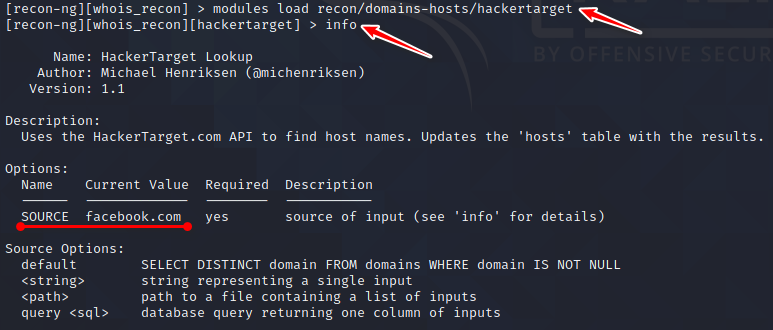

**Lab Objective:**

Learn how to find WHOIS information on a target domain-name with Recon-ng.

**Lab Purpose:**

WHOIS information can consist of location, registration and expire dates, contact information (email, phone numbers, etc.) and more about domain-name. The purpose of this lab is to use recon-ng to automate the discovery of this information.

**Lab Tool:**

Kali Linux

**Lab Topology:**

You can use Kali Linux in a virtual machine for the purpose of this lab.

**Lab Walkthrough:**

### Task 1:

Begin this lab by opening Kali Linux within your virtual machine. Then, as root user, open a terminal and type:

recon-ng

### Task 2:

recon-ng offers the opportunity for users to create different workstations based on their project needs. For this lab, we will be gathering WHOIS information. So, create a new lab by typing the following:

workspaces create whois_recon

### Task 3:

We will begin by gathering WHOIS information about a target domain-name. Since WHOIS information is available to anyone, it is ok to do this for any domain. The domain we will be targeting is, once again, “facebook.com”, but you can do this lab for any other domain you wish.

We will need to install modules from the marketplace to search for WHOIS information. We will begin by searching WHOIS for all related information regarding a target site. To do this, we first need to install the WHOIS search module. To do this, type:

marketplace search whois

We want to install the fourth option, which is “recon/domains-contacts/whois_pocs”. To do this, type:

marketplace install recon/domains-contacts/whois_pocs

To begin searching, we first need to set the source by typing:

options set SOURCE facebook.com

To load the module for use, type:

modules load recon/domains-contacts/whois_pocs

Then, to see information about this module and how it is used, type “info” and hit enter.

We are now ready to search WHOIS for information regarding “facebook.com”. Simply type “run” and hit enter to begin the search.

As you will see, various contact and location information will show up for facebook.com. This information will be automatically saved in our workstation.

### Task 4:

We will now attempt to discover as many subdomains as possible, with their IPv4 address for facebook.com, using HackerTarget.com API. We will need to import the “hackertarget” module, as we did previously for whois_pocs.

Before we do this, you should first type “back” and press enter to quit out of the whois_pocs module. We will begin by searching the marketplace for “hackertarget” modules using:

marketplace search hackertarget

Only one option should show, which is “recon/domains-hosts/hackertarget”. You can highlight this option and press ctrl + shift + c to copy the path to the module. You can paste using ctrl + shift + v. To install the module use:

marketplace install recon/domains-hosts/hackertarget

We then want to load the module using:

modules load recon/domains-hosts/hackertarget

We are now ready to begin searching HackerTarget for subdomain information regarding Facebook. First, set the source by typing:

options set SOURCE facebook.com

If you want to see some information around what this module is used for and how, simply type “info” and hit enter.

### Task 5:

Once this is done, type “run” and hit enter. You will notice a list of various subdomains associated with facebook.com appearing.

This information can be useful for an attacker who may be targeting Facebook. They can use this information to attack the various subdomains and their IP addresses associated with Facebook, as they may not all be equally secure, to find a way through their security.