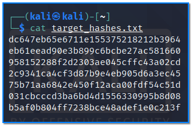
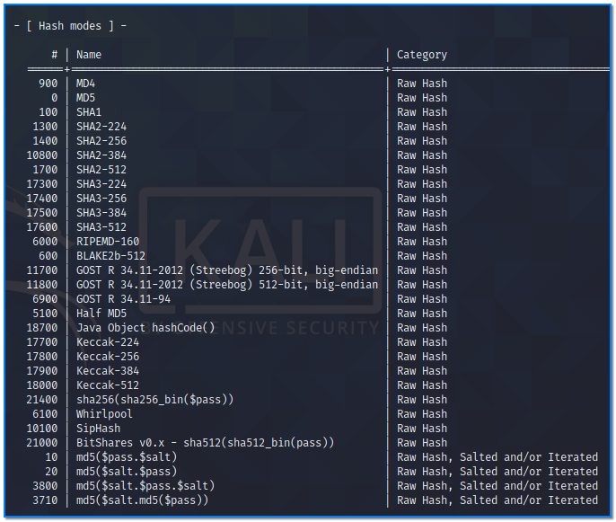
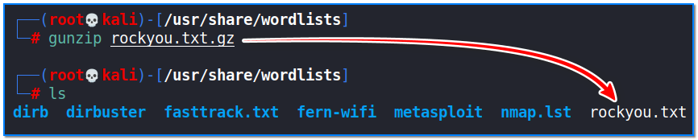
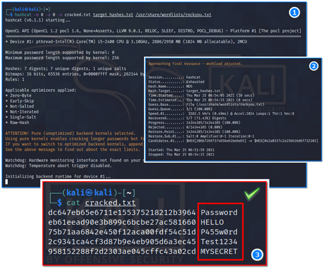

- [ ] Pasitikrinti ar viskas veikia

**Lab Objective:**

Learn how to use Hashcat to crack passwords.

**Lab Purpose:**

Hashcat is a password cracker used to crack password hashes. A hash is a one-way function that takes a word or string of words and turns them into a fixed length of random characters. This is a much more secure method of storing passwords rather than storing them in plain text. It is not reversible.

Hashcat attempts to crack these passwords by guessing a password, hashing it, and then comparing the resulting hash to the one it’s trying to crack.

**Lab Tool:**

Kali Linux

**Lab Topology:**

You can use Kali Linux in a VM for this lab.

**Lab Walkthrough:**

### Task 1:

In this lab, we will create a set of hashes and then use a dictionary to crack these hashes. The first step is to create the hashes. Open a terminal and use the following command to create a new txt document filled with some hashes:

cat << EOF > target_hashes.txt

dc647eb65e6711e155375218212b3964  
eb61eead90e3b899c6bcbe27ac581660  
958152288f2d2303ae045cffc43a02cd  
2c9341ca4cf3d87b9e4eb905d6a3ec45  
75b71aa6842e450f12aca00fdf54c51d  
031cbcccd3ba6bd4d1556330995b8d08  
b5af0b804ff7238bce48adef1e0c213f

EOF

These hashes comprise 7 different password which we will attempt to crack.

### Task 2:

We can now open hashcat. We will begin by viewing the help screen using “hashcat -h”.

hashcat -h | more

There are many pages. You can go to each next page by pressing the Space key. Press ctrl + c when you want to exit.

The two most important options available to us when using this tool are the “hash type” and “attack mode”.

Hashcat can attempt to crack numerous different hash types, which can be seen from the

screenshot below:

### Task 3:

The next step is to choose the wordlist we will use for cracking the hashes. We will be using the “rockyou.txt” file. Type the following to locate the file:

locate rockyou.txt

If the file has a .gz extension, it means it is a zipped file and we will first need to unzip it using gunzip. To do this, navigate to the directory where the file is stored and then type the following:

gunzip rockyou.txt.gz

This will unzip the file and provide us with the required .txt file.

### Task 4:

Navigate back to the home directory by typing cd. We are now ready to begin the attack.

We will use the following command to crack the password hashes:

hashcat -m 0 -a 0 -o cracked.txt target_hashes.txt /usr/share/wordlists/rockyou.txt

Let’s break down each of these options.

- The -m 0 option tells hashcat that we are attempting to crack MD5 hash types
- The -a 0 option tells hashcat we are using a dictionary attack
- The -o cracked.txt option is creating the output file for the cracked passwords
- The target_hashes.txt is the file containing the hashes
- The /usr/share/wordlists/rockyou.txt is the wordlist we will use for this dictionary attack

