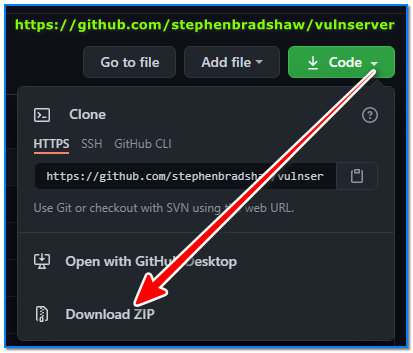
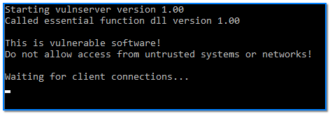
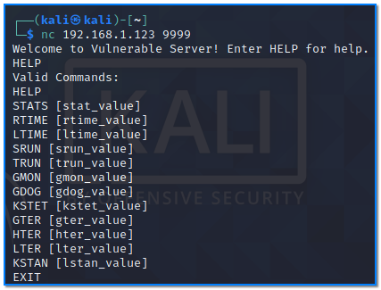
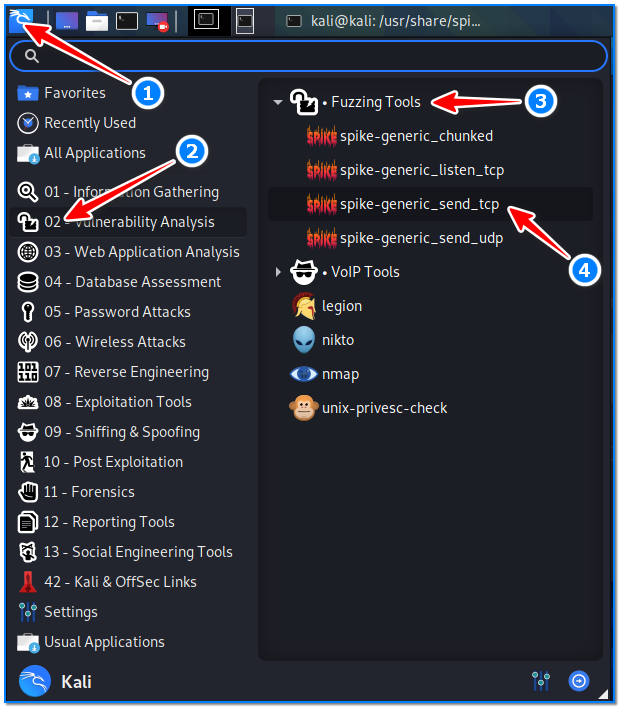
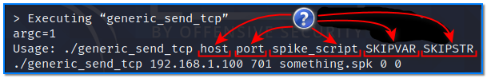
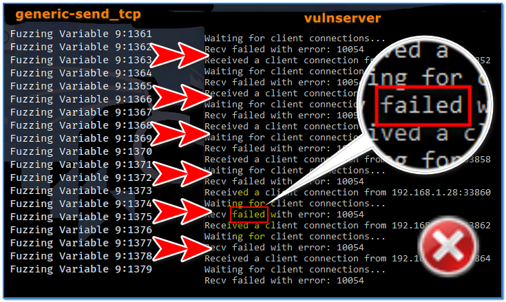
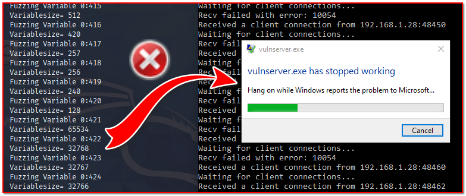

- [ ] Pasitikrinti ar viskas veikia

**Lab Objective:**

Learn how to use Spike to fuzz a server.

**Lab Purpose:**

Spike is an API which enables us to quickly develop stress tests of a protocol or application of our choosing. Spike gives us the ability to manipulate the way a service receives data, which may result in the protocol or application breaking.

**Lab Tool:**

Kali Linux and Windows

**Lab Topology:**

You can use Kali Linux in a VM and a Windows machine for this lab.

**Lab Walkthrough:**

### Task 1:

I will be using both Kali Linux and Vulnserver for this lab. Vulnserver is a server that has been intentionally built to be vulnerable. You should only deploy it on networks and machines you trust. Download vulnserver on your windows machine here:

https://github.com/stephenbradshaw/vulnserver

Once this is downloaded, extract the files to a location of your choosing. No compilation is needed. Then, click on the “vulnserver.exe” file to load the server. A command prompt will open with vulnserver running.

### Task 2:

The next step is to go to Kali and open a terminal. We will now try to connect to Vulnserver using netcat. Vulnserver runs on port 9999 by default. We can connect to it using the following command:

nc 192.168.1.128 9999

We can see the available commands supported by the server.

### Task 3:

The next step is to locate the auditing scripts used by Spike. These scripts end with a .spk extension. We can find them in Kali by typing the following command:

locate .spk

Each of these scrpits will audit various protocols and attempt to break them. In this lab, we will be using TCP as we are auditing a server. We will use a basic script to send random data over TCP to our vulnerable server.

Navigate to the Kali Start Menu in the top left, find the “Vulnerability Analysis” category and click on “Fuzzing Tools”. You will see a Spike script called “spike-generic_send_tcp”. Click on this script and you will be presented with some help information on how this script works.

We will need to include the following bits of information for this script to be successful:

- Target IP address
- Port number
- A spike script
- SKIPVAR and SKIPSTR values

We will be setting the last 2 variables (SKIPVAR, SKIPSTR) to 0 as they are not needed for this lab. let’s try using one of these built in scripts on our server by typing the following:

generic_send_tcp 192.168.1.123 9999 /usr/share/spike/audits/SMTP/smtp1.spk 0 0

This is the result on our server:

As you can see, this spike is sending random values to the target protocol (SMTP). In this case our server was not be able to handle this load. Check the content of smtp1.spk script. You will see a series of SMTP commands.

### Task 4:

We will now write our own script. Change to kali user’s home directory and paste this text in the command line:

cat << EOF > spike-trun-audit.spk  
s_readline();  
s_string(“TRUN |”);  
s_string_variable(“COMMAND”);  
EOF

We created a script called “spike-trun-audit.spk” in our home directory. This script will be targeting the TRUN commands on the Vulnserver. This will read the banner the server sends, simulate the user sending the TRUN command, and randomize the user input with the TRUN command.

Once this is completed, we can target the server with our custom script:

generic_send_tcp 192.168.1.123 9999 spike-trun-audit.spk 0 0

If you attempt to return to the Vulnserver, you will find that it has crashed. We have successfully broken a protocol running on the server, resulting in the server crashing as it is unable to handle this data. We now know that the TRUN command on this server is vulnerable!

