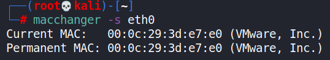
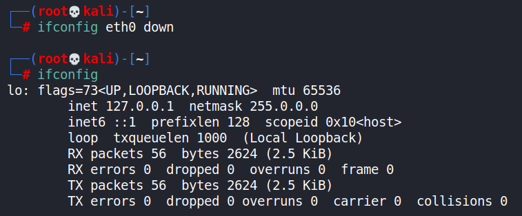
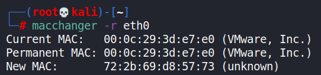
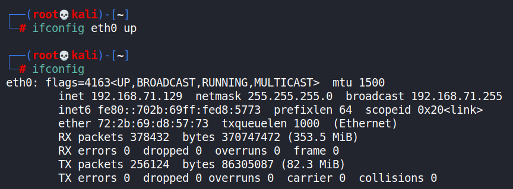
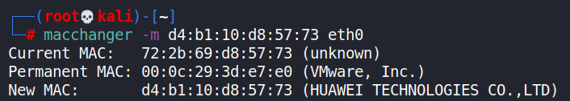
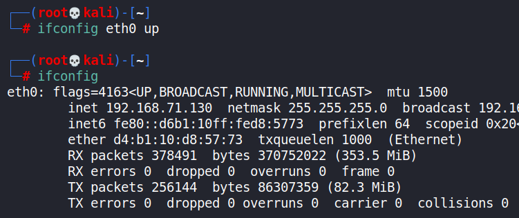
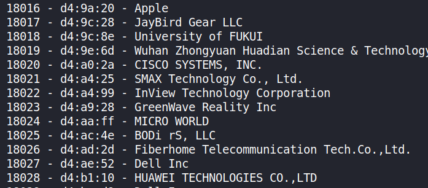
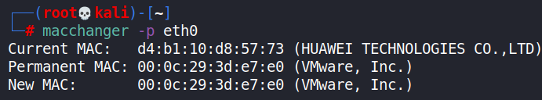

- [ ] Pasitikrinti ar viskas veikia

Learn how to use macchanger to spoof your MAC address.

**Lab Purpose:**

Macchanger is a tool which allows us to change our network card’s hardware MAC address to a random address. This is useful when performing penetration tests or other audits in order to evade detection.

**Lab Tool:**

Kali Linux

**Lab Topology:**

You can use Kali Linux in a VM for this lab.

**Lab Walkthrough:**

### Task 1:

I will be using Kali Linux for this lab as macchanger comes pre-installed on Kali. We will begin by viewing the help screen for this tool by typing the following:

macchanger -h

We will first check what our current MAC address is using the following command:

macchanger -s eth0

### Task 2:

We must first turn off the interface we are going to change the MAC address for, otherwise the tool will not work. To do this, use the following command:

ifconfig eth0 down

We can now set a random MAC address for this interface by executing the following:

macchanger -r eth0

We can now bring our interface back up using this command:

ifconfig eth0 up

Finally, we can view our MAC address for this interface again to confirm that it has been changed, using this command:

macchanger -s eth 0

### Task 3:

We can also change our MAC address to a specific address if we want to mascarade as a specific device. There are actually 4 sets of Locally Administered Address Ranges that can be used on your network without fear of conflict, assuming no one else has assigned these on your network:

x2-xx-xx-xx-xx-xx  
x6-xx-xx-xx-xx-xx  
xA-xx-xx-xx-xx-xx  
xE-xx-xx-xx-xx-xx

We can do this using the following commands:

ifconfig eth0 down

macchanger -m d4:b1:10:d8:57:73 eth0

ifconfig eth0 up

macchanger -s eth0

### Task 4:

We can use the “-l” option to find the MAC address prefix of specific hardware vendors, allowing us to masquerade as a device from one of these vendors:

macchanger -l

### Task 5:

To revert to our original permanent MAC address, we can use the following set of commands:

ifconfig eth0 down

macchanger -p eth0

ifconfig eth0 up