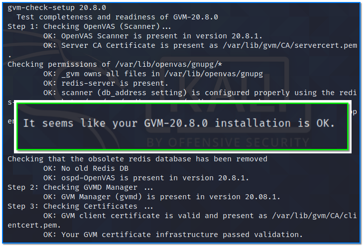
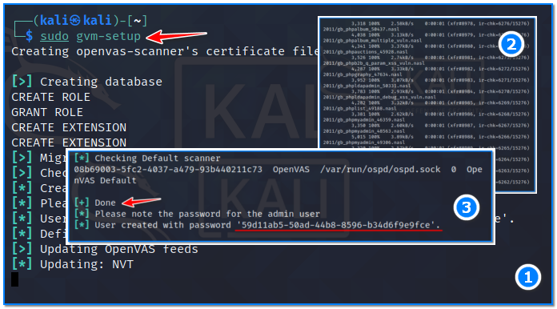
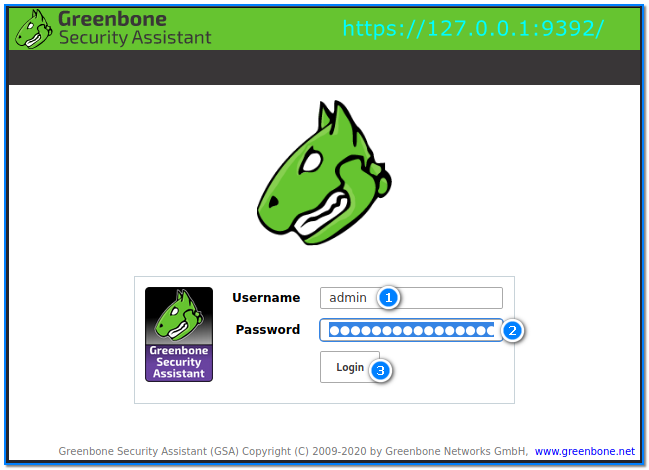
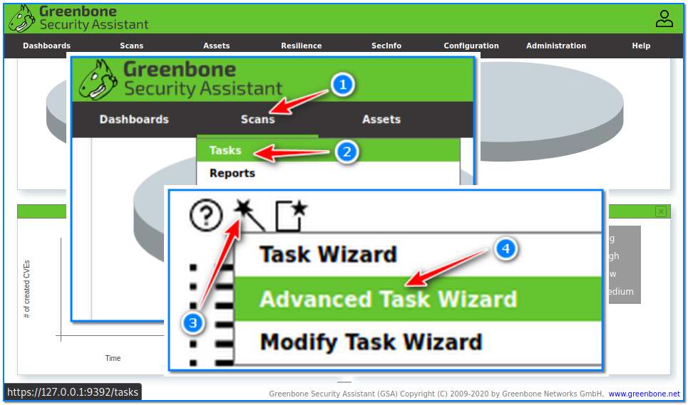
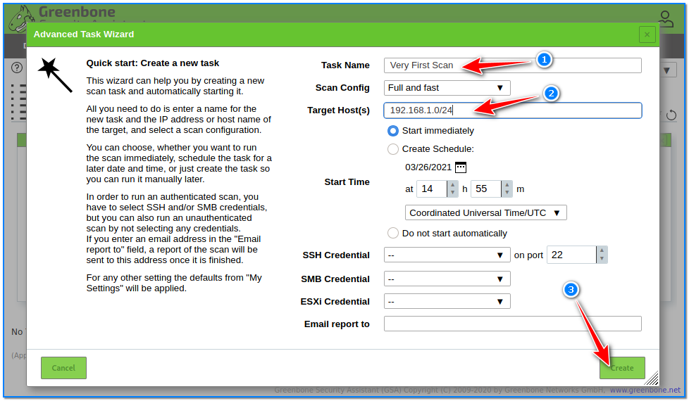
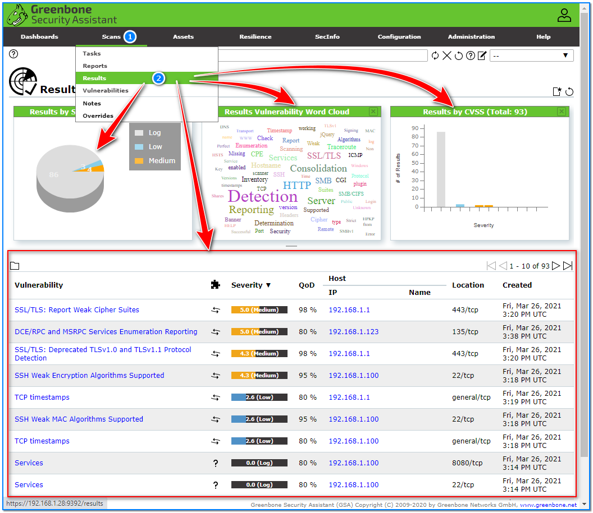

- [ ] Pasitikrinti ar viskas veikia

**Lab Objective:**

Learn how to use OpenVAS to perform a quick network vulnerability scan.

**Lab Purpose:**

OpenVAS is an open-source vulnerability scanner which can test a system for security vulnerabilities.

**Lab Tool:**

Kali Linux

**Lab Topology:**

You can use Kali Linux in a VM for this lab.

**Lab Walkthrough:**

### Task 1:

I will be using Kali Linux for this lab. To begin, we will first need to download OpenVAS. This can be done using the following command:

sudo apt install openvas

Once it is installed, we can view the help screen for this tool by typing the following:

openvas -h

### Task 2:

OpenVAS recently changed its name to Greenbone Vulnerability Manager (GVM). Therefore, to start this tool, we will need to type the following:

sudo gvm-setup

This will download and install all of the necessary plugins for the tool to work. This tool has a very large database and may take a while to download.

When the installation is finished, the password specified for the user “admin” will appear on the last page of terminal screen. Copy this and paste it into a file. This will be necessary when connecting to the OpenVAS page.

Now, we can check if our installation has been completed correctly using the following command:

sudo gvm-check-setup

Once this command displays that the installation is OK, reboot Kali Linux to use the tool.

### Task 3:

To start the tool we will use the following command:

sudo gvm-start

This may take a minute to load up correctly. Once completed, a firefox will start with the address https://127.0.0.1:9392. Accept the warning for the self-signed certificate and you will be presented with a login screen. Use the password you saved previously and login as “admin” with this password. We are now at the OpenVAS dashboard.

### Task 4:

In this lab, we will run a vulnerability scan of our home network. To do this, hover over the Scans tab and click on Tasks. This will bring you to the Tasks dashboard. To begin a quick scan, click on the wand icon on the top left hand corner and select the Advanced Task Wizard option.

Here, it is very easy for us to setup a simple scan of our network. Give your task a name and then input the subnet of your local network. Once this is done, simply click create. This task will be created and will initiate immediately. The task itself will take a bit of time to complete as it performs a comprehensive scan of your network.

### Task 5:

When the scan is complete, we can view the findings by hovering over the Scans tab at the top of the screen and clicking on Results from the dropdown menu. This will display a summary of all the vulnerabilities found by OpenVAS. If you click into each of these findings, you will find a detailed description of each of the vulnerabilities found and how they can be fixed.

