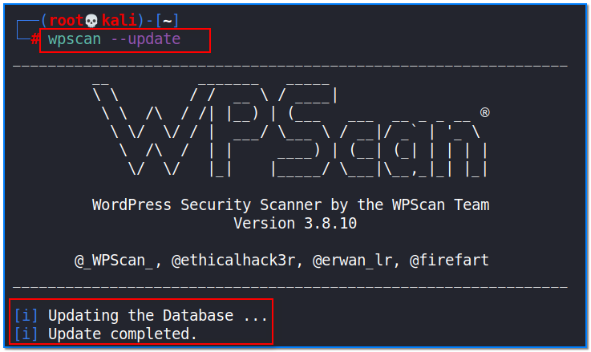
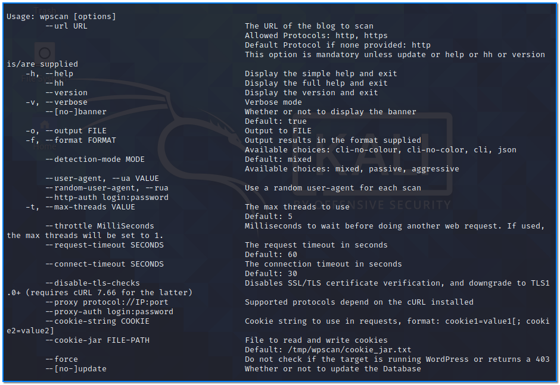
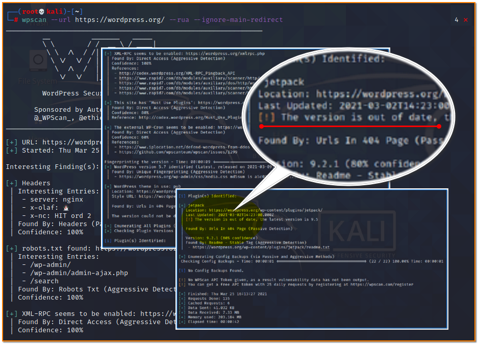
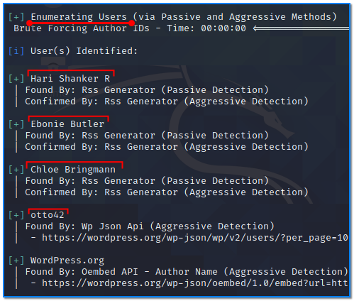
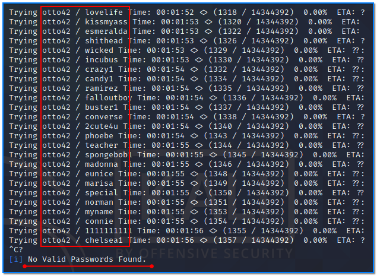

- [ ] Pasitikrinti ar viskas veikia

**Lab Objective:**

Learn how to use wpscan to automatically scan WordPress sites for vulnerabilities.

**Lab Purpose:**

Wpscan is an open-source WordPress security scanner. It can be used to scan any WordPress to find vulnerabilities within the WordPress core as well as popular WordPress plugins and themes. wpscan uses the wpvulndb.com to check the target for known vulnerabilities.

**Lab Tool:**

Kali Linux

**Lab Topology:**

You can use Kali Linux in a VM for this lab.

**Lab Walkthrough:**

### Task 1:

It is important to note that you should only ever scan a site with permission from the site owner.

I will be using Kali Linux for this lab as wpscan comes pre-installed. To begin, we will first update the wpscan databases using the following command:

wpscan –update

Once this is done, we can view the help page for this tool by typing the following:

wpscan -h | more

There are many pages. You can go to the next page by pressing the Space key. Press ctrl + c when

you want to exit.

### Task 2:

We will begin by scanning our target with a quick overall scan. To do this, type the command like in the example below:

wpscan –url https://wordpress.org/ –rua –ignore-main-redirect

The “–url” tage is specifying the target we wish to scan

The “–rua” tag is telling the tool to use a random-user-agent for each scan

The “–ignore-main-redirect” tag is telling the tool not to follow any redirects and simply target the URL specified

The results of this scan will provide us with some basic information around the versions of plugins

installed, the version of WordPress in use (which has a minor warn in this instance), etc.

### Task 3:

Similarly, adding –enumerate vt to the command checks the WordPress website for vulnerable themes:

wpscan –url https://wordpress.org/ –rua –ignore-main-redirect –enumerate vt

We can save the previous command for later review. We specify a text file name with the “-o” parameter:

wpscan –url https://wordpress.org/ –rua –ignore-main-redirect –enumerate vt  
-o report.txt

Nothing is displayed on the screen, everything is stored in the report.txt file.

### Task 4:

We can enumerate all registered users of a WordPress site using the following command:

wpscan –url https://wordpress.org/ –rua –ignore-main-redirect —

enumerate u

### Task 5:

Using the information gathered from the above command, we can then attempt to brute force the passwords for these usernames using a wordlist. This can be done by executing the following command:

wpscan –url https://wordpress.org/ –rua –ignore-main-redirect  
-P /usr/share/wordlists/rockyou.txt -U otto42

Press ctrl + c to when you want to break process.

