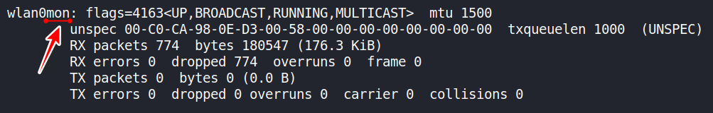
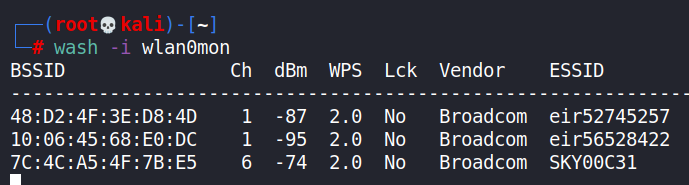
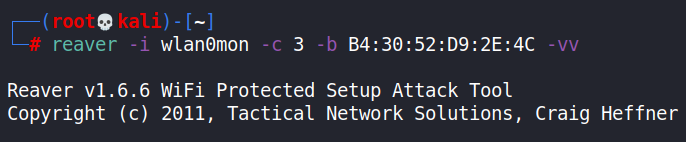
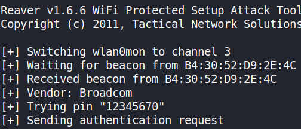

- [ ] Pasitikrinti ar viskas veikia

**Lab Objective:**

Learn how to hack WPS-enabled Wi-Fis with Reaver.

**Lab Purpose:**

WPS stands for Wi-Fi Protected Setup. It was invented to make it easier for users of a network to create secure connections between certain devices and networks. It works by pressing a button on the router and the device simultaneously. An 8-digit PIN is created, allowing the device to connect.

Reaver is a tool which takes advantage of the way WPS creates these PINs.

**Lab Tool:**

Kali Linux

**Lab Topology:**

You can use Kali Linux in a VM for this lab. Many commands in this lab will require root privileges to work. First of all, we must be the “root” user using the terminal:

sudo su –

**Lab Walkthrough:**

### Task 1:

It is important to note that you should only target a network with permission from the network owner.

I will be using Kali Linux for this lab as reaver comes pre-installed.

We will begin by first viewing the help screen for this tool. Simply type the following:

reaver -h

### Task 2:

You will need a wireless card which is capable of being put into “monitor mode” to complete this lab. In this lab, we will use an Alfa network card for this purpose. There are numerous Wi-Fi adapters in the market which supports Wi-Fi hacking. In this page, you can find some of them:

[https://www.ceos3c.com/security/best-wireless-network-adapter-for-wifi-hacking-in-2019/](https://www.ceos3c.com/security/best-wireless-network-adapter-for-wifi-hacking-in-2019/)

The first step is to place our wireless interface into monitor mode. We can do this using the following command:

airmon-ng start wlan0

We can check that the interface is in monitor mode by typing ifconfig. You will notice that the interface will have a mon at the end of its name. You may get a message that some services are interfering with your card when putting it into monitor mode. If this happens, simply run the

following command:

airmon-ng check kill

### Task 3:

Once our interface is in monitor mode, we can now scan for nearby networks. We can do this with the following command:

wash -i wlan0mon

This command will show us all available networks and whether these networks have WPS enabled.

### Task 4:

We now have all the information we need to launch the attack. We can choose the network we want to attack using this command:

reaver -i wlanmon0 -c 3 -b B4:30:52:D9:2E:4C -vv

Let’s break this command down:

The -i tag is telling Reaver which interface we want to use for the attack

The -c tag is telling the tool which channel the Wi-Fi network we are targeting is on

The -b tag is the BSSID of the network we are targeting

The -vv tag is enabling verbose, which will tell us what the tool is doing

When this command is executed, Reaver will begin testing various PINs against the network.

