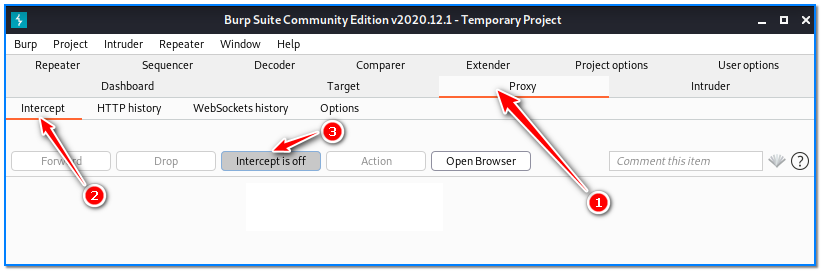

- [ ] Pasitikrinti ar viskas veikia

**Lab Objective:**

Learn how to exploit a CSRF vulnerability.

**Lab Purpose:**

CSRF is a vulnerability found in web applications, which allows an attacker to induce users to perform actions that they do not intend to perform. This vulnerability allows an attacker to circumvent the same origin policy, which is designed to prevent different websites from interfering with each other.

The impact of the attack depends on the level of permissions that the victim has set. Such attacks take advantage of the fact that a website completely trusts a user once it can confirm that the user is indeed who they say they are.

**Lab Tool:**

Kali Linux and Burp Suite

**Lab Topology:**

You can use Kali Linux in a VM for this lab.

**Lab Walkthrough:**

### Task 1:

We will be using Burp Suite for this lab. It comes pre-installed on Kali Linux, but may need to be updated using the command: sudo apt upgrade burpsuite

We strongly recommend you look at previous lab, lab 7, that we did on Burp Suite. Until requested, keep interception mode OFF in Burp Suite.

### Task 2:

In this lab, we will be using the Port Swigger Web Security Academy in order to demonstrate vulnerability. They provide some vulnerable labs where you can practice these skills. You will need to sign up (for free) in order to follow along with this lab:

https://portswigger.net/web-security

### Task 3:

For this lab, we will be demonstrating how a CSRF vulnerability can be exploited. The lab we will be using to demonstrate this vulnerability is the following:

[https://portswigger.net/web-security/csrf/lab-no-defenses](https://portswigger.net/web-security/csrf/lab-no-defenses)

Before starting the lab session, the username and password you will use for login will be displayed on the description page. Write it down somewhere. Then, click the “Access the lab” button.

Click the My Account link which is placed on the up-right corner of Shop. Then, login with the credentials which we have recorded on the previous page. In our case, that was:

Username: wiener and Password: peter

Do not use your real portswinger.net credentials!

We can now see an email change form on the Shop page.

Now, make sure that Burp Suite has Intercept Mode turned ON.

Enter some random email address here and Burp Suite will capture web traffic automatically. In this instance, we entered [user@example.com](mailto:user@example.com) as the new email address.

### Task 4:

Let’s look at the Burp Suite’s interception window.

Right-click on the current Burp Suite window and select the Copy URL. Paste this URL somewhere, as it will be needed in the next task.

### Task **5**:

In this step, we will create a malicious HTML form page which is filled by the email address and URL we have caught in the previous task.

Open a text editor, select the following text in the grey area, then copy and paste it into editor. Fill  the URL and e-mail address values in the corresponding places in the editor:

|   |
|---|
||

Our HTML template looked as follows when filled in with the values:

In this example, we chose lucifer@evil-user.net as the email address.

### Task 6:

Now, turn OFF Intercept mode in Burp Suite.

The next step is to navigate to the “Go to exploit server” button at the top of the Shop page.

Place your altered HTML form code into the Body section and press “Store”.

Our CSRF attempt has been successful.

The reason it was successful is this: if we take the URL, send it to a user, and they click on it, their email will be changed to that which we have specified. This is a powerful method, as the URL itself will look harmless to the user, while their e-mail is being change in the background, unbeknownst to them.