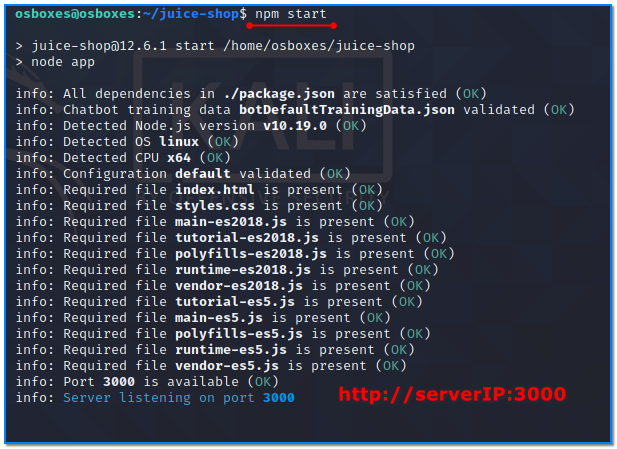
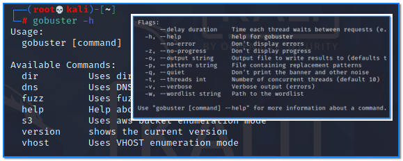
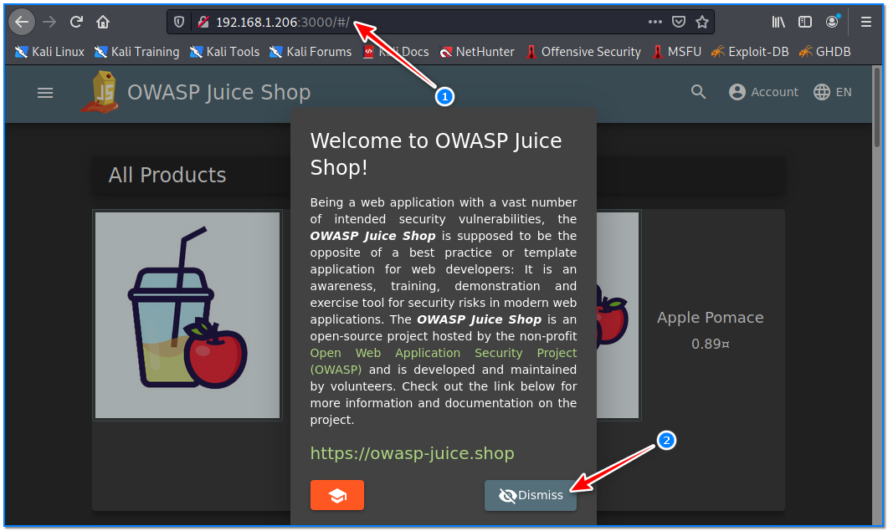
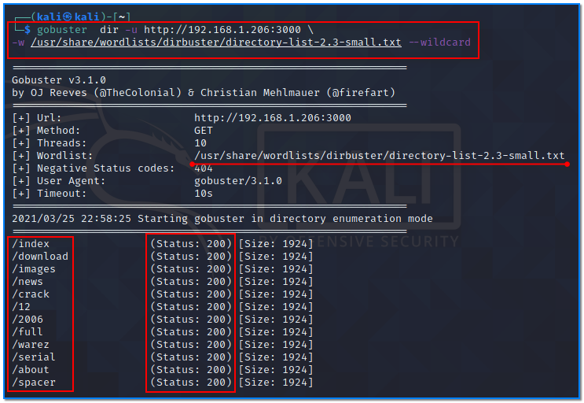
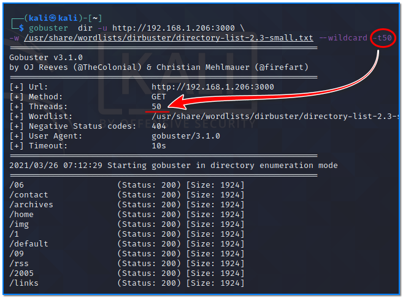
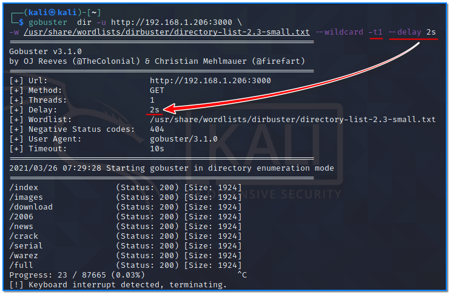
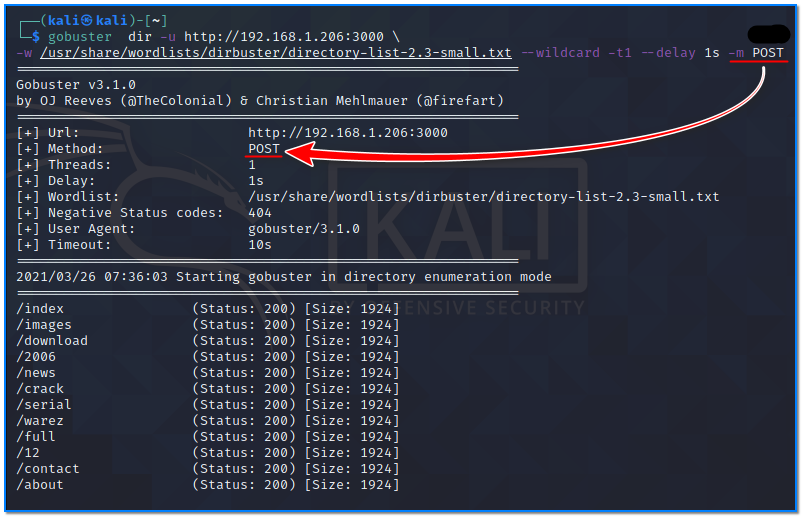

- [ ] Pasitikrinti ar viskas veikia

**Lab Objective:**

Learn how to discover directories on a web application.

**Lab Purpose:**

Gobuster is a free opensource tool used to brute force URLs, thereby discovering available files and directories in web sites. It can also discover DNS subdomains with the wildcard option enabled.

**Lab Tool:**

Kali Linux

**Lab Topology:**

You can use Kali Linux in a VM and another Ubuntu VM for this lab.

**Lab Walkthrough:**

### Task 1:

As always, you should only use this tool against a site with permission from the owner. We will be using this tool against OWASP Juice Shop, which we will run on a separate local VM. This is a shop designed to be vulnerable so you can practice hacking on it. It can be downloaded from the following link:

[https://owasp.org/www-project-juice-shop/](https://owasp.org/www-project-juice-shop/)

In this lab, we need another machine to run “OWASP Juice Shop” into it. You can find a prebuilt version of Ubuntu Server image on [https://www.osboxes.org/ubuntu-server/](https://www.osboxes.org/ubuntu-server/) for this purpose. Download and import it to your virtualization platform and run.

In our system, the IP address of our Ubuntu VM is 192.168.1.206. You have to learn yours.

In Kali Linux, login to Ubuntu machine via SSH. Then, type these commands in a terminal as regular user:

git clone [https://github.com/bkimminich/juice-shop.git](https://github.com/bkimminich/juice-shop.git)

cd juice-shop

sudo apt install npm

npm install  (This step takes long time. So be patient.)  
npm start

### Task 2:

Now, download gobuster by opening a new terminal in Kali and typing the following:

sudo su –  
apt-get install gobuster

Close the current terminal and open a new one after installation is finished.

You can then view the help screen by typing the following:

gobuster -h

### Task 3:

Once OWASP Juice Shop is up and running, you can type the Ubuntu’s IP into your browser to access it. In this case, [http://192.168.1.206:3000](http://192.168.1.206:3000/) is our URL. You will use your IP address on your local system.

Open a terminal in Kali. We can run a quick scan on this application to discover directories using the following command:

gobuster  dir -u [http://192.168.1.206:3000](http://192.168.1.206:3000/)  
-w /usr/share/wordlists/dirbuster/directory-list-2.3-small.txt –wildcard

Let’s break this down:

- The dir option tells gobuster to look for all possible URLs and subdirectories of the URL specified
- The -u option is our target URL
- The -w option is the wordlist we will use to brute force this target.
- The –wildcard option is to discover DNS domains and to accept any redirects.

Press ctrl+c to break run.

### Task 4:

We can append the “-x” option to search for certain files. For example, if we append “-x .js,.php”, then we will see the normal results as well as any files we can access with these extensions:

gobuster  dir -u [http://192.168.1.206:3000](http://192.168.1.206:3000/)  
-w /usr/share/wordlists/dirbuster/directory-list-2.3-small.txt –wildcard -x .js .php

### Task 5:

By default, the thread count is 10 in gobuster. We can append -t to determine the number of threads that will run simultaneously. The more threads running, the faster the scan will be:

gobuster  dir -u [http://192.168.1.206:3000](http://192.168.1.206:3000/)  
-w /usr/share/wordlists/dirbuster/directory-list-2.3-small.txt –

wildcard -t 50

### Task 6:

In most firewalls, traffic from a single IP source to web servers is limited. It may be necessary to reduce the frequency of requests in order to be able to scan within these limits. We can increase the waiting time of two consecutive requests by adding the “—delay” parameter:

gobuster  dir -u [http://192.168.1.206:3000](http://192.168.1.206:3000/) –wildcard -t 1 –-delay 2s  
-w /usr/share/wordlists/dirbuster/directory-list-2.3-small.txt

In this example, we reduced the number of threads to 1 as we increased the delay to 2s.

### Task 7:

By default, “gobuster” requests are made with the GET method. It is possible to change this using the “-m” parameter. In this example, scanning was performed using POST method instead of GET:

gobuster  dir -u [http://192.168.1.206:3000](http://192.168.1.206:3000/)  -t 1 –-delay 2s -m POST

-w /usr/share/wordlists/dirbuster/directory-list-2.3-small.txt –wildcard