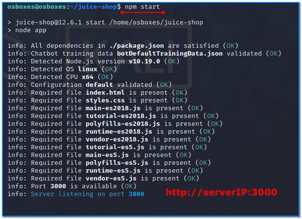

- [ ] Pasitikrinti ar viskas veikia

**Lab Objective:**

Learn how to use Burp Suite Intruder to brute force a password.

**Lab Purpose:**

The intruder feature of Burp Suite is used to automate customized attacks against web applications. It can be configured to work in several different ways and can be used to perform a huge range of tasks.

**Lab Tool:**

Kali Linux

**Lab Topology:**

You can use Kali Linux in a VM for this lab.

**Lab Walkthrough:**

### Task 1:

As always, you should only use this tool against a site with permission from the owner. We will be using this tool against OWASP Juice Shop, which we will run on a separate local VM. This is a shop designed to be vulnerable so you can practice hacking on it. It can be downloaded from the following link:

[https://owasp.org/www-project-juice-shop/](https://owasp.org/www-project-juice-shop/)

In this lab, we need another machine to run “OWASP Juice Shop”. You can find a prebuilt version of Ubuntu Server 20.04 image on [https://www.osboxes.org/ubuntu-server/](https://www.osboxes.org/ubuntu-server/) for this purpose. Download and import it to your virtualization platform and run.

In our system, the IP address of Ubuntu VM is 192.168.1.206. You have to learn yours.

In Kali Linux, login to Ubuntu machine via SSH. Then type these commands in a terminal as regular user:

git clone [https://github.com/bkimminich/juice-shop.git](https://github.com/bkimminich/juice-shop.git)

cd juice-shop

sudo apt install npm

npm install  (  
This step takes long time. So be patient.)  
npm start

### Task 2:

Launch the Burp Suite by typing burpsuite into the Kali terminal and ensure Intercept is turned on.

We then want to access the login page of the vulnerable shop. To do this, first type the local IP of the shop into your browser to access the page, then click the login button on the top right.

### Task 3:

When you are at the login screen, ensure that the proxy is enabled in Burp Suite and submit some values into the login page.

When you have the captured request, right-click on the page and press send to “Intruder”. Then navigate to the Intruder tab at the top.

### Task 4:

Here, you will find that the first page contains the IP of the webpage and the port it is running on. Navigate to the Positions tab within the Intruder tab. Don’t get overwhelmed with the icons on this

page. First, remove all icons by clicking the Clear button on the right.

Then, navigate to the email parameter of the request we captured on this page. Input the following for the email value:

[admin@juice-sh.op](mailto:admin@juice-sh.op)

This is the administrator’s email. We will be attempting to guess the password for this account. Then, for the password parameter, remove any values and input two icons beside each other in this field so that it looks like the screenshot above.

Finally, navigate to the Payloads page. Click on Load beside Payloads, which will allow us to load a .txt file full of passwords to guess against the admin’s email. We will use the “default_pass_for_services_unhash.txt” which is located in “/usr/share/wordlists/metasploit”. Select this file. This will import the file.

### Task 5:

Navigate back to the Target tab and click Start Attack on the right.

A new window will popup and the attack will begin. It may take a while to get the correct password. Click on the dropdown menu at the top of this new screen and select filter 2xx. This will show us when one of the passwords returns a 200 result, indicating it is the correct password.

