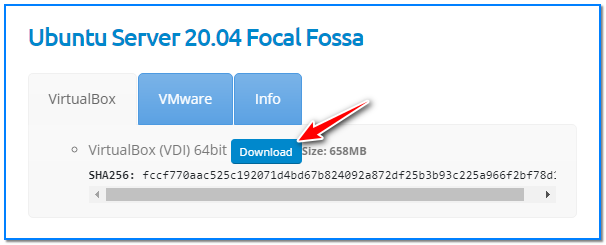
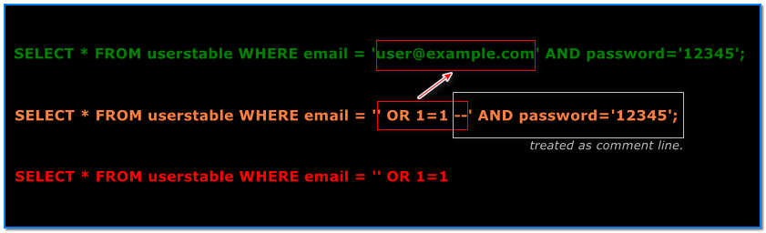

- [ ] Pasitikrinti ar viskas veikia

**Lab Objective:**

Learn how to conduct a manual SQL injection attack.

**Lab Purpose:**

The intruder feature of Burp Suite is used to automate customized attacks against web applications. It can be configured to work in several different ways, and can be used to perform a huge range of tasks.

**Lab Tool:**

Kali Linux or Windows

**Lab Topology:**

You can use a Windows machine or Kali Linux in a VM for this lab.

**Lab Walkthrough:**

### Task 1:

As always, you should only use this tool against a site with permission from the owner. We will be using this tool against OWASP Juice Shop, which we will run on a separate local VM. This is a shop designed to be vulnerable so you can practice hacking on it. It can be downloaded from the following link:

[https://owasp.org/www-project-juice-shop/](https://owasp.org/www-project-juice-shop/)

In this lab, we need another machine to run “OWASP Juice Shop”. You can find a prebuilt version of Ubuntu Server 20.04 image on [https://www.osboxes.org/ubuntu-server/](https://www.osboxes.org/ubuntu-server/) for this purpose. Download and import it to your virtualization platform and run.

In our system, the IP address of Ubuntu VM is 192.168.1.206. You have to learn yours.

In Kali Linux, login to Ubuntu machine via SSH. Then, type these commands in a terminal as regular user:

git clone [https://github.com/bkimminich/juice-shop.git](https://github.com/bkimminich/juice-shop.git)

cd juice-shop

sudo apt install npm

npm install (This step takes long time. So be patient.)  
npm start

### Task 2:

Once Juice Shop is running, type the http://serverIP:3000 address into your browser to access the shop. Once there, head to the login screen. For this lab, we will be attempting to login as the admin.

Open Burp Suite and have “Intercept On”. Then, fill in some random value for both “email” and “password”, and press login. Go to Burp Suite and ensure you have captured the resulting request.

### Task 3:

In the captured request, go the the email parameter and remove the value you input previously. Instead, type the following:

‘ or 1=1–

Click the Forward button until the email and password fields appear on the “Burp Suite” page.

### Task 4:

Let’s break down what this line of code does.

The ‘ character will break out of the commas and close the brackets in the SQL query.  
OR in an SQL statement will return TRUE if either side of it is TRUE. Since 1=1 is always true, this whole statement will always return as true. The — character is used to comment out data in SQL, so any possible restrictions on the login placed after this character will be commented out and will not affect our login.

This will then let the server know that the email is valid and log us into the user id 0, which is the “admin” account.

When you have the code above, input it into the email parameter, and forward the request.

### Task 5:

Turn Intercept off in Burp Suite and return to the Juice Shop application. You will find that we are now logged in as the administrator.

