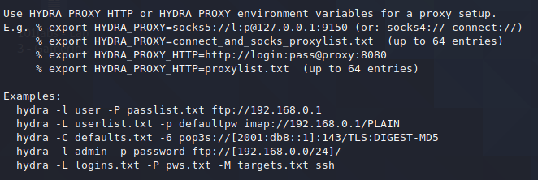
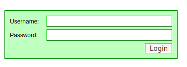
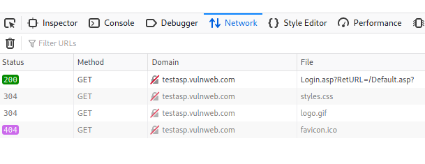
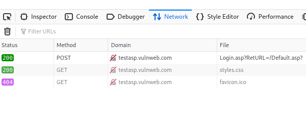
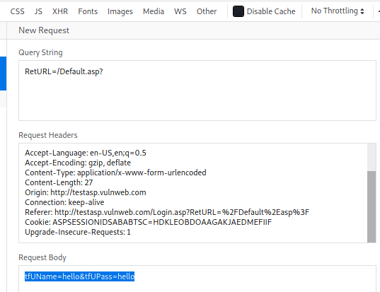
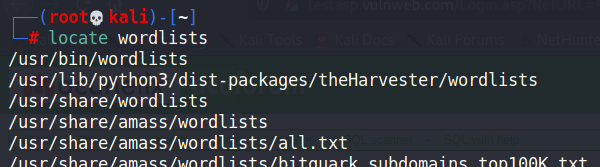
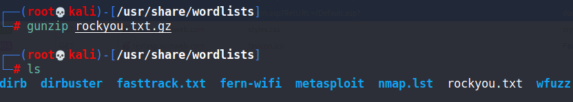
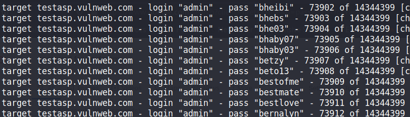

**Lab Objective:**

Learn how to conduct a dictionary attack to crack passwords online, using Hydra.

**Lab Purpose:**

Hydra is an advanced password cracker which can be used to crack passwords for online pages, such as the login page of a website. This is useful as we don’t need to capture a hash and attempt to crack it offline; we can simply target the login page itself, with any username and password combination we like.

A dictionary attack is a type of password attack which uses a combination of words from a wordlist and attempts all of them in association with a username to login as a user. It typically takes a long time to perform, and the results are dependent on the accuracy and quality of your wordlist. A dictionary attack is a form of brute forcing.

**Lab Tool:**

Kali Linux

**Lab Topology:**

You can use Kali Linux in a virtual machine for this lab.

Note: This site has been developed for the purpose of specific types of hacking. Never use hydra on any site, system, or network without prior permission from the owner.

**Lab Walkthrough:**

### Task 1:

The first step is to power up Kali Linux in a virtual machine. Then, open the Hydra help menu with the following command as “root” user:

sudo hydra

For this lab, I will be focusing on the command line interface version of Hydra, but you can also access the GUI version of hydra using the following command as “root” user:

sudo xhydra

Type “hydra -h” to get the help menu and see what kind of attacks we can run using Hydra.

Note the examples at the bottom of the help menu, which will provide you with a better idea of the syntax Hydra supports.

### Task 2:

The site we will be targeting is the following:

http://testasp.vulnweb.com/Login.asp?RetURL=/Default.asp?

Note that this site has been developed for the purpose of hacking, and you should not use Hydra on any other site without permission from the owner.

To use Hydra against an online target such as this one, we need to capture the post-form parameters. Hydra will use these parameters to send its various requests to the correct target. To capture this information, open target site with web browser in Kali. Then, press ctrl + shift + I to open the browser developer tools panel.

Navigate to the tab called “Network”. When you are there, reload the page by pressing ctrl + F5. You should see several GET requests. This is our machine requesting data from the server so that we can see the login form.

Now enter a random username and password into the login page and click login. You should see a new POST request pop up in the Network tab. This is our machine sending the data to the server. This request contains the parameters we need.

### Task 3:

Right click on the POST request and select “Edit and Resend”. A page will open to the right of the Network header, with information regarding the POST request. Scroll down to the Request Body section and copy the tfUName and tfUPass Parameters. Hydra will need this information.

### Task 4:

For this attack, we will be attempting to login as admin. We will need to choose a wordlist to guess passwords to login as this account. Open the terminal and type: “locate wordlists” to see all the different wordlists Kali has installed. We will use the rockyou.txt wordlist for this attack. Type “locate rockyou.txt” to see the path to this wordlist.

If the rockyou.txt wordlist file has a .gz extension on it, we will first need to extract the file. To do this, change directory to the wordlist directory using the following command:

cd /usr/share/wordlists

Then use the following command to extract the file:

gunzip rockyou.txt.gz

Type ls into the terminal after this and you will see that the rockyou.txt file is now available.

Great! We now have all the information we need and are ready to open Hydra and begin the attack.

### Task 5:

Let’s begin the attack by submitting the following command to hydra:

hydra -l admin -P /usr/share/wordlists/rockyou.txt testasp.vulnweb.com http-post-form “/Login.asp?RetURL=/Default.asp?:tfUName=^USER^&tfUPass=^PASS^:S=logout” -vV -f

Once you press enter, the attack will begin and Hydra will start guessing a lot of passwords for the username admin in an attempt to login.

Ok, this may be a lot to take in; let’s break it down with ctrl + C.

-l is the username we will be logging in as

-P is the wordlist we will be using to guess the password for this user

http-post-form is the type of request hydra will be sending to the server in order for us to login

“/Login.asp?RetURL=/Default.asp?:tfUName=^USER^&tfUPass=^PASS^:S=logout” – This is the actual request hydra is sending to the server, it will replace USER and PASS with the -l and -P values we specified earlier

-vV will show us each of the username and password login attempts

-f will finish that attack when the correct username and password combination is entered

### Task 6:

Note that hydra will probably not be able to guess the password, so you can end the attack at any point by pressing ctrl + c. This is an example of Hydra attempting a dictionary attack for a POST request. Hydra can also be used to attack usernames and passwords of different services—such as SSH, FTP, telnet, proxy, etc.—making it an extremely powerful and useful tool to have in your arsenal.