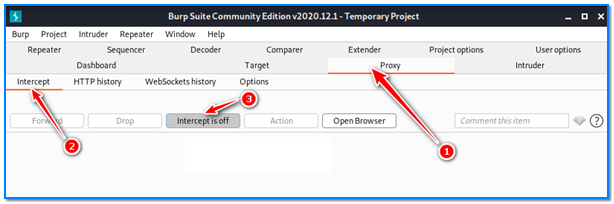
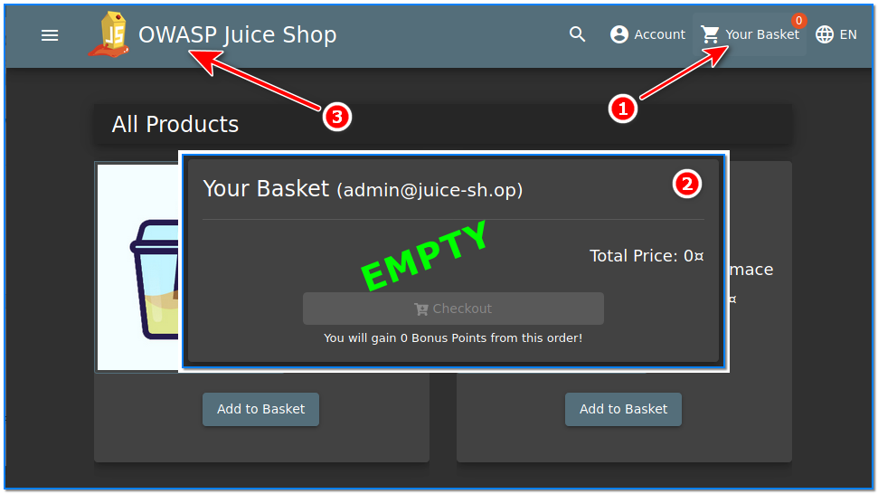
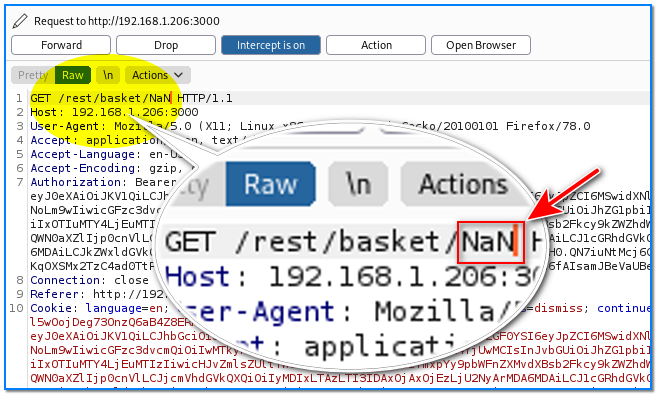
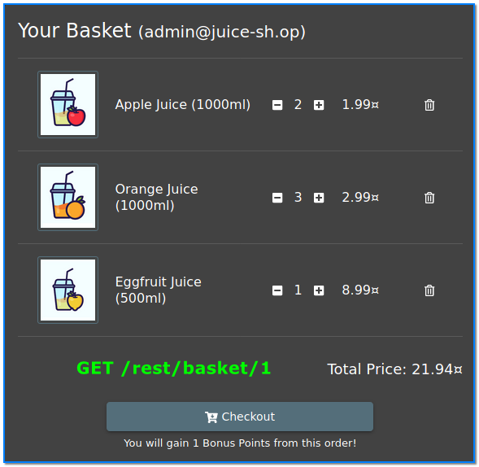
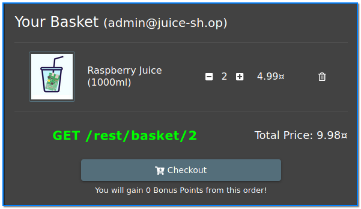
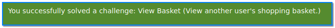

- [ ] Pasitikrinti ar viskas veikia

**Lab Objective:**

Learn how to take advantage of a broken access control vulnerability in a website.

**Lab Purpose:**

Broken access control is when a user can view other users’ information, perform unauthorized information disclosure, modify or destroy all data, or perform a business function outside of the limits of the user. More information can be found here: [https://owasp.org/www-project-top-ten/2017/A5_2017-Broken_Access_Control](https://owasp.org/www-project-top-ten/2017/A5_2017-Broken_Access_Control)

**Lab Tool:**

Kali Linux or Windows

**Lab Topology:**

You can use a Windows machine or Kali Linux in a VM for this lab.

**Lab Walkthrough:**

### Task 1:

As always, you should only use this tool against a site with permission from the owner. We will be using this tool against OWASP Juice Shop, which we will run on a separate local VM. This is a shop designed to be vulnerable so you can practice hacking on it. It can be downloaded from the following link:

[https://owasp.org/www-project-juice-shop/](https://owasp.org/www-project-juice-shop/)

In this lab we need another machine to run “OWASP Juice Shop”. You can find a prebuilt version of Ubuntu Server 20.04 image on [https://www.osboxes.org/ubuntu-server/](https://www.osboxes.org/ubuntu-server/) for this purpose. Download and import it to your virtualization platform and run.

In our system, the IP address of Ubuntu VM is 192.168.1.206. You have to learn yours.

In Kali Linux, login to Ubuntu machine via SSH. Then type these commands in a terminal as regular user:

git clone [https://github.com/bkimminich/juice-shop.git](https://github.com/bkimminich/juice-shop.git)

cd juice-shop

sudo apt install npm

npm install (This step takes long time. So be patient.)  
npm start

Once Juice Shop is running, type the local IP address into your browser to access the shop. For this lab, we will be attempting to view another user’s basket without being logged in as that user.

### Task 2:

To begin this lab, first login as the admin. If you are unsure how to do this, look at the manual SQL injection lab and you will find instructions there. Once logged in as the admin, open Burp Suite and ensure Intercept is turned off.

Then, click on the basket in the Juice Shop. Be sure your basket has no item. Empty your basket if there’s any item you can see in there.

### Task 3:

Return to main page, then turn intercept mode on in Burp Suite. Then, click on the basket in the Juice Shop again. Forward the requests until you find the request beginning with the following:

GET /rest/basket/NaN

This request is loading the contents of our “admin” basket to display to us.

We can view another user’s basket by changing the NaN at the end of the /basket line to 1:

GET /rest/basket/1

Once this is done, forward the rest of the requests. Then, turn Intercept off and return to the Juice Shop site. You will find that our basket contents have changed, as we are now viewing the contents of user 1’s basket.

Let’s try to change to another user’s basket:

GET /rest/basket/2

Once this is done, forward the rest of the requests. Then, turn Intercept off and return to the Juice Shop site. You will find that our basket contents have changed, as we are now viewing the contents of user 2’s basket.

