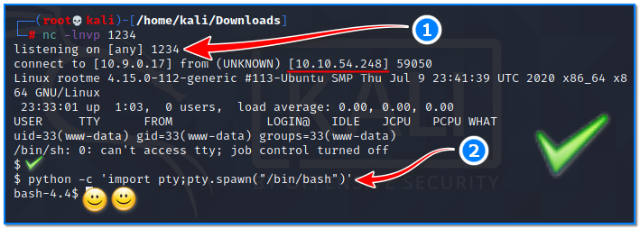
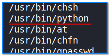
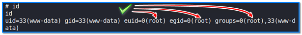
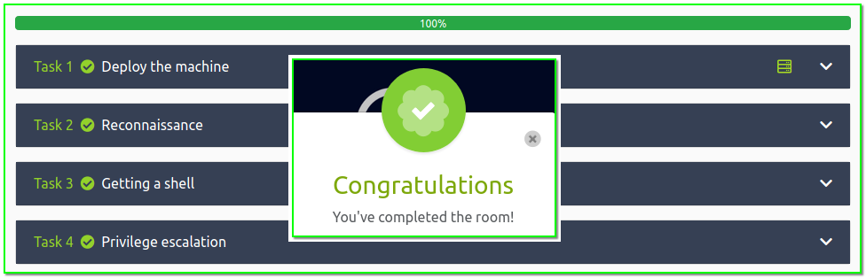

- [ ] Pasitikrinti ar viskas veikia

**Lab Objective:**

Learn how to manually escalate privileges from a shell using python.

**Lab Purpose:**

Privilege escalation occurs when a user exploits a bug, misconfiguration, or design flaw in an application or operating system to gain access to resources that should normally be unavailable to that user.

**Lab Tool:**

Kali Linux

**Lab Topology:**

You can use Kali Linux in a VM for this lab.

**Lab Walkthrough:**

### Task 1:

**Note:** This lab is a continuation of lab 41. You will need to complete that lab before you are able to complete this!

In lab 41, we managed to get a stable shell on the RootMe server. In this lab, our goal is to escalate our privileges from a normal user to an administrator.

Login into tryhackme.com as usual, and navigate to challenge page:  
[https://tryhackme.com/room/rrootme](https://tryhackme.com/room/rrootme)

### Task 2:

We discovered from Lab 41 that we have / uploads and / panel URLs on the target server and we can use them to upload and run our evil “PHP-REVERSE-SHELL” code.

Continuing where we left off,  
when the PHP code run was sent; it provided us a shell capability by establishing a reverse TCP connection to our attacker Kali machine (1). Now, we have a remote shell which owner is not root. We upgraded its capability by executing a python code (2).

### Task 3:

The next step is to find all files with a permission of SUID. This permission allows users to run these files with the same level of privilege as the owner of these files. We are typically looking for scripting/coding languages here; if we can run a coding language such as python as root, there is a very high chance of us being able to escalate our privileges this way.

We can search for all files with the SUID permission by typing the following into our shell:

find / -perm -u=s -type f 2>/dev/null

This command uses the find tool to find all files with the SUID permission. Hit enter and you will see a list of these files.

Looking through these files for coding languages, we can see python is there.

### Task 4:

Great! After some searching around, I found the following site which contains a list of python commands we can use to escalate our privileges in different situations. In this case, we can use the following command:

python -c ‘import os; os.execl(“/bin/sh”, “sh”, “-p”)’

This command creates a local SUID copy of the binary and runs it to maintain elevated privileges.

Let’s type this python command into our remote shell and hit enter. It may take a few minutes to run as python does its thing. When it is finished, we will no longer be in a bash shell and we will have “root” privileges! We can check if we have root privileges on the server by typing “id” into your shell.

### Task 5

One of the tryHackMe challenges is to find the “root.txt” file on the target server and read the data in it. Run the following commands on the terminal screen in the target server:

find / -type f -name root.txt  2>/dev/null

cat /root/root.txt

We were able to read this file because we are root and can read everything in the target server.

There are some other easy tasks that you can solve within tryHackMe. However, as these are out of scope, they will not be described in this lab. Once you have completed all the steps, tryHackMe will consider this room to be completed.

