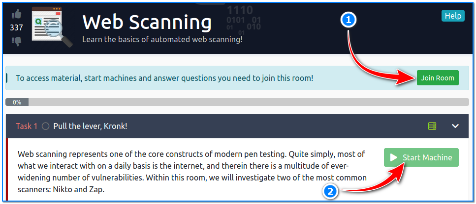

- [ ] Pasitikrinti ar viskas veikia

**Lab Objective:**

Learn how to scan web applications for vulnerabilities with nikto.

**Lab Purpose:**

Nikto is an open-source web server scanner. It performs comprehensive tests against web servers for multiple vulnerabilities including over 6700 potentially dangerous files/programs, checks for outdated versions of over 1250 servers, and version specific problems on over 270 servers.

**Lab Tool:**

Kali Linux

**Lab Topology:**

You can use Kali Linux in a VM for this lab.

**Lab Walkthrough:**

### Task 1:

We will be conducting this attack against a TryHackMe server. This server is designed to be vulnerable so that this technique can be practiced. We can access the server using openvpn client.

How to connect to this environment with OpenVPN was discussed in detail in lab 41.

After a successful connection, write down the local VPN IP adress. We will use this information later. Open another browser tab in Kali, then navigate to: [https://tryhackme.com/room/rpwebscanning](https://tryhackme.com/room/rpwebscanning)

On this page, scroll down until you see the “Join Room” button. Click it. On the next page, click the “Start Machine” button under Task 1 section to start the Lab.

By default, you have 1 hour to finish the all tasks in that lab. However, if necessary, you can request additional time by clicking the “Add 1 hour” button at the top of the page.

The IP address in the frame that appears after the target environment is started will be our target IPaddress. We will use this information later.

### Task 2:

Although the nikto tool that we will use in this lab is installed with Kali, we will extract it from the git repo and use it. To do this, let’s open a terminal screen on our Kali machine and write the following:

git clone https://github.com/sullo/nikto

We will begin by viewing the help screen of nikto tool. This tool has numerous info pages available to it. To view the short version, open a terminal screen in Kali then type the following:

cd ~/nikto/program  
./nikto.pl -h

To view the more comprehensive version, type the following:

./nikto.pl -H

### Task 3:

We will check the database for any errors using the following command:

./nikto.pl -dbcheck

Once this is done, we are ready to begin.

### Task 4:

We will begin this lab by performing a basic scan on this webserver. This can be done by typing the following:

./nikto.pl -h 10.10.16.168

The -h tag is used in Nikto to specify the target, don’t get confused between this and the help screen command. We used our assigned target IP address as parameter. This scan operation may takes a few minutes. Please be patient.

The results of the scan can be seen below.

We can see some useful information here such as the fact that the webserver version is outdated, some interesting directories available to use (such as the /config directory), and that the XSS-Protection header is not defined.

The above image shows the files in the “/config” directory. Here, a file with extension .bak can contain valuable information!

### Task 5:

We can run a more comprehensive scan using plugins. We can view all available plugins which Nikto supports, by typing the following:

./nikto.pl -list-plugins

We will use the test plugin, which will run a comprehensive scan against the webserver for all the basic and most common vulnerabilities. This can be done using the following command:

./nikto.pl -Plugins test -h 10.10.16.168

We can also specify for Nikto to target a specific port when scanning, by adding the -p tag to a command:

./nikto.pl -Plugins test -h 10.10.16.168 -p 80

### Task 6:

We can use Nikto to run credentialed scans on the webserver too. We simply have to specify the username and password for Nikto to use to sign in. Nikto will then perform a scan from the perspective of the signed in user:

./nikto.pl -h 10.10.16.168 -id admin:Password123

### Task 7:

Nikto scans can take a while to run. We can specify that we want a scan to run for a certain length of time by providing Nikto with a time at which the scan will finish. In the screenshot below, the scan will run until 1:30:

./nikto.pl -h 10.10.16.168 -until 13:30