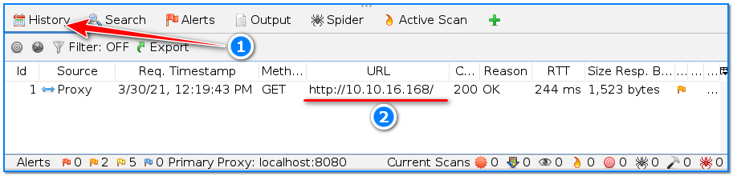

- [ ] Pasitikrinti ar viskas veikia

**Lab Objective:**

Learn how to scan using OWASP Zed Attack Proxy (ZAP).

**Lab Purpose:**

ZAP is a dynamic application security testing (DAST) tool for finding vulnerabilities in web applications. It is free and open source. It’s also one of the most popular web application scanners.

**Lab Tool:**

Kali Linux

**Lab Topology:**

You can use Kali Linux in a VM for this lab.

**Lab Walkthrough:**

### Task 1:

We will be conducting this attack against a TryHackMe server. This server is designed to be vulnerable so that this technique can be practiced. We can access the server using openvpn client.

How to connect to this environment with OpenVPN was discussed in detail in lab 41.

After a successful connection, write down the local VPN IP address. We will use this information later. Open another browser tab in Kali, then navigate to: [https://tryhackme.com/room/rpwebscanning](https://tryhackme.com/room/rpwebscanning)

On this page, scroll down until you see the “Join Room” button. Click it. On the next page, click the “Start Machine” button under Task 1 section to start the Lab.

By default, you have 1 hour to finish the all tasks in that lab. However, if necessary, you can request additional time by clicking the “Add 1 hour” button at the top of the page.

The IP address in the frame that appears after the target environment is started will be our target IP

address. We will use this information later.

### Task 2

ZAP can be launched by going to your terminal and typing the following:

owasp-zap

-2.png)

You will see many lines of code appearing in your terminal and a window will pop up with the ZAP tool. You may see an initial window with numerous updates for various tools used by ZAP. Simply hit the “Update All” button on the bottom right of the screen to update all the tools, then click Close. You will then be presented with the ZAP tool.

### Task 3:

With the server launched, we will perform an initial scan of it. Press on Quick Scan in the window in the top right of the tool. Input the following to begin the attack:

-1.png)

[http://10.10.16.168/](http://10.10.16.168/)

Once this is typed in, click the Attack button at the bottom.

.png)

When the attack button is pressed, the attack will begin. You will see a number of POST and GET requests being transmitted from ZAP to the server specified. There will also be a status bar, showing you how far through the scan the tool is.

### Task 4:

When the attack is finished, ZAP will display an Alerts tab. This tab will display all vulnerabilities and potential security issues found by the scan.

You will see that the most severe vulnerabilities will be located at the top of the list. In this case, the most severe vulnerability is Medium. This can be seen by clicking on each vulnerability found.

Each vulnerability category listed can be expanded, which will display each request and response which make up the vulnerability.

For example, in this vulnerability, we can see that the robots.txt file is visible to the user. You can view this file by typing the following into your browser:

[http://10.10.16.168/robots.txt](http://10.10.16.168/robots.txt)

ZAP does a good job of detailing each vulnerability. If you click on a specific vulnerability, such as robots.txt, we will be presented with a range of information such as the severity of the vulnerability as well as a description, solution, and references for more information.

We can also see the raw request and response data for each vulnerability at the top right of the screen, after you have clicked on a specific vulnerability.

### Task 5:

If we navigate to the Spider tab at the top of this bottom section, we can see the various pages and directories which were scanned. We can see all in-scope and “Out of Scope” pages here as well.

### Task 6:

If we navigate to the Active Scan page, we can see all of the raw GET and POST requests made by ZAP to the server during the scan.

### Task 7:

The History tab will display all scans performed. In our case, there will only be one scan here.

