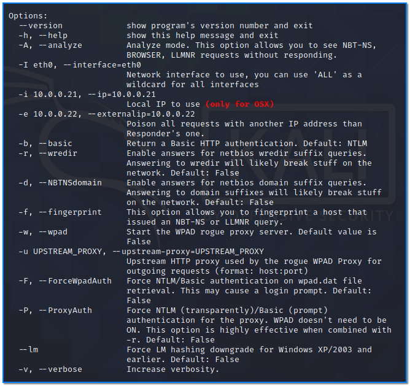
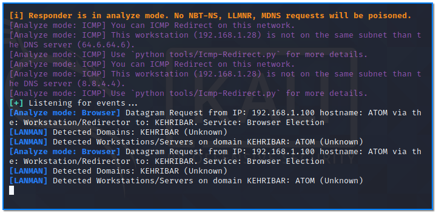
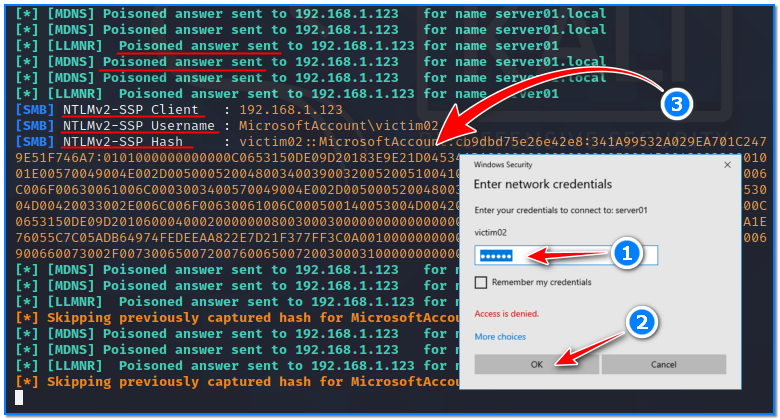
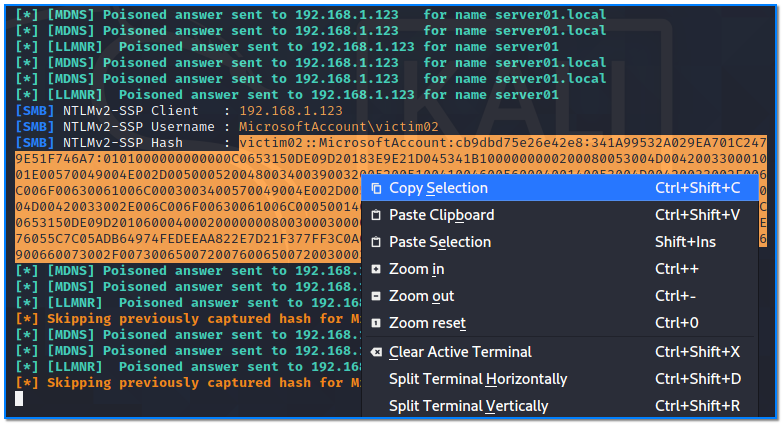
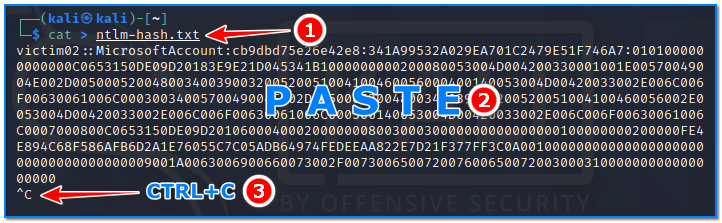
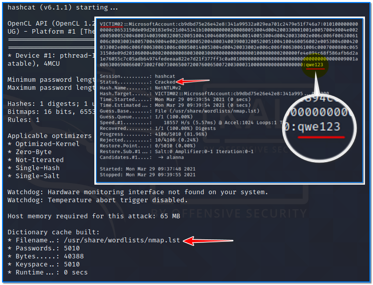

- [ ] Pasitikrinti ar viskas veikia

**Lab Objective:**

Learn how to capture NTLM hashes on your network with Responder.

**Lab Purpose:**

Responder is a tool used to quickly gather credentials from target systems on a network. It is a LLMNR, NBTNS and MDNS poisoner which is easy to use and highly effective against vulnerable networks.

**Lab Tool:**

Kali Linux

**Lab Topology:**

You can use Kali Linux in a VM for this lab.

**Lab Walkthrough:**

### Task 1:

We will be using Kali Linux for this lab as Responder comes pre-installed on Kali.

The first thing we will do is look at the help page for this tool. We can do this by opening a terminal and typing the following:

responder -h

### Task 2:

In this lab, we will be targeting a machine on our network with a machine which has an open browser with the goal of capturing NTLM hashes.

Before we launch this attack, we will use the analyser mode of the “responder” tool to discover potential targets on our network. This mode will analyse all requests on a network but will not respond to them.

We can launch this mode using the following command:

responder -I eth0 -A

Any event on the network will be shown on the screen after this command is executed.

This is a good method for passively discovering possible target systems.

### Task 3:

We can perform a poisoning with responder tool by simply typing the following:

responder -I eth0

This will launch Responder and the tool will poison responses and capture any credentials it can. If a user attempts to connect to a non-existing server share, Responder will respond and attempt to send them a login prompt.

If the user enters their password, Responder will catch the hash of password then display it on the screen.

In the screenshot above, we have captured the hash for the user “victim02”. We can now take this hash to hashcat and attempt to crack it.

### Task 4:

Copy the hash captured in the previous step and save it to a text file.

Then, open hashcat and type the following:

hashcat -m 5600 -a 0 ntlm-hash.txt /usr/share/wordlists/nmap.lst -O

This will tell hashcat that we are attempting to dictionary crack an NTLMv2 hash. Considering that this password is a simple one, hashcat manages to crack it in a few minutes using a word list

(nmap.lst) in this case.

We can see from the above screenshot that hashcat uncovered the password for the user “hello”, which is “qwe123”.