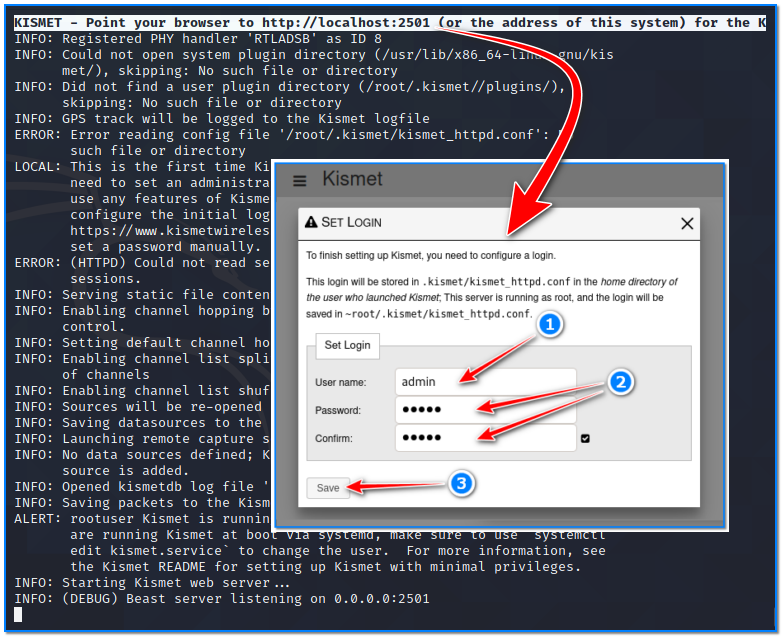
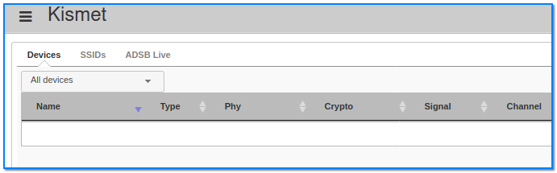
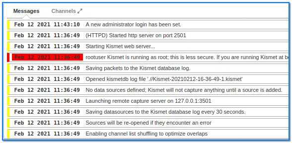
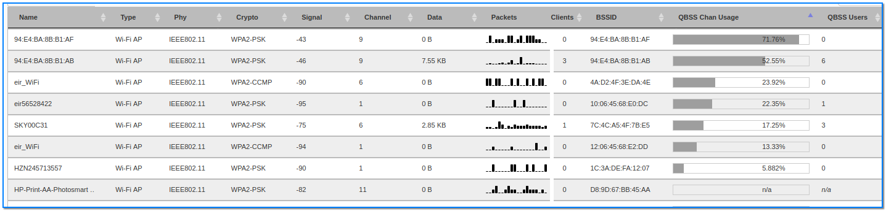
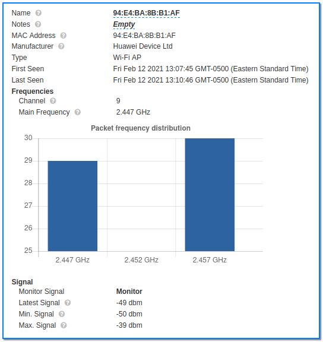
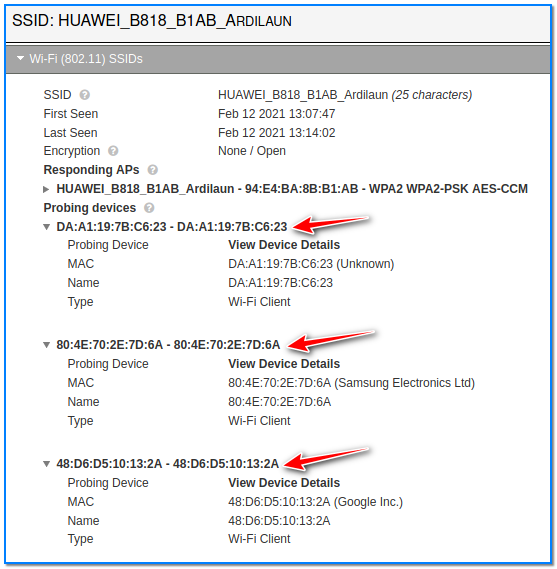
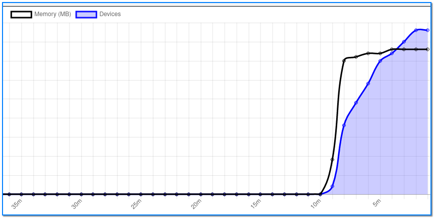
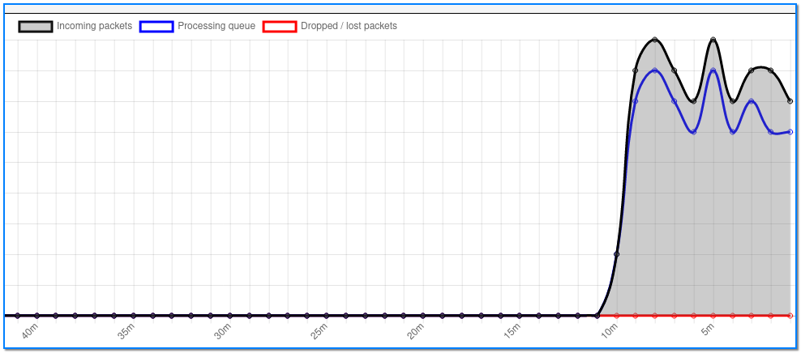
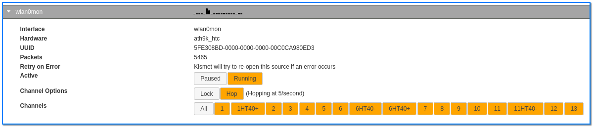

- [ ] Pasitikrinti ar viskas veikia

**Lab Objective:**

Learn how to monitor Wi-Fi signals with Kismet.

**Lab Purpose:**

Kismet is a Wi-Fi network analysing tool. It can function as a wireless network detector, sniffer, and Intrusion Detection System (IDS). It can be launched by simply opening a terminal and typing “kismet”.

**Lab Tool:**

Kali Linux

**Lab Topology:**

You can use Kali Linux in a VM for this lab.

**Lab Walkthrough:**

### Task 1:

The Kismet tool is already included with Kali Linux. All we need is to update it:

sudo su –

apt upgrade kismet

### Task 2:

We will need a wireless card which is capable of being put into “monitor mode” to complete this lab. In this lab, we will use an Alfa network card for this purpose. There are numerous Wi-Fi adapters on market which support Wi-Fi hacking. In this page, you can find some of them:

https://www.ceos3c.com/security/best-wireless-network-adapter-for-wifi-hacking-in-2019/

The next step is to put our wireless card into monitor mode. We can do this by typing the following into a terminal:

airmon-ng start wlan0

### Task 3:

We are now ready to launch the tool. Kismet will be accessed through our browser as it will start a service on one of our local ports. To see which port kismet is running on, type the following into the terminal:

kismet

This will start “kismet” and a message will appear at the top of the terminal telling you the address to visit to access the control centre for the tool.

You will need to set an admin username and password here to use the tool with.

Once you can access this page in Firefox, return to the terminal and press ctrl + c. Then, type the following into the terminal:

kismet -c wlan0mon

This will start kismet and tell it to use our wireless interface. You will be able to access the tool from the same page as you did above. Login with the same username and password you had set above.

### Task 4:

We are now at the main page for the kismet tool. Here, we can see kismet gathering a lot of information about nearby Wi-Fi networks. There are a number of headings which we can organise this information by, which can be seen in the screenshot below:

A summary of the information being gathered by kismet can be viewed at the bottom of the page.

You will see lots of information being gathered about nearby Wi-Fi networks on this main page.

If you click on any of these access points or clients, you will see more detailed information regarding the device. This information is displayed using graphs and charts.

### Task 5:

If you click on a particular access point, you will see information about that access point as well as some of the active devices connected to that network.

### Task 6:

By clicking the hamburger menu on the top left of the screen, we can view other information about these nearby networks. We can view the channels kismet is monitoring, the number of total packets kismet is picking up on and processing, and the amount of memory being used on the networks.

### Task 7:

If you want to focus on a particular network and capture more packets, you can navigate to the data sources page. Once there, click on your interface and you can lock kismet on a specific channel. Kismet will then only capture packets from this channel. Simply take note of the channel your target is broadcasting on and lock kismet on this channel to capture more packets from your target.

Kismet is a very useful tool for mapping network infrastructure, war driving, and network monitoring. Kismet will pick up on any suspicious activity, such as a network constantly changing its name or devices spoofing MAC addresses, making it useful as an IDS system also. Any alerts picked up by kismet will be displayed in the bell icon in the top right of the page, as well as in the alerts section at the bottom of the main page.