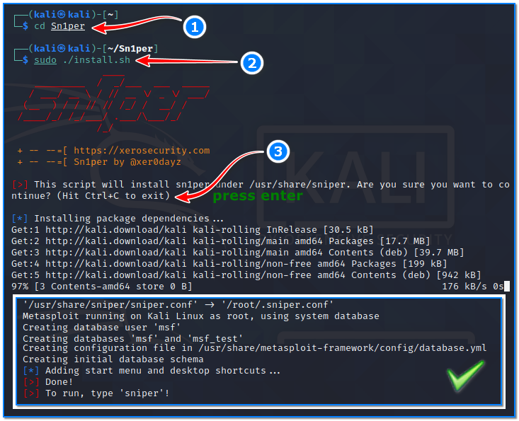
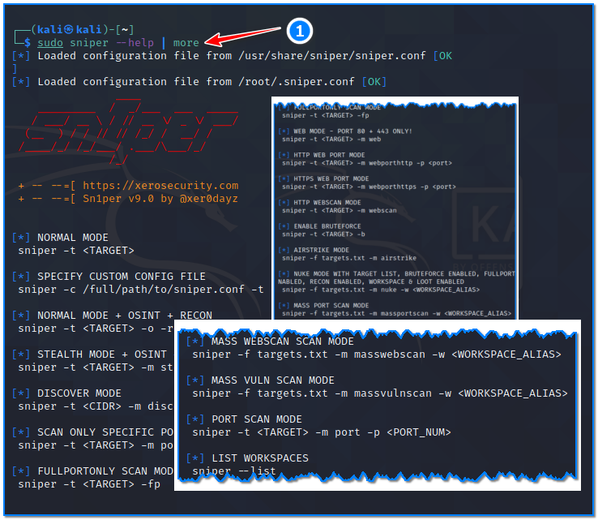
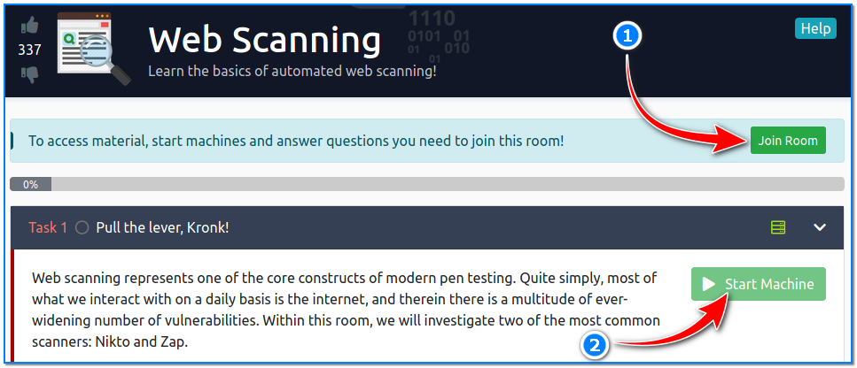
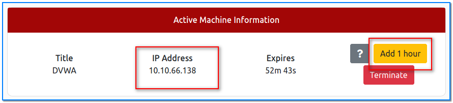
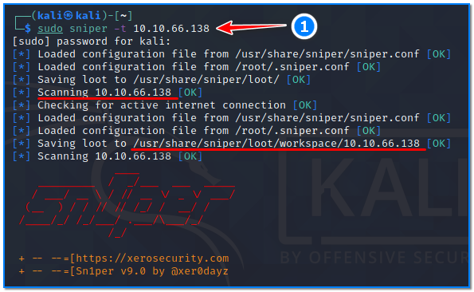
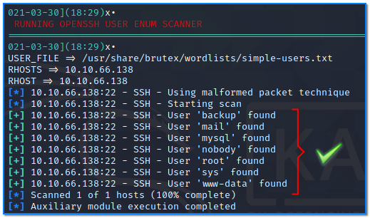
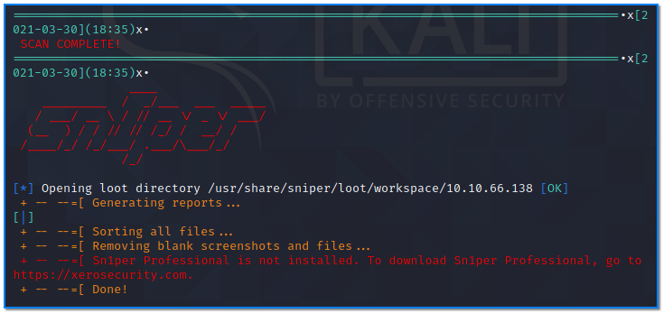
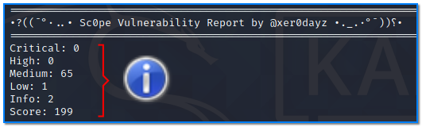

- [ ] Pasitikrinti ar viskas veikia

**Lab Objective:**

Learn how to perform a comprehensive vulnerability scan using Sn1per.

**Lab Purpose:**

Sn1per is an automated scanner which can be used during a penetration test to enumerate and scan for vulnerabilities. It is an extremely popular vulnerability scanner. There is both a community and enterprise edition available. Sn1per makes use of several different popular tools and bundles them into one, making it a very effective tool for a number of different purposes. The Sn1per tool web page can be accessed here: [https://github.com/1N3/Sn1per](https://github.com/1N3/Sn1per)

**Lab Tool:**

Kali Linux

**Lab Topology:**

You can use Kali Linux in a VM for this lab.

**Lab Walkthrough:**

### Task 1:

Sn1per tool is not included with Kali. For this reason, we will download and install it from the source. We can do this by typing the following command on terminal screen on Kali:

sudo git clone [https://github.com/1N3/Sn1per.git](https://github.com/1N3/Sn1per.git)

Once this is downloaded, we will then need to install the tool by typing the following:

cd Sn1per  
sudo ./install.sh

This will take a while to execute, as Sn1per downloads all the tools and dependencies it needs to run effectively.

When the installation is finished, close this and open a new terminal.

### Task 2:

We can view the help screen for this tool by typing the following command:

sudo sniper –help | more

As you can see, the Sniper tool has many parameters. Before we begin, make sure the tool is fully up to date by running the following command:

sudo sniper –update

### Task 3:

We will be using this tool against a TryHackMe server. This server is designed to be vulnerable so that this technique can be practiced. We can access the server using openvpn client.

How to connect to this environment with OpenVPN was discussed in detail in lab 41.

After a successful connection, write down the local VPN IP adress. We will use this information later. Open another browser tab in Kali, then navigate to: [https://tryhackme.com/room/rpwebscanning](https://tryhackme.com/room/rpwebscanning)

On this page, scroll down until you see the “Join Room” button and click here. On the next page, click the “Start Machine” button under Task 1 section to start the lab.

By default, you have 1 hour to finish the all tasks in that lab. However, if necessary, you can request additional time by clicking the “Add 1 hour” button at the top of the page.

The IP address in the frame that appears after the target environment is started will be our target IP address. We will use this information later.

### Task 4:

Now we can perform a default, comprehensive scan on our target using the following command:

sudo sniper -t 10.10.66.138

Sniper will begin scanning the target using a variety of different tools. This makes Sniper highly effective at both information gathering and vulnerability enumeration. Sniper makes use of many popular tools such as nmap, metasploit, spider, smuggler, and many others, depending on the types of vulnerabilities it discovers.

### Task 5:

Sn1per can be run in several different modes, depending on your goals against your target.

Here is a list of the different modes which can be used with this tool:

- NORMAL: Performs basic scan of targets and open ports using both active and passive checks for optimal performance.
- STEALTH: Quickly enumerate single targets using mostly non-intrusive scans to avoid WAF/IPS blocking.
- FLYOVER: Fast multi-threaded high-level scans of multiple targets (useful for collecting high level data on many hosts quickly).
- AIRSTRIKE: Quickly enumerates open ports/services on multiple hosts and performs basic fingerprinting. To use, specify the full location of the file which contains all hosts, IPs that need to be scanned and run ./sn1per /full/path/to/targets.txt airstrike to begin scanning.
- NUKE: Launch full audit of multiple hosts specified in text file of choice. Usage example: ./sniper /pentest/loot/targets.txt nuke.
- DISCOVER: Parses all hosts on a subnet/CIDR (ie. 192.168.0.0/16) and initiates a sniper scan against each host. Useful for internal network scans.
- PORT: Scans a specific port for vulnerabilities. Reporting is not currently available in this mode.
- FULLPORTONLY: Performs a full detailed port scan and saves results to XML.
- MASSPORTSCAN: Runs a “fullportonly” scan on mutiple targets specified via the “-f” switch.
- WEB: Adds fully automatic web application scans to the results (port 80/tcp & 443/tcp only). Ideal for web applications but may increase scan time significantly.
- MASSWEB: Runs “web” mode scans on multiple targets specified via the “-f” switch.
- WEBPORTHTTP: Launches a full HTTP web application scan against a specific host and port.
- WEBPORTHTTPS: Launches a full HTTPS web application scan against a specific host and port.
- WEBSCAN: Launches a full HTTP & HTTPS web application scan against via Burpsuite and Arachni.
- MASSWEBSCAN: Runs “webscan” mode scans of multiple targets specified via the “-f” switch.
- VULNSCAN: Launches an OpenVAS vulnerability scan.
- MASSVULNSCAN: Launches a “vulnscan” mode scans on multiple targets specified via the “-f” switch.

You can practice on the machine above by running different scans against it and comparing their different outputs.