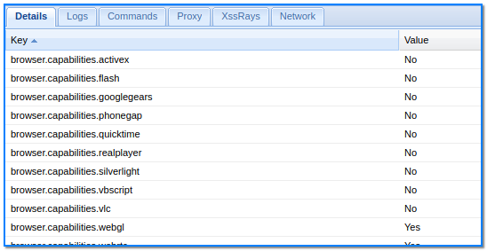

- [ ] Pasitikrinti ar viskas veikia

**Lab Objective:**

Learn how to perform information gathering by hooking a browser using BeEF.

**Lab Purpose:**

BeEF is a pentesting tool which focuses on exploiting web browsers. It looks past the hardened network perimeter and client system to instead focus on exploitability within the context of the web browser. If a BeEF exploitation is successful, there is no limit to the information gathering that can then be performed.

**Lab Tool:**

Kali Linux

**Lab Topology:**

You can use Kali Linux in a VM for this lab.

**Lab Walkthrough:**

### Task 1:

We first need to install the BeEF tool on Kali. We can do this by opening a terminal and typing the following:

sudo apt install beef-xss

Once this is done, we can launch the tool by typing the following:

sudo beef-xss

You will then be asked to enter a password for the tool. Do this and press enter.

This will execute several lines of code and will open a new window in your web browser, where you will have access to the control panel for BeEF. If the browser could not open automatically in Kali,

.png)

open it yourself and type “http://127.0.0.1:3000/ui/panel” in the address line.

When the page loads, you will be asked for a username and password to login to BeEF. Use the username “beef” and the password you set above.

### Task 2:

We are now able to access the control panel for this tool. The first page contains lots of documentation, where you can learn more details about how this tool works.

-2.png)

We will begin by pressing the link for the basic demo page, which can be found on the main page when logged in to BeeEF. When you press this link, a new window will open with a hooked browser.

To test this hooked browser, type something in the text window at the bottom of the screen.

-1.png)

Then, click on the list of browsers to the far left of the beef control panel page. Select your local browser and press on the Logs tab. Select ID column to sort by ascending order. This will show you every action you have taken on the demo page that is open.

### Task 3:

Navigate to the details tab. Here, you will be presented with an abundance of information regarding the details of the browser you have hooked such as the version, the plugins installed, etc.

### Task 4:

Navigate to the Commands tab. Here, we can specify a few different malicious command to execute on the target browser. For example, click on the Social Engineering folder and select the Fake Flash Update command.

This command, when executed, will present the user with a popup on their screen to update their version of Flash. This popup will contain a payload which is downloaded by the user if they click on the update button. Select this command and click Execute on the bottom right of the screen. Once this is done, navigate to the browser demo page.

As you can see, you are presented with a fake Flash update popup. If the user presses on the buttons in this popup, a file is downloaded to their machine.

This file can be a custom payload designed by us, which we can add to this exploit in the Commands tab.

### Task 5:

We will run through another example of a malicious command which we can run. In the Social Engineering folder under the commands tab, select the Google Phishing Command. This will present the user with a fake login screen for Gmail. Click execute on the bottom right and navigate back to the demo page.

As you can see, we are presented with a login screen for Google. We can customise the URL in the Commands tab to change the look of this page to a newer version of the Gmail login page. If the user inputs their details here, BeEF will capture them. The details entered can be found by navigating back to the Commands tab, selecting the same exploit, and clicking on the tab in between the list of exploits and the description of the exploit.

