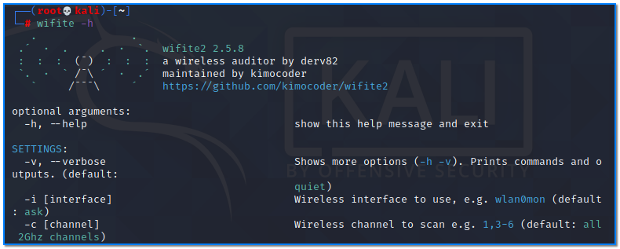
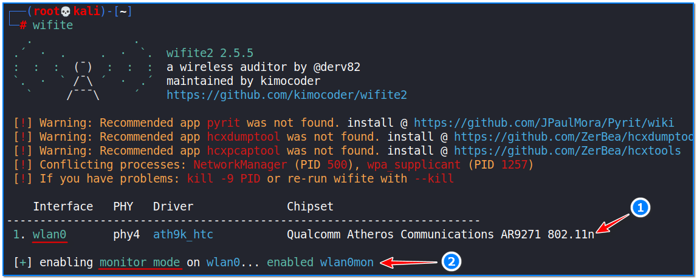
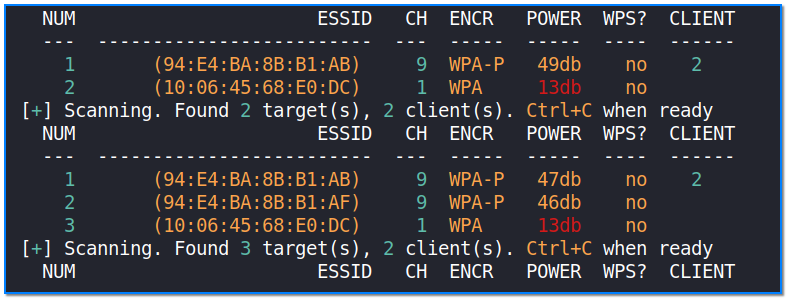
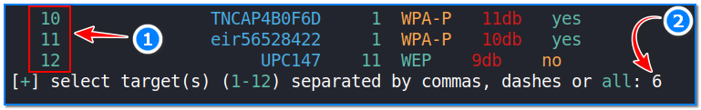
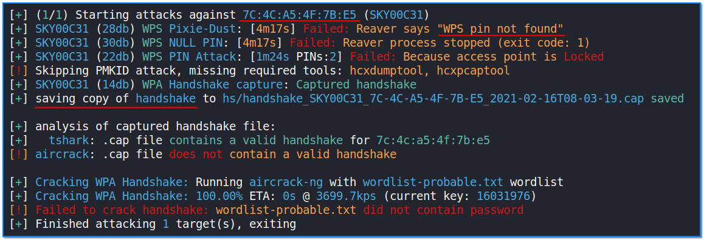

- [ ] Pasitikrinti ar viskas veikia

**Lab Objective:**

Learn how to hack WPS networks using Wifite.

**Lab Purpose:**

Wifite is a customizable tool which can be used to hack multiple WEP-, WPA-, and WPS-encrypted networks in a row. It is designed to be a “set it and forget it” wireless auditing tool. If Wifite fails to crack a WPA handshake, the handshake will be backed up in a file to Wifite.

**Lab Tool:**

Kali Linux

**Lab Topology:**

You can use Kali Linux in a VM for this lab.

**Lab Walkthrough:**

### Task 1:

You will need a wireless card which is capable of being put into “monitor mode” to complete this lab. In this lab, we will use an Alfa network card for this purpose. There are numerous Wi-Fi adapters in the market which support Wi-Fi hacking. In this page, you can find some of them:

[https://www.ceos3c.com/security/best-wireless-network-adapter-for-wifi-hacking-in-2019/](https://www.ceos3c.com/security/best-wireless-network-adapter-for-wifi-hacking-in-2019/)

If you don’t have such a card, you can still read along to learn the process behind an attack using this tool.

We will begin this lab by opening a terminal in Kali and viewing the help screen for Wifite. We can do this by typing the following as root user:

sudo su –  
wifite -h

### Task 2:

Ensure you have your wireless network card connected to your machine. Once this is done, we can then launch the tool by typing the following:

wifite

Immediately, Wifite will put your network card into “monitor mode” and begin searching for nearby networks. It will display information about these networks, such as whether they have WPS enabled or not, as well as the channel it is running on, the number of clients connected to it, the power of the signal, the level of encryption, and the ESSID.

### Task 3:

When you have found the network that you want to target, end the search for networks by hitting ctrl + c on your keyboard. You will then be asked to choose your target by inputting its ID, which is shown on the num column. Choose the number to the left of your target’s ESSID.

### Task 4:

Wifite will then begin launching attacks against the specified target. It will begin by launching a Pixie-Dust attack, followed by NULL PIN, PIN Attack and PMKID attack. If all of these attacks fail, Wifite will capture the WPA handshake and attempt to crack it using aircrack-ng. If this attack also fails, Wifite will close and save the captured WPA handshake to a file before exiting.

