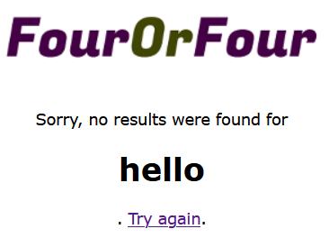
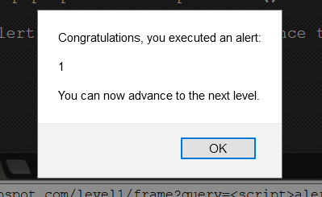
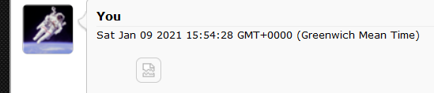
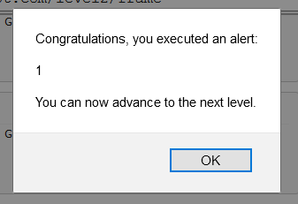

- [ ] Pasitikrinti ar viskas veikia

**Lab Objective:**

Learn how to test a website for an XXS vulnerability – Cross site scripting.

**Lab Purpose:**

XXS is a common vulnerability in web applications and is frequently listed as a top vulnerability in the OWASP top ten. XXS occurs when web applications execute JavaScript, which is input into the form sections of a web application. The applications perform no security checks on the entered data. It simply passes it straight to the server, causing inputted JavaScript to execute.

**Lab Tool:**

Web browser

**Lab Topology:**

You can use any web browser of your choosing for this lab.

**Lab Walkthrough:**

### Task 1:

We will begin this lab by opening a web browser of your choice. There are numerous sites on the web that have been setup for the purpose of practising attacks like XXS. We will be using this site: https://xss-game.appspot.com

The site has several levels of XXS which vary in difficulty. It also offers you several hints on how to proceed if stuck on a level. This is a great way to advance your knowledge of this type of web application attack.

### Task 2:

Let’s begin by navigating to the following URL:

[https://xss-game.appspot.com/level1](https://xss-game.appspot.com/level1)

This is the first level. We are presented with a simple search box for a web page.

To be able to execute JavaScript in a web application like this one, a basic understanding of the syntax for JavaScript and HTML is required.

For example,

# ”Header here”

will create a header. Enter this value into the search box and see what result you get.

Great! We know this application is vulnerable to XXS now, as our input is directly reflected in the output of the search result. Note, what we just did is not XXS as there is no JavaScript involved. We simply know now that the web application is most likely vulnerable to XXS.

### Task 3:

Now, to execute the XXS attack. Try to figure it out yourself using the hints the site provides you. The answer is the following:

This will cause an alert text box to pop up on our screen with “1” on it.

We have successfully executed an XXS attack.

### Task 4:

For level 2, we will only be talking about it in brief. In this level, we are presented with a forum page.

The script we entered for level 1 will not work here. We need to first enter a HTML tag which will adopt the script we entered in level 1, so that every time this page is visited and the tag is loaded, the XXS attack will run. This is a method of achieving a persistent XXS attack on a site.

This bit of HTML is loading an image, which doesn’t exist into the forum. Every time there is an error, the JavaScript alert will run. Considering that the image doesn’t exist and that it will be loaded every time a user visits the forum, the JavaScript alert will always run.

### Task 5:

To deepen your understanding of different levels of XXS, you should attempt the next few levels and see how far you get.