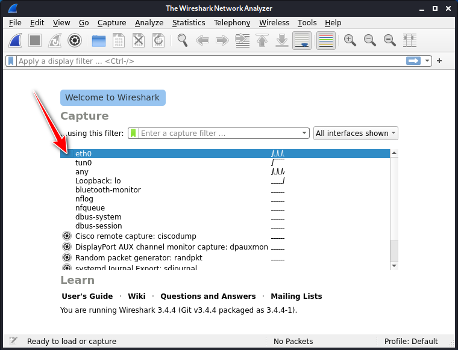
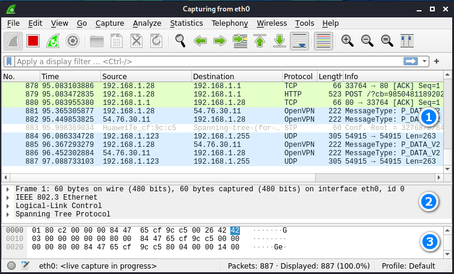
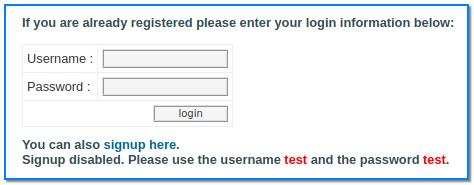
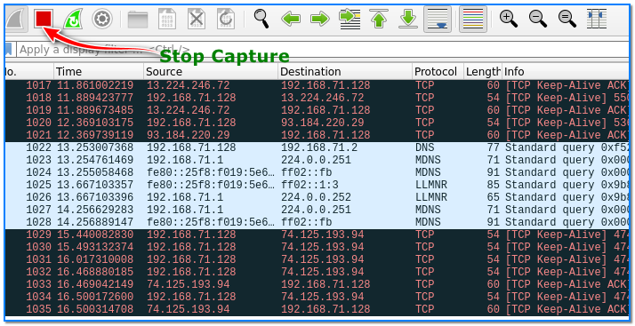
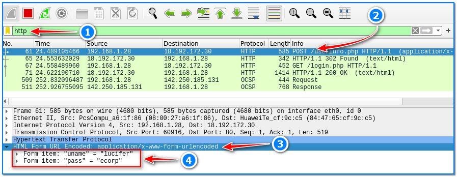
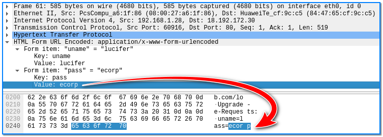
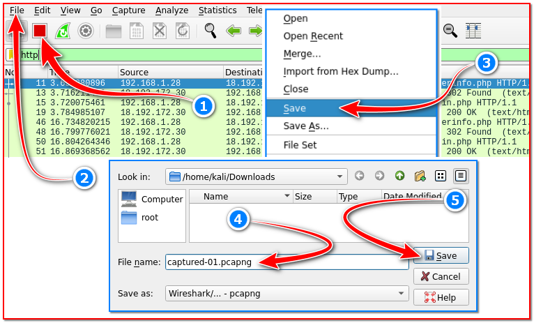
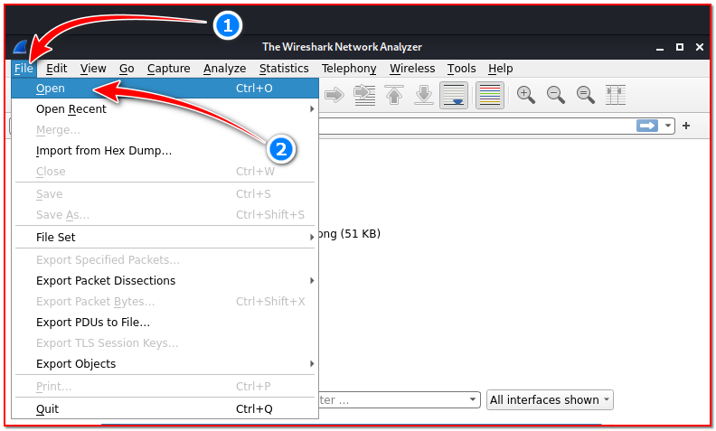

- [ ] Pasitikrinti ar viskas veikia

**Lab Objective:**

Learn how to capture usernames and passwords submitted through http websites with Wireshark.

**Lab Purpose:**

Wireshark is an open-source packet analyser. It is used for analysis, network troubleshooting, and software and communications protocol development and education. It is a very useful tool for looking in depth at the communications happening on a network.

**Lab Tool:**

Kali Linux

**Lab Topology:**

You can use Kali Linux in a VM for this lab.

**Lab Walkthrough:**

### Task 1:

For this lab, we will be capturing requests sent and received from our Kali machine. We will then analyse these requests for captured information. You do not need any wireless network card for this lab.

To begin, open a terminal screen in Kali and start Wireshark by typing the following:

sudo wireshark

You can also start the tool by navigating to the menu on the top left, hovering over the Sniffing & Spoofing tab, and selecting the Wireshark tool.

### Task 2:

Once open, Wireshark will ask you which interface you would like to use to capture packets. For this lab, we will be using our “eth0” interface, so select this now by double clicking on it.

You will then be presented with a window that is clearly divided up into three sections. The top section is used to display a list of the packets captured. These packets are displayed as a table. Information about each packet is displayed here, such as the packet number, packet source and destination, the time captured, and the packet’s protocol.

The second panel describes a hierarchical display of the information included in a single packet. You can expand different sections to view different information about each specific packet. We will be using this pane later in this lab.

The third pane displays the encoded packet data and displays a packet in its raw, unprocessed form.

### Task 3:

The next step is to open Firefox and visit the following site:

[http://testphp.vulnweb.com/login.php](http://testphp.vulnweb.com/login.php)

Here, you will find a login page. Notice the lock with the red line at the top left of the page, indicating that this page is communicating through http, meaning that any data submitted here will not be encrypted.

Enter a random username and password into this form and click login. Once this is done, return to Wireshark.

### Task 4:

You will notice Wireshark capturing a few different packets. We can end the packet capture now by pressing the red square in the top left corner.

We will now attempt to find our login information captured by Wireshark.

Click on the box at the top of the Window which says: “Apply a display filter”. In this box, type the following:

http

This will only show us the “http” requests captured by Wireshark. Then, hit enter. You will notice the number of captured packets drastically reduces. There is only a handful of info left.

Look for the packet with POST included in the Info section of the first pane (2). Once you find it, select this packet.

Then, look at the second pane and the section called Hypertext Transfer Protocol (this is what http stands for). Click on this section and expand it to see the information it contains (3).

Then, click on the HTML Form URL Encoded section to expand the information within this tab. You will then see the username and password entered the form on the http site (4).

We can also view the usernames and passwords in raw form at the bottom of the third pane.

### Task 5:

It is possible to export the captured data packets to a file for later analysis.

Thanks to Wireshark, it is possible to capture any packet transmitted on the same network without encryption.