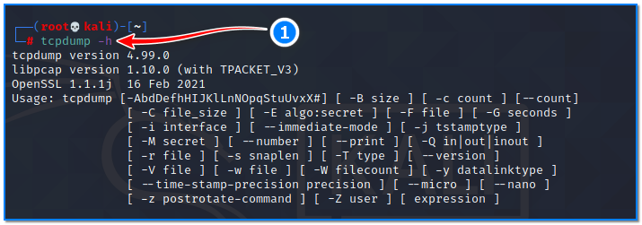
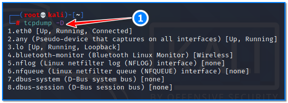
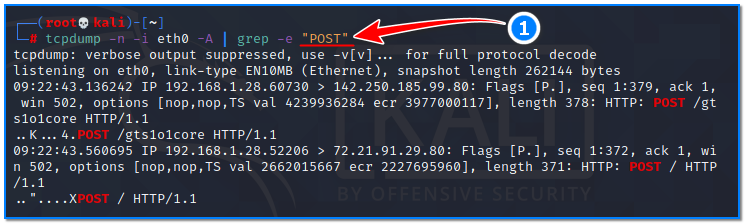
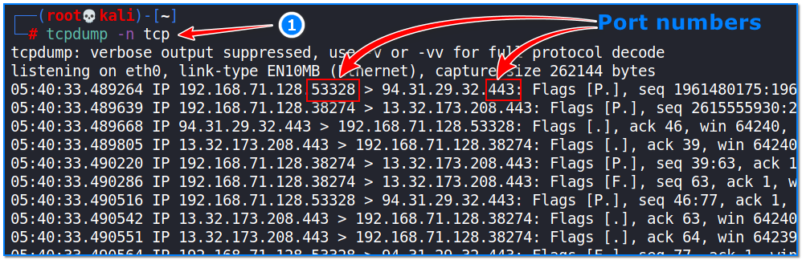
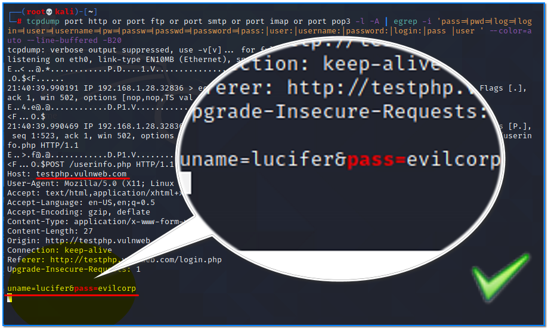

- [ ] Pasitikrinti ar viskas veikia

**Lab Objective:**

Learn how to capture packets using tcpdump.

**Lab Purpose:**

Tcpdump is a network packet analyser and capture tool. It allows the user to display TCP/IP and other packets being transmitted or received over a network. We can call it a different kind of Wireshark. It is a free tool.

**Lab Tool:**

Kali Linux

**Lab Topology:**

You can use Kali Linux in a VM for this lab.

**Lab Walkthrough:**

### Task 1:

The tcpdump tool is already included in Kali. There is no need to install it separately. We will begin this lab by first viewing the help screen of this tool. Open a terminal screen and type the following:

sudo su –

tcpdump -h

### Task 2:

To begin capturing packets, we first need to select the interface that we want to use for packet capture. We can list all interfaces available to us using the following command:

tcpdump -D

You can then select the interface you want to use to begin capturing packets with the following command:

tcpdump -i eth0

Also, by using the “-Q <in|out>” parameter, we can determine the direction of the package to be monitored according to the interface:

tcpdump -n -i eth0 -Q out

Normally, tcpdump shows the hosts and ports by their names on the capture outputs. However, this might slow us down a bit. If we want to run the above scan faster, we can specify for tcpdump not to resolve IP addresses to hostnames by appending “-n” to the command. This also shows ports with their numbers instead names. It will look like the following:

tcpdump -n -i wlan0

We then use the -c parameter, which will help us to capture the exact amount of data that we need and display them. It refines the amount of data we captured:

tcpdump -n -i wlan0 -c 5

### Task 3:

We can also get the ethernet header (link layer headers) by appending “-e” to the command above. This will look like the following:

tcpdump -n -e -i wlan0

### Task 4:

The verbose mode provides information regarding the traffic scan. For example, time to live (TTL), identification of data, total length, and available options in IP packets. It enables additional packet integrity checks such as verifying the IP and ICMP headers. To get extra information from our scan, we need to use -v parameter.

tcpdump -n -i eth0 -v

### Task 5:

We can also use tcpdump to filter packets based on several expressions. If we want to view only TCP packets, we can use the following command:

tcpdump -n tcp

We can also specify to pick up DNS request packets using this command:

tcpdump -n “udp and dst port 53”

### Task 6:

Tcpdump is a powerful tool when it comes to customisation. We can input a variety of combinations of commands to gather different packets from a network. For example, this next command will display the SSH packets coming from one source and going to another destination.

tcpdump “src 192.168.1.28 and dst 192.168.1.1 and port ssh”

This can be especially useful if spying on a particular target on a network. Instead of port names, direct numbers can be written here.

### Task 7:

To print each packet in ASCII code, we need to use “-A” parameter. This next command is an example of using grep with tcpdump to help it only display information we deem to be important.

tcpdump -n -i eth0 -A | grep -e “POST”

This command will begin gathering all packets using tcpdump, and we then use grep to find and display all POST requests to us. This is an example of how tcpdump can be used in a creative fashion to display detailed information about the network.

### Task 8:

In tcpdump, we can write and read into a “.pcap” extension file. “-w” parameter allows us to write raw data packets that we have as an output to a standard pcap file. This created pcap file can then be re-examined with tcpdump by using “-r” parameter, or imported to Wireshark tools which runs on another machine if desired, and a filter can be applied on it.

In the example below, we save the packages captured by the eth0 interface in the first line to the specified pcap file. In the second line, we do an analysis by reading this recorded file without real-time monitoring:

tcpdump -n -i eth0 -w sess01.pcap  
tcpdump -n -r  sess01.pcap | more

### Task 9:

Finally, we will attempt to capture usernames and passwords submitted through a http form from a device on the network. We will use the following command to do this:

tcpdump port http or port ftp or port smtp or port imap or port pop3 -l -A | egrep -i ‘pass=|pwd=|log=|login=|user=|username=|pw=|passw=|passwd=|password=|pass:|user:|username:|password:|login:|pass |user ‘ –color=auto –line-buffered -B20

This command will search for any usernames or passwords communicated with known protocols over the network. We can test this out by first executing this command and then visiting the following webpage:

[http://testphp.vulnweb.com/login.php](http://testphp.vulnweb.com/login.php)

With the command above running in the background, submit a random username and password through this form. Then, return to the terminal and you will find the username and password captured there.

