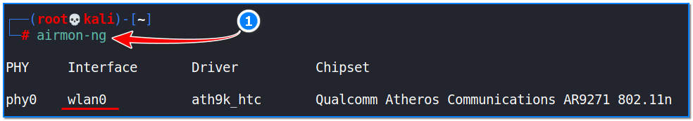
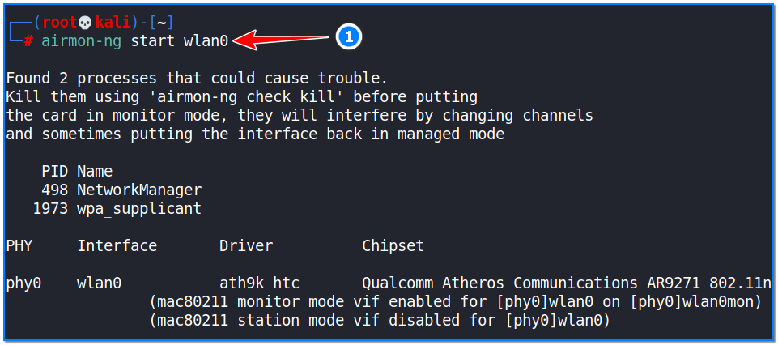
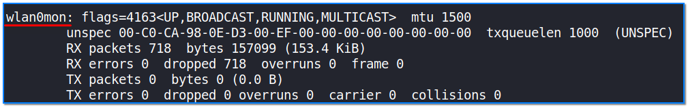
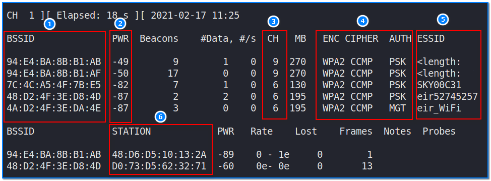
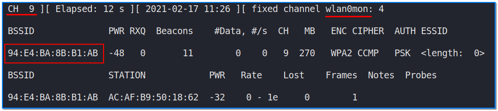

- [ ] Pasitikrinti ar viskas veikia

**Lab Objective:**

Learn how to discover nearby Wi-Fi networks with Airodump-ng.

**Lab Purpose:**

Airodump-ng is a part of the Aircrack-ng set of utilities for analysing Wi-Fi networks for weaknesses. It is mainly used for Wi-Fi discovery.

**Lab Tool:**

Kali Linux

**Lab Topology:**

You can use Kali Linux in a VM for this lab.

**Lab Walkthrough:**

### Task 1:

Airodump-ng comes pre-installed on Kali. You will need a wireless card which is capable of being put into “monitor mode” to complete this lab. In this lab, we will use an Alfa network card for this purpose. There are numerous Wi-Fi adapters on market which are supports Wi-Fi hacking. In this page, you can find some of them:

[https://www.ceos3c.com/security/best-wireless-network-adapter-for-wifi-hacking-in-2019/](https://www.ceos3c.com/security/best-wireless-network-adapter-for-wifi-hacking-in-2019/)

We will begin this lab by first connecting our wireless network card to our Kali machine. Once the network card is connected, we can use airmon-ng to show us the available network cards which will work with the Aircrack-ng tools by using this command:

sudo su –

airmon-ng

The next step is to then place this card into monitor mode using the following command:

airmon-ng start wlan0

This will allow our network card to intercept nearby Wi-Fi packets.

We can confirm that our network card is in monitor mode by executing the following command:

ifconfig

You will note that the interface now has a “mon” after its name; “wlan0mon” in this instance.

### Task 2:

Once the above task is done, we can then start airodump-ng and discover nearby Wi-Fi networks using the following command:

airodump-ng wlan0mon

This will start the airodump-ng tool and it will begin searching for nearby Wi-Fi networks.

1) Shows us MAC address of detected Access Points.  
2) Signal power level also tells target device distance from our Wi-Fi antenna. Higher numbers indicate better signal.  
3) Channel number on which target APs are running.  
4) The encryption methods that targets are using.  
5) If the target AP advertises themselves with a name, we can see it in this section.  
6) MAC address of connected clients to various AP stations. MAC address of various client devices that are connected to APs around.

### Task 3:

Once your target network has been found, we can stop the search by hitting ctrl + c on the keyboard.

We will now run airodump-ng again, but only for the target network. This way, we can capture more information about our target network and the clients connected to the network.

To do this, we will use the following command:

airodump-ng -c 9 –bssid 94:e4:ba:8b:81:ab -w /root/Desktop wlanmon

When you execute this command, you will then see that airodump is now only capturing information about your target network.

“-bssid” is used to specify the BSSID MAC address of a target machine.  
“-w” is used to specify the location where our files are going to be written.  
“-c” is used to specify the target channel number.

We can see that, on the network above, there is one client connected to the network and the number of frames that client is communicating through the network. Keep this running state, as we will need it for the next lab where we capture the WPA handshake file.